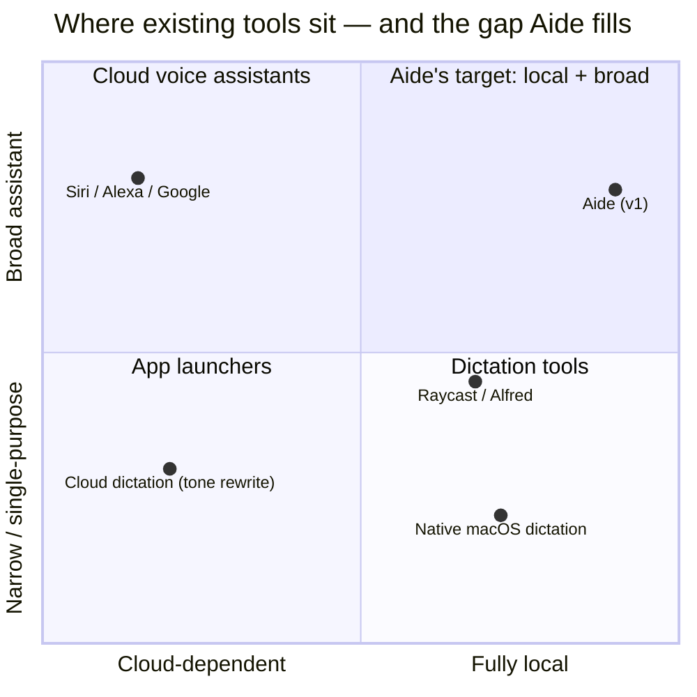
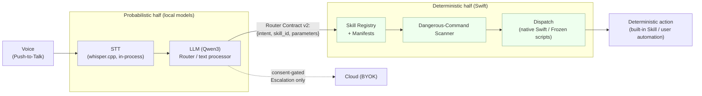

# Aide — Problem to Solve

> **Document 1 of 6** — the upstream "north star." This is the *why* behind Aide: the authoritative problem framing, target user, goals, and non-negotiable constraints that every downstream design decision must serve. It contains no schemas, module diagrams, or algorithms (see [`03-architecture.md`](./03-architecture.md), [`04-hld.md`](./04-hld.md), [`05-lld.md`](./05-lld.md) for those).

---

## 1. Purpose of This Document

This document establishes the problem Aide solves and the constraints under which it must be solved. It is the single source of intent for the other five specs. When a later design decision appears to conflict with a goal, principle, or constraint stated here, **this document wins** unless it is itself amended by the product owner.

What this document does:

- Frames the user pain and why existing tools fail to address it.
- Names the target user and their context of use.
- States Aide's product vision and positioning — deliberately narrow, deliberately not an autonomous agent.
- Enumerates v1 **Goals**, **Non-Goals**, and the **Non-Negotiable Constraints** (privacy, local-first, safety, honesty) that bound the entire design space.
- Defines the **Success Criteria** by which v1 is judged, and the **Key Risks** that could invalidate the approach.

What this document does **not** do: prescribe *how* anything is built. Terms appear in their canonical form throughout; see [`02-glossary.md`](./02-glossary.md) for definitions. Where a claim derives from the source PRD or a post-PRD locked decision, it is grounded to that source.

**Grounding convention.** Throughout, `PRD §N` refers to the source PRD sections; `LD-N` refers to the numbered **Authoritative Locked Decisions** from the product-owner design review, which override any conflicting PRD default. The most consequential override is **Router Contract v2** (`LD-10`), a deliberate amendment to the PRD's "locked" §6.

---

## 2. The Problem

### 2.1 Current State & User Pain

A technical macOS user who wants to drive their machine, and produce text, by voice today faces a fragmented and privacy-hostile landscape. The tasks are ordinary; the friction is not:

| Task the user wants | What they must do today | Pain |
|---|---|---|
| "Open Safari," "pause the music," "set a 10-minute timer" | Reach for the mouse/keyboard, or use a cloud voice assistant | Context switch; assistant is slow, cloud-dependent, and privacy-opaque |
| Dictate a Slack message / commit body / email in their own voice, cleaned up | Type it, or dictate raw and hand-edit filler and disfluencies | Native macOS dictation inserts *raw* transcript — no tone or grammar cleanup |
| Dictate in Hindi or code-mixed English-Hindi | Mostly unsupported or low-quality in mainstream dictation | Multilingual speakers are underserved (`PRD §1` target user) |
| "What does this error on my screen mean?" then "how do I fix it?" | Screenshot → paste into a chatbot → lose the follow-up thread | Screen content leaves the machine; conversation context is manual |
| "Run my prod sanity check every morning" | Hand-write a shell script + a `launchd`/cron entry | High-friction, error-prone, no guardrails against a dangerous command |
| Ask a quick general-knowledge question | Open a browser / chatbot; wait; trust an unlabeled answer | Overkill for a one-liner; no honest "I don't know" signal |

The through-line: **every one of these forces either a context switch away from the current app, or the surrender of local data (audio, screenshots, keystrokes) to a cloud service the user cannot inspect.** The user is a developer who values determinism, privacy, and staying in flow, and no single tool respects all three.

### 2.2 Why Existing Solutions Fall Short

Three product categories each solve a slice and miss the rest.

**Cloud voice assistants (Siri, Alexa, Google Assistant).**

- Send audio — and often screen or account context — off-device by design. This violates the user's core requirement before any feature is even discussed (`PRD §4`).
- Behave as opaque, semi-autonomous agents: the mapping from utterance to action is not inspectable, not deterministic, and not extensible by the user.
- Degrade or fail entirely offline.
- Offer no path to a user-authored, frozen automation with safety review.

**Dictation tools (native macOS dictation, cloud "tone rewrite" apps).**

- Native dictation inserts a **raw** transcript — no grammar repair, no filler removal, no **Tone Preset**, and weak non-English performance.
- Cloud tone-rewriting tools fix the text quality but stream the user's dictation to a server, reintroducing the privacy problem.
- None couple dictation to a **Personalization Dictionary** the user controls, or to a bias prompt that improves recognition of the user's own vocabulary over time — without model training.

**Launchers (Raycast, Alfred).**

- Keyboard-first, not voice-first; they do not solve hands-busy or flow-preserving voice control.
- No dictation-with-cleanup, no **Screen Q&A**, no local general-knowledge answering.
- Extensible, but not via *spoken* intent that compiles to a safety-reviewed, frozen automation.

**The gap.** No existing product is simultaneously (a) **local-first** for all core inference, (b) a **broad** assistant spanning command, dictation, screen Q&A, and scheduled automation, and (c) **deterministic and inspectable** rather than an autonomous agent. That intersection is Aide.

---

## 3. Target User & Context of Use

| Dimension | v1 target |
|---|---|
| **Primary user** | The developer building Aide, then technical early adopters (`PRD §1`). |
| **Distribution** | Direct DMG download; no App Store (`PRD §1`, `LD-8`). |
| **Hardware** | **Apple Silicon only, macOS 14+.** Reference machine: Apple **M2 / 16GB** (the **16GB Tier**). An **8GB Tier** is supported with smaller models (`LD-1`, `PRD §3`). |
| **Language** | English primary; **Hindi and code-mixed English-Hindi are in scope for Dictation Mode** — a first-class requirement, not an edge case (`PRD §1`, `PRD §3`). |
| **Technical level** | Comfortable with shell, scripts, and permissions; expects determinism and inspectability; distrustful of silent cloud exfiltration. |
| **Trust posture** | "Local unless I say otherwise." Will trade some raw quality for provable privacy (`PRD §4`). |

**Context of use.** Aide runs continuously as a **Menubar App** (`MenuBarExtra`) with no Dock icon by default. The user is typically mid-task in another application. Input is **Push-to-Talk** via two global hotkeys — **Hotkey A** (Command Mode) and **Hotkey B** (Dictation Mode) — so invocation never requires leaving the current app. Feedback appears in a non-activating **Overlay** (an `NSPanel` that never steals focus, critical during dictation) and in the menubar. **Wake Word** exists only as an experimental, off-by-default alternative (`LD-5`, `PRD §5`). The defining constraint of the context: **the user's hands and attention are already committed elsewhere, and their machine may be offline.**

---

## 4. Product Vision & Positioning

> **Aide is a deterministic Skill system with an LLM acting purely as a Router and text processor. The LLM never freely controls the screen. Aide is *not* an autonomous agent.** (`PRD §1`)

This positioning is the product's spine, not a tagline. It draws a hard line through the architecture:

The **Router Contract** is the boundary between the two halves (`PRD §6`, superseded by **Router Contract v2**, `LD-9`/`LD-10`). Everything to the left is probabilistic and confined to *understanding*; everything to the right is deterministic Swift that *acts*. The LLM's authority ends at emitting a structured intent — it never gains the ability to click arbitrary UI or run un-reviewed code.

**Positioning summary — what Aide is, and is not:**

| Aide **is** | Aide **is not** |
|---|---|
| A local-first voice front-end to a fixed, extensible set of **Skills** | A "click anything on screen" autonomous agent (`PRD §1`) |
| An LLM used as a **Router** (utterance → `skill_id` + parameters) and a **text processor** (dictation cleanup, Q&A) | An LLM with free control of the screen or shell |
| A dictation tool with tone-aware cleanup and a user-owned **Personalization Dictionary** | A cloud dictation service |
| An OCR-based **Screen Q&A** answerer (Apple Vision; **no VLM** in v1, `PRD §9`) | A vision-language model reading the screen |
| A safety-reviewed automation builder (spoken intent → **Frozen Script** + `launchd`) | A system that runs LLM-generated scripts unreviewed or regenerated per run |

**On the Router's role (Router Contract v2, `LD-10`).** The Router **always runs locally** (`LD-9`) and emits `{intent, skill_id, parameters}` with **no confidence field**. Safety is enforced by measurable gates, not by a self-reported number — see §7. Cloud handoff exists only at the *answer/script* layer, never for routing.

---

## 5. Goals

Ranked. Higher goals constrain lower ones.

| # | Goal | Grounding |
|---|---|---|
| **G1** | **Local-first by default.** All STT, OCR, routing, dictation cleanup, and Screen Q&A run on-device. With the network cable pulled, everything works except explicit cloud **Escalation**. | `PRD §4.1`, `LD-9` |
| **G2** | **Provable privacy.** Screenshots and audio never leave the machine implicitly; any outbound request shows a visible **Local/Cloud Indicator**; zero telemetry. | `PRD §4`, privacy invariants |
| **G3** | **Safety-first execution.** No unapproved or unconfirmed dangerous command ever executes. Deterministic **Dangerous-Command Scanner** + **Risk Tier** gating + **Confirm-Back**. | `PRD §7.3`, `LD-11`–`LD-14` |
| **G4** | **Push-to-talk command control** of common Mac actions via built-in **Skills**, end-to-end ≤ ~2 s on the 16GB reference machine (design target, not a hard gate). | `PRD §5`, `PRD §12`, `LD-4` |
| **G5** | **Dictation as the hero feature** — transcribe → tone-aware cleanup → insert at cursor (**AX-first, clipboard-paste fallback**), including Hindi / code-mixed input. | `PRD §8`, `LD-7` |
| **G6** | **General-knowledge Q&A locally, with honesty over hallucination** — the local model answers directly and prefixes low-confidence answers with the **Sentinel Token** `⟨UNSURE⟩`. | `PRD §7.1a`, `LD-12` |
| **G7** | **Screen Q&A** via screenshot → Apple Vision **OCR** (with **Bounding Box** layout) → local LLM, with **Session Context** carrying follow-ups. | `PRD §7.1b`, `PRD §9` |
| **G8** | **One unified Skill system** — built-in Skills and User Script-Automations share one **Manifest** schema, one **Skill Registry**, one scheduler; the Router prompt + **GBNF Grammar** are generated from the registry. | `PRD §7`, `LD-15` |
| **G9** | **Safe, user-owned extensibility** — spoken intent → generated script + manifest → shown in full → approved → **Frozen** → scheduled via **launchd**, with per-run guardrails. | `PRD §7.2`, `LD-15` |
| **G10** | **Consent-gated cloud escalation (BYOK)** — the single OpenAI-compatible client offloads only at the answer/script layer, only with explicit consent (or an explicit opt-in), always visibly indicated. | `PRD §4.4`, `LD-12` |
| **G11** | **Graceful, legible failure** — every denied permission, sidecar crash, or model unload surfaces a human-readable state and an actionable fix, never silent breakage. | `PRD §10.7`, `PRD §12`, `LD-3` |
| **G12** | **Frictionless first run** — DMG → onboarding → first successful voice command, unassisted, on Apple Silicon / macOS 14+; **dev builds are signed day one**. | `PRD §10`, `LD-1`, `LD-2` |

---

## 6. Non-Goals / Out of Scope (v1)

Explicitly excluded. Listing them is load-bearing: several are *permanently* excluded to preserve the vision (§4), not merely deferred.

| Out of scope (v1) | Kind | Grounding |
|---|---|---|
| Autonomous / open-ended screen control ("click anything" agent) | **Permanent** (violates vision) | `PRD §1`, `PRD §18` |
| Any **VLM** — screen understanding is OCR-only | **v1** | `PRD §1`, `PRD §9` |
| Wake Word as the *primary* input (ships experimental, off by default) | **v1** | `PRD §5`, `LD-5` |
| Acoustic model fine-tuning / voice profiles / speaker ID | **Permanent** (no model training anywhere) | `PRD §1`, `PRD §8.2` |
| Web search / search-engine integration (local LLM GK Q&A **is** in scope) | **v1** | `PRD §1`, `PRD §7.1a` |
| Telemetry / analytics / crash reporting of any kind | **Permanent** | `PRD §4.5`, privacy invariants |
| App Store distribution (DMG only) | **v1** | `PRD §1`, `LD-8` |
| iOS / Windows; **do not architect for cross-platform** | **v1+** | `PRD §1`, `LD-1` |
| Non-Apple-Silicon / macOS < 14; Intel Macs | **Permanent (v1 scope)** | `LD-1` |
| Automatic "too hard for local" detection | **Permanent** (would silently exfiltrate) | `PRD §4.4`, privacy invariants |
| A **confidence** field in the Router output | **Permanent** (replaced by Router Contract v2 gates) | `LD-10` |
| A confirmation/override path for **Hard-Block** commands (e.g. `sudo`) in Aide-generated automations | **Permanent** | `PRD §7.3`, `LD-13`, `LD-14` |
| Streaming STT (v1 is **batch-on-release**; buffer architected so streaming can be added later) | **v1** | `LD-6`, `PRD §13` |
| Custom user-defined Tone Presets; custom Wake Word phrase training | **v1** | `PRD §8.1`, `PRD §5` |
| Implicit auto-population of the Personalization Dictionary via edit detection (v1 is **explicit-only**: "correct that: X should be Y") | **v1** | `LD-16` (narrows `PRD §8.2`) |

---

## 7. Guiding Principles & Non-Negotiable Constraints

These are hard constraints. Any downstream design that violates one is wrong, regardless of how well it performs otherwise.

### 7.1 Privacy Model (load-bearing — `PRD §4`, privacy invariants)

1. **Offline-first.** STT, OCR, routing, dictation cleanup, and Screen Q&A are local. Only two categories of traffic ever leave: one-time model downloads, and explicit user-initiated cloud **Escalation**.
2. **Screenshots and audio never leave implicitly.** Sending either to a cloud model is a distinct, deliberate, clearly-labeled action — **never** an automatic fallback.
3. **Visible Local/Cloud Indicator.** Whenever a request is about to leave the machine, the Overlay/menubar signals it, unmistakably. "Local unless I say otherwise" must be *legible*, not merely true.
4. **No auto-detection of "too hard for local."** Wrong guesses would silently ship user data to the cloud; prohibited. Escalation is consent-gated.
5. **Zero telemetry.** Nothing phones home.

**Two disclosed exceptions,** stated once during onboarding, then never nagged: the keyless utility calls for **Weather (Open-Meteo)** and **Currency (Frankfurter)** — non-sensitive query data (`PRD §7.1`, `LD` Defaults).

### 7.2 Local-First & Model Residency (`PRD §3`, `LD-3`, `LD-8`)

- **STT** is **whisper.cpp**, in-process via SwiftPM. The **LLM (Qwen3)** runs behind a single **Sidecar** — **llama-server**, bundled and version-pinned, on a dynamic localhost port with health-check + backoff restart. Models live in **Application Support**, delivered from pinned Hugging Face commit SHAs with SHA-256 verification, resumable.
- **Tiered Model Residency:** **16GB Tier** = Whisper `large-v3-turbo` + Qwen3-8B Q4_K_M (LLM stays resident; follow-ups instant). **8GB Tier** = Whisper `small`/`medium` + Qwen3-4B Q4 (LLM unloads on idle; a follow-up triggers a visible reload, never a dropped **Session Context**).

### 7.3 Safety-First Execution (`PRD §7.3`, `LD-10`–`LD-14`)

The LLM self-censoring is **not** sufficient. Safety is deterministic Swift:

- **Router Contract v2 gates** (in order): (a) **Whisper Segment-Probability Pre-Gate** before routing; (b) **Logprob-Derived Routing Confidence** measured at the token(s) selecting `skill_id`, thresholded from ~1 week of real logs (loose provisional thresholds until calibrated; day-one calibration-logging harness); (c) **parameter schema validation as HARD rejection**; (d) per-manifest **Risk Tier**.
- **Risk Tier semantics:** `low` = execute when gates pass; `confirm` = execute silently when routing logprob is clearly high, **Confirm-Back** when marginal; `always_confirm` = always **Confirm-Back**, regardless (destructive/irreversible).
- **Dangerous-Command Scanner** (Swift, in-process, **pattern-based — never LLM**, cannot be prompt-injected): recurses into pipes / `$()` / backticks / `sh -c`; two tiers — **Hard-Block** (`sudo` / priv-esc, no override) vs **Confirm**. It analyzes strings as *data* and never executes them. Scope: executable channels by routed intent, plus destination-aware scanning for Dictation Mode into a known terminal emulator (bundle-ID allowlist); **not** prose Q&A. Hard-Block-no-override is reserved for Aide-generated automations. Default posture is strict: false positives are acceptable, false negatives are not.

### 7.4 Honesty over Hallucination (`PRD §7.1a`, `LD-12`)

- The local model answers general-knowledge Q&A by default and must **prefer admitting uncertainty over guessing**. Its system prompt makes it prefix low-confidence answers with the exact **Sentinel Token** `⟨UNSURE⟩`.
- Deterministic app behavior on an exact `⟨UNSURE⟩` match: **BYOK configured** → offer **Offload** (or auto-offload if opted in); **no key** → a teach-BYOK message explaining why a cloud key yields reliable answers. **Offload is consent-gated, never automatic exfiltration.**
- Honesty is enforced by prompt, not guaranteed: small models have imperfect self-knowledge; this reduces but cannot eliminate hallucination.

### 7.5 Deterministic-First Execution (`PRD §7.1b`)

Common recurring actions (reminders, app-launch-at-time) compile to **parameterized declarative actions** executed by Aide's own scheduler — **not** LLM-generated shell scripts. The LLM only extracts intent + parameters. Arbitrary logic goes through the **User Script-Automation** path, where the script is shown in full, approved, and **Frozen** (never regenerated per run).

### 7.6 Platform, Signing & Legibility (`LD-1`, `LD-2`, `PRD §10`, `PRD §12`)

- **Apple Silicon only, macOS 14+**; reference machine Apple M2 / 16GB. Hardened runtime + **Entitlements** configured from day one; enrolled Apple Developer Program; **dev builds signed day one** (notarization is a later flip, not a refactor).
- **Legible failure is a constraint, not a nicety.** Denied **TCC**/**Accessibility** permissions disable only the dependent features, with a persistent, actionable fix-it hint. Sidecar crash → auto-restart with backoff; the app never goes down silently.

---

## 8. Success Criteria & Acceptance Signals

v1 is successful when all of the following hold (`PRD §14`, reinforced by `LD` constraints):

| # | Criterion | Acceptance signal |
|---|---|---|
| **S1** | **Daily-driver adoption** | The developer uses Dictation Mode and **≥3 Skills daily for two weeks** without reaching for alternatives. |
| **S2** | **Unassisted first success** | A non-developer goes DMG → onboarding → first successful voice command **with no external help**. |
| **S3** | **Zero unsafe execution** | **Zero incidents** of an unapproved or unconfirmed dangerous command executing, across all testing. This is a *hard* gate, not a target. |
| **S4** | **Works offline** | Fully functional with networking disabled, except BYOK **Escalation** paths, which degrade with clear messaging. |
| **S5** | **Privacy is provable** | With the network monitored, no screenshot or audio leaves the machine without an explicit user action and a visible **Local/Cloud Indicator**; zero background/telemetry traffic. |
| **S6** | **Latency in target band** | Command Mode end-to-end (release hotkey → Skill executes) ≈ **≤ 2 s**, dictation insertion ≈ **≤ 3 s**, on the 16GB reference machine (design targets). |
| **S7** | **Honesty signal works end-to-end** | On post-cutoff / long-tail questions, the model emits `⟨UNSURE⟩` and the app deterministically offers Offload (BYOK) or the teach-BYOK message (no key) rather than presenting a confident guess. |
| **S8** | **Calibration harness live** | The day-one calibration-logging harness records routing logprobs and gate outcomes, enabling threshold calibration from ~1 week of real logs (`LD-10`). |

---

## 9. Key Risks & Open Questions

| # | Risk / open question | Impact | Disposition |
|---|---|---|---|
| **R1** | **Routing-confidence threshold is uncalibrated at ship.** `⟨` Logprob-Derived Routing Confidence `⟩` thresholds depend on ~1 week of real logs (`LD-10`). | Mis-gated dispatch (guess-execute or over-prompting) | Ship with **loose provisional thresholds** + calibration harness; tighten post-launch. Tracked in [`05-lld.md`](./05-lld.md). |
| **R2** | **Small local models write buggy shell scripts** (`PRD §4.4`). | Poor automation quality without BYOK | Script/automation generation is cloud-preferred *when BYOK is configured*; local fallback carries a visible "results may be rougher" caveat. Never auto-exfiltrate. |
| **R3** | **8GB Whisper variant (small vs medium) unresolved for non-English** (`PRD §3`). | Degraded Hindi / code-mixed dictation on 8GB | **Build-time calibration task**; test on non-English audio before locking. Assumption: 16GB reference machine is primary; 8GB is a supported-but-secondary tier. |
| **R4** | **Honesty signal is imperfect.** `⟨UNSURE⟩` cannot be a 100%-reliable "I don't know" (`PRD §7.1a`, `LD-12`). | Residual hallucination on long-tail facts | Accepted and documented; enforced by aggressive system prompt; exact-string match drives deterministic app behavior. |
| **R5** | **AX text insertion is rejected by some apps** (esp. Electron) (`PRD §8`, `LD-7`). | Failed/garbled insertion | **Clipboard-paste fallback with save/restore** exists from day one; per-app allow/deny map. Detailed in [`04-hld.md`](./04-hld.md). |
| **R6** | **Dangerous-Command Scanner false-negative** on obfuscated commands. | An unsafe command slips through (violates S3) | Strict-by-default, recursive descent into pipes/`$()`/backticks/`sh -c`; err toward flagging; Hard-Block for priv-esc has no override. Patterns in [`05-lld.md`](./05-lld.md). |
| **R7** | **Batch-on-release STT raises perceived latency** vs. streaming (`LD-6`). | Slower feel on long utterances | Accepted for v1; audio buffer is architected so streaming can be added later without redesign. |
| **R8** | **First-run permission UX is fragile** — a broken TCC walkthrough kills adoption (`PRD §10`). | Fails S2 | One-permission-at-a-time flow, deep-linked, auto-advancing on grant; graceful degradation for skips. |
| **R9** | **Sidecar (llama-server) lifecycle instability** on a dynamic port. | App-wide failures if unmanaged | Single bundled, version-pinned Sidecar with health-check + backoff restart; never takes the app down (`LD-3`). |
| **Q1** | Session Context idle timeout default. | Follow-up context lost too early/late | **Resolved:** default **8 min** (`LD` Defaults); overridable. |
| **Q2** | Should destination-aware terminal scanning allow an override on Confirm? | Usability vs. safety | **Resolved:** Dictation Mode into a known terminal emulator scans pre-insertion and Confirm-Backs with **override allowed**; Hard-Block-no-override is reserved for Aide-generated automations (`LD-14`). |

---

## 10. Document Map

This is Document 1 of a 6-part set. Each downstream doc refines this one at increasing detail; none may contradict the goals, non-goals, or constraints above.

| Doc | Purpose | You are here / go here for |
|---|---|---|
| [`01-problem-to-solve.md`](./01-problem-to-solve.md) | **The why** — problem, user, goals, non-goals, principles. | **This document.** The north star every other doc serves. |
| [`02-glossary.md`](./02-glossary.md) | **Ubiquitous language** — canonical definitions of every term (Command Mode, Router Contract v2, Risk Tier, Sentinel Token, Offload, etc.). | The precise meaning of any capitalized term used here. |
| [`03-architecture.md`](./03-architecture.md) | **Structural system architecture** + cross-cutting concerns (processes, the probabilistic/deterministic boundary, privacy enforcement, sidecar lifecycle). | How the pieces fit and where the trust boundaries live. |
| [`04-hld.md`](./04-hld.md) | **High-level design per subsystem** — STT, Router, Skills/Dispatch, Dictation, Screen Q&A, Escalation, Onboarding. | How each subsystem works at a design level. |
| [`05-lld.md`](./05-lld.md) | **Low-level design** — schemas (Manifest, Router Contract v2), algorithms, interfaces, state machines, scanner patterns, thresholds. | Exact contracts and implementable detail. |
| [`06-walkthrough.md`](./06-walkthrough.md) | **End-to-end narrative traces** — command, dictation, screen Q&A, uncertain-answer Offload, automation authoring, dangerous-command block. | How it all behaves in concrete scenarios. |

---

*Assumptions made in this document, all PRD/locked-decision-consistent:* (1) the 16GB M2 reference machine is the primary optimization target and the 8GB tier is a supported secondary path (from `LD-1` + `PRD §3`); (2) "provable privacy" (S5) is treated as an explicit acceptance signal derived from the `PRD §4` invariants, since the PRD states the invariants without naming the test; (3) permanent vs. v1-only classification of non-goals in §6 is inferred from whether the exclusion protects the core vision/privacy model (permanent) or is a scoping choice (v1). No other interpretation departs from the PRD or the locked decisions.
