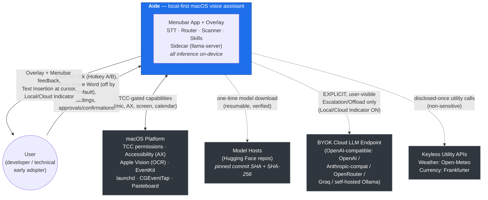
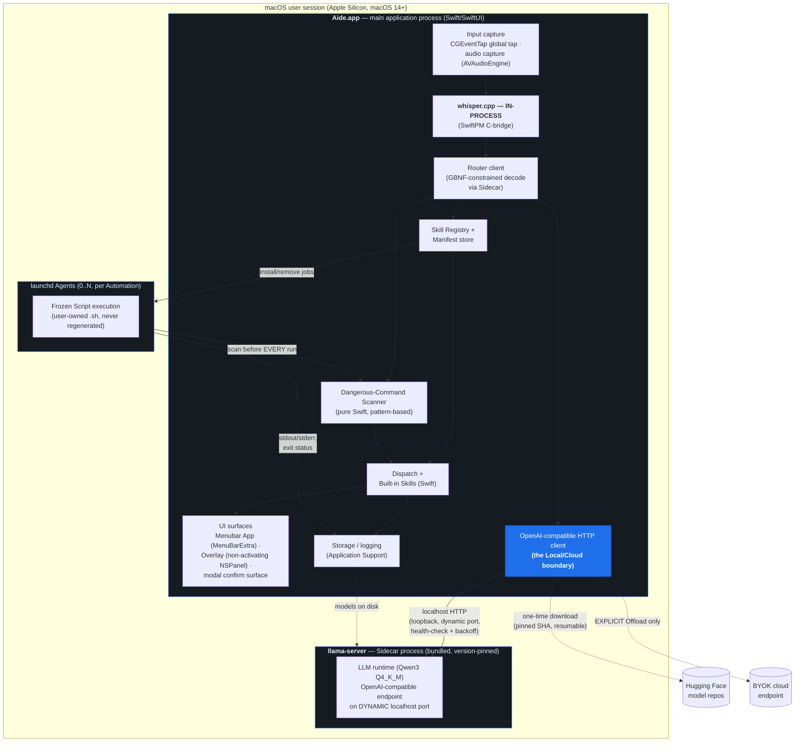
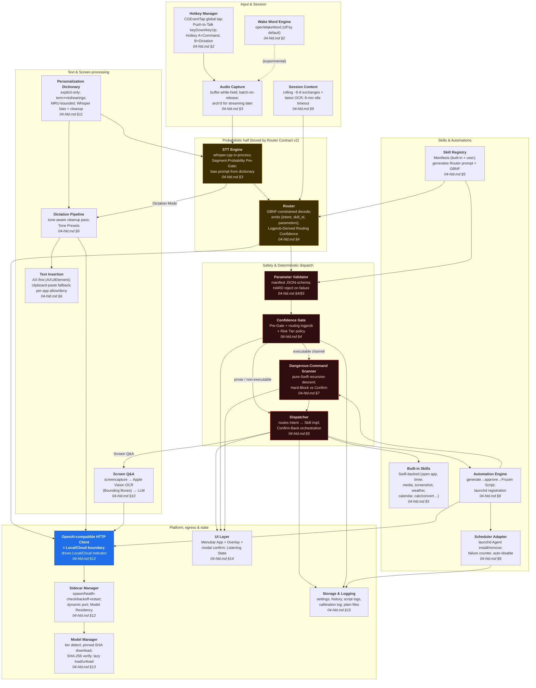
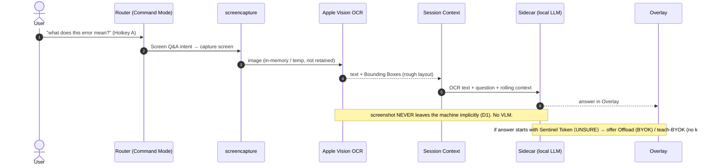
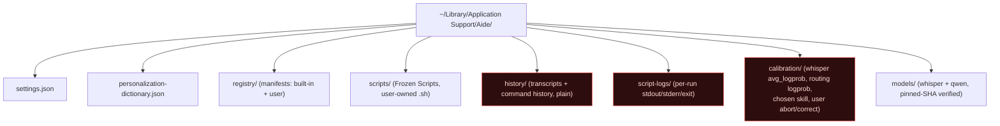
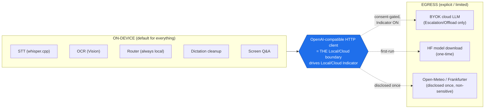
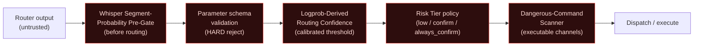
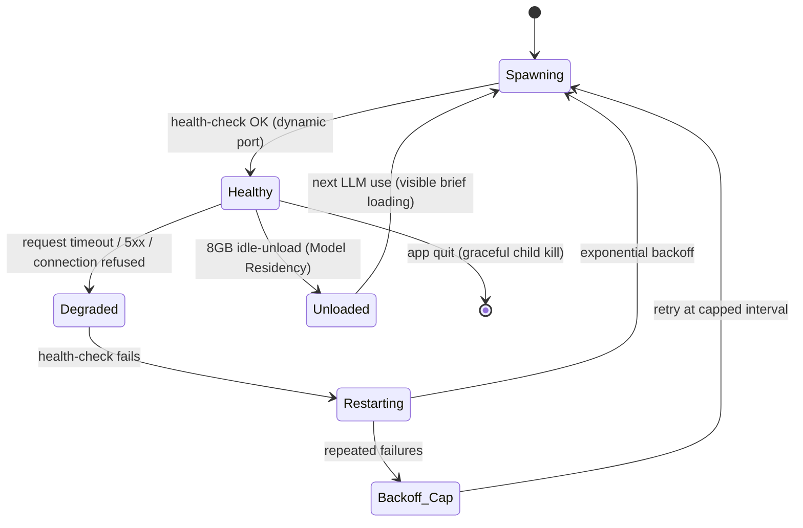

# Aide — Architecture

> Structural system architecture and cross-cutting concerns for **Aide**, a local-first macOS voice assistant.
>
> **Reading order in the set:** [`01-problem-to-solve.md`](01-problem-to-solve.md) (the why) → [`02-glossary.md`](02-glossary.md) (canonical terms) → **this doc** (structure + cross-cutting) → [`04-hld.md`](04-hld.md) (per-subsystem HLD) → [`05-lld.md`](05-lld.md) (schemas/algorithms/state machines) → [`06-walkthrough.md`](06-walkthrough.md) (end-to-end traces).
>
> **This document is authoritative** for all future implementation agents on *structure* and *cross-cutting concerns*. Per-subsystem internals are deferred to `04-hld.md`; concrete schemas, grammars, wire formats, and state machines to `05-lld.md`; narrative scenario traces to `06-walkthrough.md`. Terms rendered in Title Case (e.g. Command Mode, Sidecar, Confirm-Back) are canonical — see `02-glossary.md`.

---

## 1. Purpose & Scope

### 1.1 Purpose

This document defines the **big-picture structure** of Aide: its process boundaries, its major components and their responsibilities, how data flows through the system at runtime, and the cross-cutting concerns (privacy, safety, concurrency, resilience, observability, performance) that every subsystem must honor. It exists so that any implementation agent can place a new piece of work in the correct process, on the correct thread, behind the correct safety gate, without re-deriving the whole system.

### 1.2 In scope for this document

- Architectural drivers and their traceability to the product problem (`01-problem-to-solve.md`).
- C4 Level 1 (System Context), Level 2 (Container/Process), and Level 3 (Component) views.
- Runtime & concurrency model: threads, queues/actors, main-thread rules, backpressure, single-instance, sleep/wake.
- High-level data-flow sequence overviews for the five core scenarios.
- The locked technology stack with rationale.
- Deployment, packaging, signing, and storage layout at a high level.
- Cross-cutting concerns: the Local/Cloud data boundary, the safety boundary, concurrency, error handling/resilience, observability, and the latency budget.
- Architectural Decision Records (ADR summary) and the constraints/assumptions/risks ledger.

### 1.3 Out of scope for this document (deferred)

| Concern | Where it lives |
|---|---|
| Per-subsystem internal design (STT, Router, Scanner, Skill Registry, Dictation, Screen Q&A, Personalization, Scheduler, Sidecar lifecycle) | `04-hld.md` |
| JSON schemas, GBNF Grammar text, Router Contract v2 wire format, prompt templates, state machines, algorithms, logprob math | `05-lld.md` |
| End-to-end narrative traces with timings | `06-walkthrough.md` |
| Canonical term definitions | `02-glossary.md` |
| Product rationale / user problems | `01-problem-to-solve.md` |

### 1.4 Product scope boundaries (from PRD, load-bearing for structure)

Aide is **not an autonomous agent**. It is a *deterministic Skill system* with an LLM acting purely as a Router and text processor. The LLM never freely controls the screen. This inverts the usual "agent" architecture: the probabilistic component (LLM) is boxed inside a narrow contract (Router Contract v2), and everything downstream of that contract is deterministic Swift. Platform is **Apple Silicon only, macOS 14+**; reference machine is Apple M2 / 16GB (16GB Tier). No VLM, no web search, no telemetry, no App Store, Apple-Silicon-only (do not architect for Windows/iOS).

---

## 2. Architectural Drivers

The architecture is shaped by five load-bearing drivers. Each traces to a specific promise or problem in `01-problem-to-solve.md` and PRD §4/§12. These drivers are ranked: when they conflict, the earlier one wins.

| # | Driver | Traces to | Architectural consequence |
|---|---|---|---|
| **D1** | **Privacy / local-first** — "Local unless I say otherwise" is the core trust promise; screenshots and audio never leave the machine implicitly; zero telemetry. | PRD §4.1–4.5; `01-problem-to-solve.md` "trust promise" | All inference (STT, OCR, Router, cleanup, Screen Q&A) runs on-device. The **only** egress is (a) one-time model downloads and (b) an explicit, user-visible cloud Escalation/Offload. A single **Local/Cloud data boundary** is drawn through exactly one component (the OpenAI-compatible HTTP client). The Local/Cloud Indicator is driven off that boundary. See §10.1. |
| **D2** | **Safety boundary** — a wrong Skill trigger can be *dangerous*, not merely annoying; a voice-triggerable path to root must not exist. | PRD §6, §7.3; `01-problem-to-solve.md` "deterministic half" | A hard boundary separates the *probabilistic* half (Whisper + Router LLM) from the *deterministic* half (validation, Dangerous-Command Scanner, Dispatch, Skills). The Router emits only `{intent, skill_id, parameters}` (Router Contract v2); everything after is deterministic Swift. The Scanner is **pattern-based, in-process, never an LLM**, so it cannot be prompt-injected. See §10.2. |
| **D3** | **Latency budget** — Command Mode ≤ ~2s (release → execute); Dictation ≤ ~3s to insert; near-zero idle CPU. | PRD §12 | whisper.cpp is **in-process** (no IPC on the hot path for STT). The Router LLM uses a **GBNF Grammar** to constrain decoding to a handful of tokens. Models are resident on the 16GB Tier so follow-ups are instant. See §10.6. |
| **D4** | **Offline operation** — "pull the network cable and everything works except cloud escalation." | PRD §4.1, §14 | No cloud dependency on any core path. The Sidecar (llama-server) binds **localhost only**. Network-backed utilities (Weather via Open-Meteo, Currency via Frankfurter) are the *only* implicit egress besides model downloads, disclosed once, and degrade gracefully when offline. No automatic "too hard for local" detection is permitted (D1 forbids silent exfiltration). |
| **D5** | **Resilience** — Sidecar crash must never take the app down; all failures surface as human-readable states, never silent. | PRD §12 | The LLM runtime is isolated in a **separate Sidecar process** so a llama-server crash is recoverable via health-check + backoff restart without killing STT, hotkeys, or the UI. Every subsystem degrades to a legible state (denied permission disables only its dependent feature). See §10.4. |

**Why the Sidecar split (D5) does not violate the latency budget (D3):** the Router and cleanup passes tolerate localhost-HTTP round-trip overhead (sub-millisecond loopback), while STT — the most latency-sensitive and highest-bandwidth stage — is kept in-process. The split buys process-level fault isolation for the component (llama.cpp) most likely to crash or hang under memory pressure, at negligible latency cost.

---

## 3. System Context (C4 Level 1)

Aide as a single system, its human user, and the external systems it touches. Note the asymmetry that encodes D1: **many inbound local interactions, exactly two classes of outbound network traffic**, both explicit.



**Legend / boundary rules:**

- **Solid arrows = local, always-on interactions.** Dashed arrows = network egress, and every network arrow is either one-time (model download) or explicit + indicated (cloud Offload) or disclosed-once + non-sensitive (utility APIs).
- The **BYOK Cloud LLM** is reached only through the single OpenAI-compatible HTTP client (see §4), the same client that talks to the local Sidecar. This one client *is* the Local/Cloud boundary; the Local/Cloud Indicator reflects whether this **inference** client is pointed at the local Sidecar (LOCAL) or a BYOK endpoint (CLOUD) for a given request. It tracks **Aide-originated inference only** — the disclosed-once utility APIs (Weather via Open-Meteo, Currency via Frankfurter) and a user script's own declared network I/O are **out of the Indicator's scope** (see `06-walkthrough.md` §16).
- Aide never contacts a search engine, never sends screenshots or audio to any endpoint implicitly, and phones home to nothing (zero telemetry).

---

## 4. Container / Process View (C4 Level 2)

Aide runs as **one foreground application process** plus **one bundled Sidecar process**, with **zero-or-more launchd Agent processes** for scheduled Automations. This is the smallest process footprint that satisfies fault isolation (D5) without paying IPC cost on the STT hot path (D3).



### 4.1 Process boundaries & why they are drawn where they are

| Boundary | Processes | Rationale |
|---|---|---|
| **App ↔ Sidecar** | `Aide.app` ↔ `llama-server` | The LLM runtime (llama.cpp) is the component most likely to hang or crash under memory pressure and the one with the largest, most opaque native footprint. Isolating it in a separate process (D5) means a crash is recoverable by restart, not fatal to the app. **whisper.cpp is deliberately kept in-process** (not a second sidecar) because STT is the latency- and bandwidth-critical hot path (D3) and a C-bridge over SwiftPM has no IPC overhead. |
| **App ↔ launchd Agents** | `Aide.app` ↔ per-Automation agents | Scheduled Automations run as their own launchd-managed processes so their lifecycle (schedule, catch-up on wake, per-run timeout, kill) is owned by the OS scheduler, and a runaway Frozen Script cannot destabilize the app. Agents write logs back to Application Support; the Scanner re-runs on the script **before every execution** (see §10.2). |
| **App ↔ macOS/TCC** | in-process framework calls | Microphone, Accessibility, Screen Recording, Calendar are TCC-gated framework calls, not a separate process, but each is a *capability boundary*: a denied grant disables only the dependent feature (graceful degradation, §10.4). |

### 4.2 Inter-process communication (IPC)

- **App → Sidecar: localhost HTTP (loopback), OpenAI-compatible.** The Sidecar binds a **dynamic localhost port** (chosen at spawn, never a fixed well-known port, never a non-loopback interface — D4). The App discovers the port from the spawn handshake and holds it for the process lifetime. Requests are chat/completions calls; the Router request additionally carries a **GBNF Grammar** to constrain decoding (see `05-lld.md` for the wire shape). Loopback HTTP adds sub-millisecond overhead — acceptable for Router and cleanup passes, which are not the tightest part of the budget.
- **App ↔ launchd Agents: filesystem + launchd control.** The App installs/removes jobs via `launchctl` (scoped to *its own* Automations — the Scanner Hard-Blocks any generated script that touches other launchd jobs or system daemons). Agents communicate results back via log files and exit status under Application Support.
- **App → Cloud / HF: HTTPS via the single HTTP client.** This is the *same* OpenAI-compatible client instance used for the Sidecar; only the base URL differs. Routing this all through one client is what makes the Local/Cloud boundary a single auditable choke point (§10.1).

### 4.3 The one-client invariant

There is exactly **one** OpenAI-compatible HTTP client abstraction in the system. It talks to (a) the local Sidecar, (b) any BYOK cloud endpoint, and it also performs (c) model downloads. Base URL + API key + model name are settings. **The Router ALWAYS points this client at the local Sidecar — routing never goes to the cloud.** Cloud handoff exists only at the *answer/script* layer (free-form Q&A Offload, script generation), never for routing (locked decision #9). This is both a simplicity win and the linchpin of the privacy model: there is one place in the code where a request can leave the machine, and the Local/Cloud Indicator is wired to it.

---

## 5. Component Map (C4 Level 3)

Major modules **inside the `Aide.app` process** and their responsibilities. This is the structural map; each module's internal design is in `04-hld.md` (section references below), and its schemas/algorithms in `05-lld.md`.



**Structural reading of the map:**

- The **amber band** (STT + Router) is the *probabilistic* half. Everything it produces is untrusted structured data that must pass through the **red band** (validation → gates → Scanner → Dispatch) before any effect occurs. This is the D2 safety boundary made physical: no amber module can reach a Skill except through the red band.
- The **Skill Registry** is the single source of truth that *generates* both the Router prompt and the GBNF Grammar (locked decision #15). Skills are never hand-listed in two places.
- The **HTTP client** (blue) is the single egress choke point (§4.3).
- The **Personalization Dictionary** feeds *two* consumers (Whisper bias prompt and Dictation cleanup prompt) and is fed only by explicit correction in v1.

---

## 6. Runtime & Concurrency Model

Aide is a Swift app; concurrency is expressed with **Swift structured concurrency (async/await) + actors** for logical isolation, and **GCD/dispatch queues** where framework callbacks demand them (CGEventTap, AVAudioEngine, Vision). The governing rules below are cross-cutting and binding on every subsystem; detailed thread ownership per subsystem is in `04-hld.md`.

### 6.1 Threads, queues & actors

| Execution context | What runs there | Rule |
|---|---|---|
| **Main thread (MainActor)** | All UI: Menubar App, Overlay, modal confirm, Listening State transitions, AX text insertion. | AppKit/SwiftUI and AXUIElement calls are main-thread-affine. **Never block the main thread** with STT, LLM, OCR, disk, or network work. |
| **Event-tap thread** | CGEventTap callback for Push-to-Talk keyDown/keyUp. | Callback must be *minimal and non-blocking*: it only flips Listening State and signals the audio actor. Any real work is dispatched off-thread. A slow tap callback stalls global input. |
| **Audio actor** | AVAudioEngine capture; ring-buffer of PCM while a hotkey is held; hands a finalized buffer to STT on release (batch-on-release v1). | Serial actor; single producer (audio callback) → single consumer (STT). Buffer sized for the max utterance; architected so a streaming consumer can attach later without changing callers (locked decision #6). |
| **STT executor** | whisper.cpp in-process inference (CPU/ANE/Metal as whisper.cpp chooses). | Runs off-main on a dedicated task; one transcription at a time (see backpressure §6.3). |
| **Router / LLM tasks** | async HTTP calls to the Sidecar; awaited, not blocked. | I/O-bound; cheap to have several outstanding, but the app issues them serially per utterance. |
| **Scanner** | pure-Swift synchronous parse (recursive descent). | Fast and CPU-only; may run inline on a background task. Deterministic, no I/O, no LLM — so it is trivially testable and cannot be prompt-injected. |
| **Sidecar Manager** | supervises the llama-server child process: spawn, health-check polling, backoff restart. | Owns process lifecycle on a dedicated task; never on main. |
| **Scheduler / Agents** | launchd runs Frozen Scripts out-of-process; the app only installs/removes jobs and reads logs. | Fully OS-owned execution; app-side work is just file + `launchctl` I/O. |

### 6.2 The single-writer discipline for shared state

Mutable shared state is owned by actors, one owner each:

- **Session Context** actor — the rolling exchange window + latest OCR; single owner, read by the Router, mutated on each utterance and by the 8-minute idle timer.
- **Skill Registry** actor — Manifests, generated Router prompt, generated GBNF; recompiled when an Automation is added/removed/enabled.
- **Personalization Dictionary** actor — MRU-bounded entries; mutated only by explicit correction; read to build the Whisper bias prompt and cleanup prompt.
- **Sidecar state** actor — current port, health status, residency/loaded-model state.

No component reaches into another's state directly; all cross-actor access is `await`-ed message passing. This keeps the D2 boundary clean (the Router cannot mutate the Registry or Dictionary; it can only read them).

### 6.3 Backpressure

Voice input is inherently serialized by Push-to-Talk (you hold a key, release, one utterance). The concurrency model leans on that:

- **One in-flight utterance at a time.** While an utterance is transcribing/routing, a new Push-to-Talk press is either (a) queued as the *next* utterance or (b) rejected with a brief "still working" Listening State — `04-hld.md §14` picks the UX; the *architectural* rule is **no unbounded queue and no concurrent Router runs for the same session**. This prevents a pile-up of LLM calls and keeps ordering deterministic.
- **Audio ring buffer is bounded**; if capture somehow outpaces consumption, the oldest audio is dropped with a visible state, never silently growing memory.
- **Sidecar calls have timeouts**; a hung LLM call fails to a legible state and can trigger a health-check → restart (§10.4), rather than blocking the pipeline indefinitely.

### 6.4 Main-thread rules (binding)

1. UI mutation, Overlay/Menubar updates, and AX insertion happen on the MainActor.
2. No synchronous inference, disk, or network on the MainActor — hop to a background task and `await`.
3. The event-tap callback does the *minimum*: state flip + signal; never inference, never disk.
4. Listening State transitions are published from wherever work happens but *applied* on the MainActor so the Overlay/Menubar never show a stale mic state.

### 6.5 Single-instance enforcement

Exactly one `Aide.app` may run per user session (PRD §12). Enforced at launch by a process-level guard (e.g. a named lock / distributed-notification check); a second launch surfaces the existing instance (focuses settings) and exits. This protects the Sidecar (one supervisor), the CGEventTap (one global tap), the dynamic-port handshake, and the launchd jobs from double-ownership.

### 6.6 Sleep / wake

- On **sleep**: the Sidecar may be left running or unloaded per Tier policy; in-flight utterances are cancelled to a clean state; the CGEventTap is re-validated on wake.
- On **wake**: the Sidecar Manager health-checks the Sidecar and restarts it if the child died; Model Residency is re-established lazily on next use (16GB keeps resident; 8GB reloads on demand with a visible brief loading state — never a dropped Session Context, PRD §7.1b).
- **Scheduled catch-up** is delegated to launchd's own missed-run semantics (PRD §12) — Aide does not hand-roll a scheduler; the Scheduler Adapter only installs correct job definitions.

---

## 7. Key Data Flows

Architectural sequence overviews for the five core scenarios. These show *which components talk to which, across which boundaries* — deep step-by-step traces with timings and edge cases live in `06-walkthrough.md`. In every diagram, note where the **D2 safety boundary** (Router → validation/gate/Scanner) and the **D1 privacy boundary** (HTTP client) sit.

### 7.1 Command Mode (route to Skill)

```mermaid
sequenceDiagram
    autonumber
    actor U as User
    participant HK as Hotkey (CGEventTap)
    participant AU as Audio actor
    participant W as whisper.cpp (in-proc)
    participant R as Router
    participant SC as Sidecar (llama-server)
    participant G as Validator + Confidence Gate
    participant DS as Dangerous-Command Scanner
    participant D as Dispatcher / Skill
    participant UI as Overlay / Menubar

    U->>HK: hold Hotkey A (Push-to-Talk)
    HK->>UI: Listening State = hot
    HK->>AU: start capture
    U->>HK: release Hotkey A
    HK->>AU: finalize buffer (batch-on-release)
    AU->>W: PCM buffer (+ bias prompt from dictionary)
    W-->>R: transcript + Whisper Segment-Probability Pre-Gate
    Note over W,R: Pre-Gate fails → prompt-back "did you say…?", no routing
    R->>SC: constrained decode (GBNF Grammar, sees Session Context)
    SC-->>R: {intent, skill_id, parameters} + Logprob-Derived Routing Confidence
    R->>G: validate parameters vs manifest schema
    Note over G: schema fail OR skill_id null → HARD reject → prompt-back
    alt executable channel (script / command intent)
        G->>DS: scan command/script
        DS-->>G: Hard-Block | Confirm | clean
    end
    G->>D: dispatch per Risk Tier (low=silent · confirm=silent if logprob high else Confirm-Back · always_confirm=always Confirm-Back)
    D->>UI: show intent / result; execute Skill
    D->>UI: append to command history (local plain log)
```

Routing is **always local** (Sidecar). No arrow in this flow reaches the cloud.

### 7.2 Dictation Mode (transcribe → tone cleanup → insert)

```mermaid
sequenceDiagram
    autonumber
    actor U as User
    participant HK as Hotkey (CGEventTap)
    participant W as whisper.cpp (in-proc)
    participant DC as Dictation Pipeline
    participant SC as Sidecar (llama-server)
    participant SCAN as Scanner (destination-aware)
    participant INS as Text Insertion (AX-first)
    participant APP as Focused app

    U->>HK: hold Hotkey B, speak, release
    HK->>W: finalized audio (+ bias prompt)
    W-->>DC: transcript
    DC->>SC: single tone-aware cleanup pass (Tone Preset)
    SC-->>DC: cleaned text
    alt focused app is a known terminal emulator (bundle-ID allowlist)
        DC->>SCAN: scan text pre-insertion
        SCAN-->>DC: Confirm-Back with override allowed (destination-aware)
    end
    DC->>INS: insert at cursor
    INS->>APP: AXUIElement insert
    alt AX rejected (e.g. Electron)
        INS->>APP: clipboard-paste fallback (save/restore pasteboard)
    end
    INS-->>U: text appears; per-app allow/deny map remembers strategy
```

Cleanup runs on the **local** Sidecar. The only egress possibility in dictation is nil unless the user explicitly Offloads — dictation cleanup never auto-escalates.

### 7.3 Screen Q&A



Follow-ups ("okay how do I fix it") reuse the same Session Context; the Router auto-classifies follow-up vs fresh command (PRD §7.1b). Screenshot processing is in-memory/temp and never uploaded implicitly.

### 7.4 Automation creation (user Script-Automation)

```mermaid
sequenceDiagram
    autonumber
    actor U as User
    participant R as Router
    participant GEN as Automation Engine
    participant HC as HTTP client (Local/Cloud boundary)
    participant CLOUD as BYOK cloud LLM (preferred)
    participant LOCAL as Local Sidecar (fallback)
    participant SCAN as Dangerous-Command Scanner
    participant UI as Approval view (modal)
    participant SCHED as Scheduler Adapter (launchd)

    U->>R: "run a prod sanity check every morning"
    R->>GEN: script-generation intent
    alt BYOK key configured
        GEN->>HC: generate script (cloud-preferred, §4.4)
        HC->>CLOUD: request  [Local/Cloud Indicator ON]
        CLOUD-->>HC: shell script + manifest draft
    else no key
        GEN->>HC: generate locally (visible "results may be rougher")
        HC->>LOCAL: request
        LOCAL-->>HC: shell script + manifest draft
    end
    HC-->>GEN: candidate script + manifest
    GEN->>SCAN: scan generated script (before display)
    SCAN-->>UI: Hard-Block (no override) | Confirm (destructive-styled) | clean
    UI->>U: show FULL script; require explicit approval
    U->>UI: approve
    UI->>GEN: freeze script (user-owned file, never regenerated)
    GEN->>SCHED: register launchd Agent per manifest schedule
    SCHED-->>U: enabled; failure counter armed
```

Script generation is the one place cloud is *preferred* (small local models write buggy scripts, PRD §4.4) — but only when a BYOK key exists, always through the indicated boundary, and the generated script is Scanner-checked *before display* and frozen on approval.

### 7.5 Scheduled run (launchd Agent executes a Frozen Script)

```mermaid
sequenceDiagram
    autonumber
    participant LD as launchd
    participant AG as Agent process (Frozen Script)
    participant SCAN as Scanner (re-scan)
    participant LOG as Script logs (Application Support)
    participant SCHED as Scheduler Adapter
    participant UI as Notification

    LD->>AG: fire per schedule (catch-up on wake)
    AG->>SCAN: re-scan script before EVERY execution
    Note over SCAN: catches hand-edits; Hard-Block → refuse to run
    SCAN-->>AG: clean → proceed
    AG->>AG: run with per-run timeout
    AG->>LOG: stdout / stderr / exit status (plain files)
    alt failure
        AG->>SCHED: increment failure counter
        SCHED->>UI: auto-disable after N consecutive failures + notify
    else success
        SCHED->>SCHED: reset failure counter
    end
```

Re-scanning **before every execution** is what makes hand-edits safe (locked decision #14): the Frozen Script is user-editable, so trust is re-verified each run, not once at creation.

---

## 8. Technology Stack & Rationale

The stack is **locked** (PRD §2, amended by the locked decisions in the brief). "Why" is the load-bearing column for future agents.

| Layer | Choice (locked) | Why this, and why not the alternative |
|---|---|---|
| **App shell / UI** | Swift + SwiftUI; **Menubar App** via MenuBarExtra; no Dock icon by default | Native, low idle footprint, first-class AX/TCC/EventKit access. MenuBarExtra is the idiomatic always-available surface. |
| **Overlay** | **Non-activating NSPanel** + SwiftUI via NSHostingView | Must show transcription/answers/confirmations **without stealing focus** during Dictation (else the cursor leaves the target app). MenuBarExtra alone can't float a focusless panel. A *separate ordinary modal* is used where typed/destructive Confirm-Back needs focus. |
| **Hotkeys** | **CGEventTap** global tap | Gives clean keyDown/keyUp needed for Push-to-Talk hold semantics. Carbon `RegisterEventHotKey` gives only key-press, not hold; hence rejected. |
| **STT** | **whisper.cpp in-process** via SwiftPM C-bridge | In-process = no IPC on the latency-critical hot path (D3); fully local (D1). A second sidecar would add serialization cost for the highest-bandwidth data (audio). |
| **STT models** | large-v3-turbo (16GB) / small\|medium (8GB), tiered | Turbo balances quality/speed at 16GB. 8GB variant is a build-time calibration task (non-English/Hindi degrades faster on smaller Whisper). |
| **LLM runtime** | llama.cpp **`llama-server` as the SOLE Sidecar**, bundled + version-pinned, OpenAI-compatible, **dynamic localhost port** | Process isolation for the crash-prone, memory-heavy component (D5). OpenAI-compatible endpoint means one client serves local + cloud (§4.3). Dynamic port avoids collisions; localhost-only preserves offline/privacy (D1/D4). |
| **LLM models** | Qwen3-8B Q4_K_M (16GB) / Qwen3-4B Q4_K_M (8GB) | Fits Tier RAM budgets with room for Whisper; strong instruction-following for routing + cleanup. |
| **Routing constraint** | **GBNF Grammar** generated from the Skill Registry | Forces syntactically-valid `{intent, skill_id, parameters}` and renormalizes logprobs so the **Logprob-Derived Routing Confidence** is measurable at the skill-selecting token(s) (locked decision #10). Free-form JSON + repair is slower and unmeasurable; rejected. |
| **Safety scanner** | **Pure Swift, pattern-based, recursive-descent** | Deterministic, testable, **cannot be prompt-injected** (D2). An LLM-based checker could be talked out of blocking; rejected outright. Recursive descent into pipes/`$()`/backticks/`sh -c` catches nested cases like `bash -c "rm -rf *"`. |
| **Screen understanding** | `screencapture` → **Apple Vision OCR** (Bounding Boxes) → text LLM | On-device, no VLM (out of scope), preserves rough layout for the text LLM. If OCR yields nothing useful, say so honestly rather than hallucinate. |
| **Text insertion** | **AX-first (AXUIElement)**, clipboard-paste fallback with pasteboard save/restore, per-app allow/deny map | AX inserts at cursor cleanly; some apps (Electron) reject AX, so a paste fallback must exist day one (PRD §2). |
| **Scheduling** | **launchd** user agents | OS-owned schedule + wake catch-up semantics; no hand-rolled scheduler; a runaway Frozen Script can't destabilize the app. |
| **Cloud/egress client** | **ONE** OpenAI-compatible HTTP client (base URL + key + model as settings) | Single Local/Cloud choke point → single place to wire the Local/Cloud Indicator (D1). Same client for Sidecar, BYOK cloud, and downloads. |
| **Model delivery** | Official HF repos, **pinned commit SHA + SHA-256 verify, resumable** | Reproducible, tamper-evident, resumable over flaky links; not bundled in the `.app` (keeps DMG small). |
| **Project generation** | **XcodeGen** + local SwiftPM modules | Declarative project spec (reviewable, mergeable), modular boundaries per subsystem. |
| **Distribution** | **DMG**, hardened runtime + entitlements day one | Notarization becomes a later settings flip, not a refactor (locked decision #2). No App Store. |
| **Wake Word** | **openWakeWord**, off by default, Experimental | Off-the-shelf pre-trained phrase; hotkeys remain primary and always functional. |
| **Utility APIs** | **Open-Meteo** (weather), **Frankfurter** (currency), keyless | Non-sensitive, keyless, disclosed once in onboarding; the only implicit egress besides model downloads. |

---

## 9. Deployment & Packaging

### 9.1 Artifact & signing posture

- **Distribution artifact:** a **DMG** containing `Aide.app`. The bundled **`llama-server`** binary ships inside the app bundle (version-pinned). Models are **not** bundled (downloaded first-run).
- **Signing (locked decision #2):** enrolled Apple Developer Program; **dev builds are signed day one**; **hardened runtime + entitlements are configured from day one** so **notarization is a later settings flip, not a refactor**. Unsigned local dev builds remain fine during iteration.
- **Entitlements / Notarization:** the app declares only the entitlements it needs (see §10.2 permission surface). Hardened runtime is enabled early precisely because bundling a helper executable (`llama-server`) + JIT-ish native libs interacts with hardened-runtime flags; getting this right early avoids a late scramble.

### 9.2 Storage layout (high level)

All persistent state lives under **`~/Library/Application Support/Aide/`** (models may alternatively live under `~/Library/Caches` per PRD §11 — but must be user-discoverable; **assumption:** we keep models under Application Support for a single discoverable root, and document the choice in `04-hld.md §13/§15`). Logs are **local, plain, human-readable files**.



- **"Wipe all history"** (one click, PRD §11) clears the red nodes (transcripts, command log, script logs — and calibration log is history-like) but **not** settings, scripts, dictionary, or models unless separately chosen.
- **Calibration logging** (locked decision #10) is a day-one, **local-only** harness under `calibration/`; it never leaves the machine (D1) and is used to set the routing-confidence threshold after ~1 week of real logs.

### 9.3 Model delivery

Models are fetched **first-run** from pinned HF commit SHAs, verified by **SHA-256**, **resumable**, with progress UI (PRD §10). The Model Manager (`04-hld.md §13`) detects RAM → proposes Tier → user confirms/overrides → downloads → verifies → places under `models/`. Lazy-load thereafter; on the 8GB Tier the LLM **unloads after idle** to return RAM (Model Residency policy, §6.6).

---

## 10. Cross-Cutting Concerns

These concerns cut across every subsystem. They are binding architectural rules; subsystem HLDs (`04-hld.md`) must conform, and LLD (`05-lld.md`) must implement them.

### 10.1 Privacy & the Local/Cloud Data Boundary

**Invariant (D1, PRD §4 — non-negotiable):** Aide is offline-first; screenshots and audio **never leave the machine implicitly**; a visible **Local/Cloud Indicator** shows on any outbound request; there is **no automatic "too hard for local" detection**; **zero telemetry**.

Architectural enforcement:



- **One boundary, one indicator.** Because *all* egress goes through the single HTTP client (§4.3), there is exactly one code location to gate and to light the Local/Cloud Indicator. Any future feature that wants network access must route through it — this is an architectural fitness function.
- **Routing never leaves.** The Router *always* runs on the local Sidecar (locked decision #9). Cloud exists only at the answer/script layer.
- **Uncertainty → consent, never auto-exfiltration.** When the local model emits the **Sentinel Token ⟨UNSURE⟩** (exact string match), the app offers **Offload** if a BYOK key exists (or auto-Offload only if the user opted in), else shows a **teach-BYOK** message (locked decision #12). It never ships data on a guess.
- **Screenshots/audio** are processed in-memory/temp and are never an automatic cloud fallback (PRD §4.2, §9).

### 10.2 Security & the Safety Boundary

**Invariant (D2):** the probabilistic half can *propose* but never *act*; every executable effect passes a deterministic gauntlet.

The gauntlet (in order) after the Router emits `{intent, skill_id, parameters}`:



- **Router Contract v2 (locked decision #10, amends PRD §6):** output is `{intent, skill_id, parameters}` with **no confidence field**. Safety is instead composed from: (a) **Whisper Segment-Probability Pre-Gate** *before* routing; (b) **Logprob-Derived Routing Confidence** measured at the token(s) selecting `skill_id` (GBNF renormalizes logprobs), threshold calibrated from ~1 week of real logs; (c) **parameter schema validation as HARD rejection**; (d) per-Manifest **Risk Tier**.
- **Risk Tier policy (locked decision #11):** `low` = execute when gates pass; `confirm` = silent when routing logprob high, **Confirm-Back** when marginal; `always_confirm` = **always Confirm-Back** regardless (destructive/irreversible).
- **Dangerous-Command Scanner (locked decisions #13/#14):** pure-Swift, in-process, **pattern-based (never LLM → cannot be prompt-injected)**, **recursive-descent** into pipes/`$()`/backticks/`sh -c` so nested cases (`bash -c "rm -rf *"`) are caught. It **analyzes strings as data, never executes them.** Two tiers: **Hard-Block** (sudo/priv-esc — no override) vs **Confirm** (distinct destructive-styled confirmation).
  - **Where it runs (channels):** on Aide-generated scripts *on display* + *before EVERY execution* + *on hand-edit*; on dictated/typed one-off commands. **PLUS destination-aware:** Dictation Mode into a known terminal emulator (bundle-ID allowlist — Terminal, iTerm2, Warp, Ghostty, kitty, Alacritty, WezTerm, …) is scanned **pre-insertion** with **Confirm-Back and override allowed**. **Hard-Block-no-override is reserved for Aide-generated automations.** It does **not** run on prose Q&A.
- **Permission surface (TCC / entitlements):** each capability is least-privilege and independently degradable.

| Capability | TCC / entitlement | Feature it gates | Degradation if denied |
|---|---|---|---|
| Microphone | mic TCC | STT (all voice) | voice input disabled; fix-it hint in settings |
| Accessibility (AX) | AX TCC | Text Insertion + global hotkeys | dictation/hotkeys degrade; hint |
| Screen Recording | screen TCC | Screen Q&A / screenshot | Screen Q&A disabled; hint |
| Calendar | EventKit TCC | calendar-read Skill | calendar Skill disabled (optional/skippable) |
| Network (utility) | outbound | Weather/Currency | those Skills degrade offline with clear message |
| launchd user agents | (no root — Scanner Hard-Blocks priv-esc) | scheduled Automations | — |

A **launchd user agent never needs root**; a voice-triggerable path to root must not exist (PRD §7.3) — hence sudo/priv-esc is Hard-Block-no-override.

### 10.3 Concurrency, Threading & Backpressure

Consolidated rules (full model in §6): UI + AX on MainActor; no blocking work on main or on the event-tap callback; shared state behind single-owner actors; **one in-flight utterance per session** (no unbounded queues, no concurrent Router runs); bounded audio ring buffer; timeouts on Sidecar calls. Push-to-Talk's natural serialization is the primary backpressure mechanism; the actors make the residual concurrency safe and deterministic.

### 10.4 Error Handling, Resilience & Recovery

**Invariant (D5, PRD §12):** the Sidecar crashing must never take the app down; **all failures surface as human-readable states, never silent.**



- **Sidecar Manager** supervises llama-server: spawn → health-check → **backoff restart** on crash/hang; the App-side pipeline shows a legible "reconnecting" state rather than hanging.
- **Graceful degradation everywhere:** a denied TCC grant disables only its dependent feature with a persistent, actionable fix-it hint (PRD §10.7); offline disables only cloud Offload + utility Skills, with clear messaging; OCR that yields nothing useful says so honestly rather than hallucinating.
- **Automation failure handling:** per-run timeout; **auto-disable after N consecutive failures** with a notification; failure counter in the Manifest; never silent-fail forever (PRD §7.2).
- **Router/STT failure:** Pre-Gate fail, schema-reject, or `skill_id: null` funnel to **prompt-back** ("did you mean…?" — nothing was resolved to execute); a *marginal* route on a `confirm`/`always_confirm` skill instead funnels to **Confirm-Back** (an action *was* resolved, confirm before running). Either way the system never guess-executes.

### 10.5 Observability & Local Logging

**Zero telemetry** (D1). All observability is **local, plain, human-readable files** under Application Support (§9.2):

| Log | Contents | Purpose | Wiped by "Wipe all history"? |
|---|---|---|---|
| Command history | transcripts + routed intents + outcomes | user-facing recall/audit | yes |
| Script logs | per-run stdout/stderr/exit, timestamps | debug Automations; failure counter source | yes |
| Calibration log | (whisper avg_logprob, routing logprob, chosen skill, user abort/correct) | set the routing-confidence threshold after ~1 week | yes (history-like) |
| Sidecar/app diagnostics | spawn/restart events, health-check state | debug resilience | (local only; not third-party) |

The **calibration-logging harness is day-one** (locked decision #10): until calibrated, thresholds are **loose/provisional**; the log is the evidence base for tightening them. Nothing here is transmitted anywhere.

### 10.6 Performance & Latency Budget

**Targets (PRD §12):** Command Mode (release → Skill executes) **≤ ~2s** on 16GB Apple Silicon; Dictation insertion **≤ ~3s** for a typical utterance. Not hard gates, but the pipeline is designed toward them. Illustrative budget on the 16GB Tier (model resident):

| Stage | Command Mode | Dictation Mode | Notes / lever |
|---|---|---|---|
| Audio finalize / buffer handoff | ~20 ms | ~20 ms | batch-on-release; ring buffer |
| whisper.cpp transcribe (short utterance) | ~400–700 ms | ~500–900 ms | in-process = no IPC; streaming later can cut this |
| Router constrained decode (few tokens, GBNF) | ~200–500 ms | — | GBNF limits token count; model resident |
| Parameter schema validation | < 5 ms | — | pure Swift |
| Dictation cleanup pass (tone-aware) | — | ~800–1500 ms | single pass (locked default) |
| Dangerous-Command Scanner (executable only) | < 10 ms | < 10 ms | pure Swift, no I/O |
| Dispatch + Skill execute (native) | ~50–300 ms | — | varies by Skill |
| Text Insertion (AX; clipboard fallback ~100 ms) | — | ~50 ms | per-app strategy cached |
| **Rough total** | **~1.1–1.5 s** | **~1.9–2.9 s** | within budget headroom |

Design levers baked into the architecture: **in-process STT** (removes IPC), **GBNF-constrained routing** (few tokens), **Model Residency** on 16GB (no reload latency on follow-ups), **single cleanup pass**, and **near-zero idle CPU** (lazy load; 8GB idle-unload). Streaming STT is architected-for (buffer design, locked decision #6) as the primary future lever if targets slip.

---

## 11. Architectural Decision Records (ADR summary)

Summary of the locked decisions governing this architecture. These **override** any conflicting PRD default (notably Router Contract v2 amends PRD §6). Each is authoritative; deeper treatment in the referenced HLD/LLD sections.

| ADR | Decision | Rationale | Alternatives rejected |
|---|---|---|---|
| **A1 Platform** | Apple Silicon only, macOS 14+; reference M2/16GB | Focus; native perf; no need to architect for Windows/iOS | Cross-platform abstraction (adds cost for out-of-scope targets) |
| **A2 Signing** | Enrolled Apple Dev Program; signed dev builds day one; hardened runtime + entitlements day one | Notarization becomes a settings flip, not a refactor | Defer signing (bundling `llama-server` + hardened runtime is painful to retrofit) |
| **A3 STT placement** | whisper.cpp **in-process** via SwiftPM C-bridge | Latency-critical hot path; no IPC; fully local | Second sidecar for STT (IPC cost on highest-bandwidth data) |
| **A4 LLM runtime** | **llama-server = sole Sidecar**, bundled/pinned, OpenAI-compatible, **dynamic localhost port**, health-check + backoff | Fault isolation for crash-prone component; one client for local+cloud; no port collisions; offline | In-process LLM (crash = app down); fixed port (collisions); multiple sidecars (complexity) |
| **A5 Hotkeys** | **CGEventTap** global tap | Clean keyDown/keyUp for Push-to-Talk hold | Carbon RegisterEventHotKey (press-only, no hold) |
| **A6 Overlay** | **Non-activating NSPanel** + SwiftUI; separate modal for focus-needing confirms; MenuBarExtra separate surface | Must not steal focus during Dictation | Ordinary window (steals focus); MenuBarExtra-only (can't float focusless panel) |
| **A7 STT mode** | **Batch-on-release v1**; buffer architected for streaming later | Simplicity; meets budget with turbo | Streaming v1 (more complex; deferred as a lever) |
| **A8 Text Insertion** | **AX-first**, clipboard-paste fallback w/ save-restore, per-app allow/deny | Clean cursor insert; some apps reject AX | AX-only (breaks in Electron); clipboard-only (clobbers pasteboard, racy) |
| **A9 Model delivery** | Official HF repos, **pinned commit SHA + SHA-256**, resumable; not bundled | Reproducible, tamper-evident, small DMG | Bundle models (huge DMG); unpinned latest (non-reproducible) |
| **A10 Routing locality** | **Router ALWAYS local**; **GBNF Grammar** constraint; cloud only at answer/script layer | Privacy (D1); measurable logprobs; valid JSON by construction | Cloud routing (exfiltration risk); free-form JSON + repair (slow, unmeasurable) |
| **A11 Router Contract v2** | Output `{intent, skill_id, parameters}`, **no confidence field**; safety = Pre-Gate + Logprob confidence + schema HARD-reject + Risk Tier; calibration harness day one | Self-reported confidence is unreliable; logprobs are grounded; amends PRD §6 | PRD §6 self-reported `confidence` field (unreliable, un-calibratable) |
| **A12 Risk Tier** | `low` / `confirm` / `always_confirm` policy (see §10.2) | Right-sizes friction to danger | Single global threshold (too blunt for destructive ops) |
| **A13 Uncertainty** | **Sentinel Token ⟨UNSURE⟩** exact-match → consent-gated Offload / teach-BYOK | Honesty-over-hallucination; never auto-exfiltrate | Auto "too hard for local" detection (silent data ship — prohibited) |
| **A14 Scanner** | Pure-Swift, pattern-based, **recursive-descent**, in-process; Hard-Block vs Confirm; destination-aware channels | Cannot be prompt-injected; catches nested cases; analyzes strings as data | LLM-based check (injectable); regex-only-flat (misses nesting) |
| **A15 Manifest/Registry** | One JSON Manifest schema (built-in + user); user = JSON + **Frozen Script**; Router prompt + GBNF generated from Registry | Single source of truth; deterministic re-runs | Two formats; hand-maintained prompt (drift); regenerate-per-run scripts (non-deterministic) |
| **A16 Personalization** | Explicit-only v1; MRU-bounded; spellings→Whisper bias (~224-tok cap), pairs→cleanup prompt | Bounded, private, no training | Auto edit-detection v1 (noisy); unbounded growth (prompt bloat) |
| **A17 Scheduling** | **launchd** user agents; OS owns schedule/catch-up | No hand-rolled scheduler; isolation | In-app timer scheduler (misses sleep/wake catch-up) |
| **A18 Egress client** | **ONE** OpenAI-compatible HTTP client = the Local/Cloud boundary | Single auditable choke point for the Indicator | Multiple network clients (multiple leak points) |

---

## 12. Constraints, Assumptions & Risks

### 12.1 Hard constraints (binding)

- **Privacy invariants (D1, PRD §4):** offline-first; no implicit screenshot/audio egress; visible Local/Cloud Indicator on any outbound request; no auto "too hard for local"; zero telemetry.
- **Safety invariants (D2, PRD §7.3):** no voice-triggerable path to root; Scanner is pattern-based/never-LLM; Hard-Block-no-override for sudo/priv-esc and for Aide-generated automations that hit blocked patterns; re-scan before every execution.
- **Platform:** Apple Silicon only, macOS 14+.
- **Determinism:** everything downstream of Router Contract v2 is deterministic Swift; the LLM never freely controls the screen.
- **Success gate (PRD §14):** *zero* incidents of an unapproved/unconfirmed dangerous command executing — an architectural fitness function the Scanner placement must guarantee.

### 12.2 Assumptions (noted inline where made)

| # | Assumption | Basis / where revisited |
|---|---|---|
| AS1 | Models live under `~/Library/Application Support/Aide/models/` (not Caches) for one discoverable root | PRD §11 allows either; §9.2; revisit in `04-hld.md §13` |
| AS2 | 16GB Tier keeps both models resident; 8GB unloads LLM on idle timeout | PRD §3, §7.1b; §6.6 |
| AS3 | Session Context idle timeout = **8 min**; single tone-aware cleanup pass; Tone Presets = As-is/Professional/Casual/Concise | locked defaults in brief |
| AS4 | Loopback HTTP overhead (sub-ms) is negligible vs the ≤2s/≤3s budgets | §2, §6, §10.6 |
| AS5 | Push-to-Talk serialization → one in-flight utterance is sufficient backpressure | §6.3 |
| AS6 | Routing-confidence threshold starts loose/provisional; tightened after ~1 week of calibration logs | locked decision #10; §10.5 |
| AS7 | Terminal-emulator bundle-ID allowlist is maintainable and extensible (Terminal, iTerm2, Warp, Ghostty, kitty, Alacritty, WezTerm, …) | locked decision #14; `04-hld.md §7` |

### 12.3 Risks & mitigations

| Risk | Impact | Mitigation | Owner doc |
|---|---|---|---|
| Small local model writes buggy shell scripts | Broken/unsafe Automations | Cloud-preferred generation when BYOK present; **full script shown + Scanner before display + Frozen + re-scan every run**; local fallback carries visible "results may be rougher" | `04-hld.md §8` |
| Router misroute at marginal confidence | Wrong/dangerous action | Pre-Gate + logprob threshold + schema HARD-reject (→ prompt-back) + Risk Tier (marginal → Confirm-Back); never guess-execute | `04-hld.md §4` |
| Prompt injection via screen/script text | Scanner bypass | Scanner is **pattern-based, never LLM**; analyzes strings as data; recursive descent into nesting | `04-hld.md §7`, `05-lld.md` |
| Sidecar hang/crash under memory pressure | Pipeline stall | Separate process; health-check + backoff restart; request timeouts; legible "reconnecting" state | §10.4 |
| ⟨UNSURE⟩ Sentinel unreliable (small-model self-knowledge) | Occasional confident hallucination | Honesty system prompt reduces (not eliminates); consent-gated Offload; teach-BYOK; documented honestly (PRD §7.1a) | `04-hld.md §9` |
| 8GB Whisper degrades on Hindi/code-mixed | Poor non-English dictation | Build-time calibration of small vs medium on non-English audio (PRD §3, §10 note) | `04-hld.md §3` |
| AX insertion rejected by an app (Electron) | Dictation fails silently | Clipboard-paste fallback with pasteboard save/restore; per-app allow/deny map cached | `04-hld.md §6` |
| TCC grant denied mid-onboarding | Broken first-run | Per-permission "why" + deep-link + auto-advance on grant; graceful degradation + persistent fix-it hints | `04-hld.md §14`, `06-walkthrough.md` |
| Calibration threshold wrong before enough data | Too many/few Confirm-Backs | Loose provisional thresholds; day-one calibration log; tighten after ~1 week; false-positives acceptable, false-negatives not | §10.5 |
| Dynamic port handshake race on relaunch | Sidecar unreachable | Single-instance enforcement; port discovered from spawn handshake; health-check gates readiness | §4.2, §6.5 |

---

*End of `03-architecture.md`. Next: `04-hld.md` (per-subsystem high-level design). Schemas, grammars, and state machines referenced throughout live in `05-lld.md`; end-to-end traces in `06-walkthrough.md`.*
