# Aide — High-Level Design (HLD)

> **Document role.** This is the per-subsystem high-level design for Aide, a local-first macOS voice assistant. It describes each subsystem's responsibilities, its collaborators, its conceptual interfaces, and how each user-facing feature works end-to-end.
>
> **Read this with its siblings:**
> - **UP → [`03-architecture.md`](./03-architecture.md)** — the structural system architecture (process model, module boundaries, threading, cross-cutting concerns). When this doc references "the structural view," it means that document.
> - **DOWN → [`05-lld.md`](./05-lld.md)** — concrete JSON schemas, Swift signatures, GBNF grammars, state-machine tables, and detailed algorithms. Whenever this doc says "see 05-lld.md," the authoritative concrete artifact lives there. **This document deliberately contains no concrete schemas or code signatures.**
> - **[`02-glossary.md`](./02-glossary.md)** — canonical definitions for every capitalized domain term used here.
> - **[`06-walkthrough.md`](./06-walkthrough.md)** — step-by-step narrative traces for the scenarios whose sequence diagrams appear in §18.
>
> **Authority.** Where the source PRD and the locked decisions conflict, the locked decisions win. In particular, **Router Contract v2** (§5) amends the PRD's "locked" §6 by removing the `confidence` field from router output.

---

## 1. Purpose & Relationship to the Architecture Doc

### 1.1 What this document is

`03-architecture.md` answers *"what are the boxes, what runs in which process, and what rules cross every box"* (offline-first, privacy invariants, the two-halves probabilistic/deterministic split, threading, error surfacing). This document answers *"what is each box responsible for, who does it talk to, and how does each feature actually flow through the boxes end-to-end."*

The relationship is strict layering of concern:

| Question | Answered in |
|---|---|
| Process/threading model, trust boundary, privacy invariants, structural diagram | `03-architecture.md` |
| Per-subsystem responsibilities, collaborators, conceptual interfaces, feature flows | **this doc (`04-hld.md`)** |
| Field-level schemas, function signatures, GBNF text, exact thresholds, state tables, algorithms | `05-lld.md` |
| Narrative "a user does X, then Y happens" traces | `06-walkthrough.md` |

### 1.2 Design invariants inherited from the architecture (restated for local convenience)

These are load-bearing and every subsystem below must honor them. They are specified authoritatively in `03-architecture.md`; repeated here only so subsystem sections can reference them by number.

- **INV-1 Offline-first.** STT, OCR, routing, dictation cleanup, and screen/knowledge Q&A run locally. With the network cable pulled, everything works except explicit cloud Escalation.
- **INV-2 No implicit egress.** Screenshots and audio never leave the machine implicitly. Cloud handoff is always a distinct, user-visible action.
- **INV-3 Visible Local/Cloud Indicator.** Any request about to leave the machine changes a legible indicator in the Overlay/Menubar first.
- **INV-4 No auto-escalation heuristics.** There is no "this is too hard for local" detector. Escalation is triggered only by explicit user action, by the ⟨UNSURE⟩ Sentinel path (which still requires user opt-in unless auto-Offload is enabled), or by the script-generation policy default.
- **INV-5 Deterministic execution half.** The LLM is a Router and text processor only. It never freely controls the screen. Everything past Dispatch is deterministic Swift/Frozen scripts.
- **INV-6 Safety cannot be prompt-injected.** The Dangerous-Command Scanner is deterministic Swift, pattern-based, and treats all strings as data.
- **INV-7 Zero telemetry.** Nothing phones home.

---

## 2. Module Decomposition Overview

Aide is one Menubar App process plus one Sidecar (`llama-server`) child process. Inside the app process, functionality is decomposed into local SwiftPM modules assembled by XcodeGen (per the locked runtime decisions). The module list below is the HLD-level decomposition; the physical package boundaries and target graph are the structural view in `03-architecture.md`.

### 2.1 Module list (one-line responsibility each)

**Layer 0 — Foundation**

| Module | Responsibility |
|---|---|
| `AideKit` | Shared domain types & enums (Risk Tier, Listening State, Mode, Intent envelope), error taxonomy, logging façade. No I/O. |
| `Persistence` | Owns the Application Support layout; atomic file I/O; history/log stores; one-click wipe. |
| `Configuration` | Typed, observable settings model (hotkeys, Tier, Tone Preset, BYOK, wake-word toggle); persists via `Persistence`. |

**Layer 1 — Runtime services**

| Module | Responsibility |
|---|---|
| `AudioCapture` | Mic session lifecycle; PCM ring buffer; Push-to-Talk gated capture; feeds STT and Wake Word. |
| `STTEngine` | whisper.cpp in-process via SwiftPM; batch-on-release transcription; emits text + per-segment probabilities (Whisper Segment-Probability Pre-Gate signal). |
| `SidecarManager` | Spawns/health-checks/restarts (backoff) the `llama-server` Sidecar on a dynamic localhost port. |
| `InferenceClient` | The single OpenAI-compatible HTTP client used for **both** local Sidecar and cloud BYOK; exposes logprobs and GBNF-constrained calls. |
| `ModelManager` | Pinned/resumable model download & verification; Tier selection; Model Residency (lazy load, 8GB idle-unload). |

**Layer 2 — Decision core**

| Module | Responsibility |
|---|---|
| `SkillRegistry` | Loads & validates Manifests (built-ins + user automations); generates the Router prompt fragment and the GBNF Grammar from itself. |
| `Router` | Runs Router Contract v2 inference (GBNF-constrained, always local); derives Logprob-Derived Routing Confidence; validates schema. |
| `Dispatcher` | Applies the Confidence Gate + Risk Tier policy; routes to Built-in Skill / Script-Automation / Q&A; owns Confirm-Back / prompt-back. |
| `Scanner` | Deterministic Dangerous-Command Scanner; Hard-Block vs Confirm classification; recursive descent into pipes/`$()`/backticks/`sh -c`. |
| `Scheduler` | Translates schedules into launchd Agents; catch-up across sleep/wake; per-run timeout; auto-disable after N failures. |

**Layer 3 — Features & skills**

| Module | Responsibility |
|---|---|
| `BuiltinSkills` | Swift-backed implementations of the v1 built-in Skill set (open/quit app, timer, media, screenshot, weather, time, calc, calendar read, "correct that"). |
| `ScriptAutomation` | User Script-Automation lifecycle: describe → generate → review → approve → Frozen → register. |
| `Dictation` | Capture → transcribe → single tone-aware cleanup pass → Text Insertion; consumes Personalization Dictionary. |
| `ScreenQA` | `screencapture` → Apple Vision OCR (Bounding Boxes) → prompt assembly → local LLM → Overlay; no-VLM honesty rule; optional crop. |
| `KnowledgeQA` | Local general-knowledge answering; ⟨UNSURE⟩ Sentinel handling; owns rolling Session Context. |
| `CloudEscalation` | Orchestrates BYOK Offload for scripts and uncertain Q&A; drives the Local/Cloud Indicator. |
| `Personalization` | Personalization Dictionary store & consumers (Whisper bias prompt, cleanup prompt); "correct that" extraction. |
| `TextInsertion` | AX-first insertion with clipboard-paste fallback (save/restore); per-app allow/deny map. |

**Layer 4 — Input & UI**

| Module | Responsibility |
|---|---|
| `HotkeyManager` | CGEventTap keyDown/keyUp for Push-to-Talk Hotkey A / Hotkey B; user-rebindable. |
| `WakeWord` | openWakeWord phrase spotting; off by default; yields to Push-to-Talk and audio-session conflicts. |
| `Overlay` | Non-activating NSPanel + SwiftUI; Listening State feedback, transcription, router result, answers, Confirm-Back. |
| `Menubar` | MenuBarExtra menu; status, quick actions, Local/Cloud Indicator. |
| `Onboarding` | First-run flow: RAM detection/Tier, model download UI, one-at-a-time TCC walkthrough with deep-links + auto-advance. |
| `SettingsUI` | Settings surfaces over `Configuration` + `Personalization` + BYOK + wipe. |
| `AppCoordinator` | Top-level orchestrator/state machine binding input → Listening State → capture → Router → Dispatch → UI. |

### 2.2 Module dependency graph

Arrows read "depends on / calls." The graph is acyclic; `AppCoordinator` is the composition root. UI modules depend downward on features; features depend on the decision core; the decision core depends on runtime services; everything may depend on Foundation.

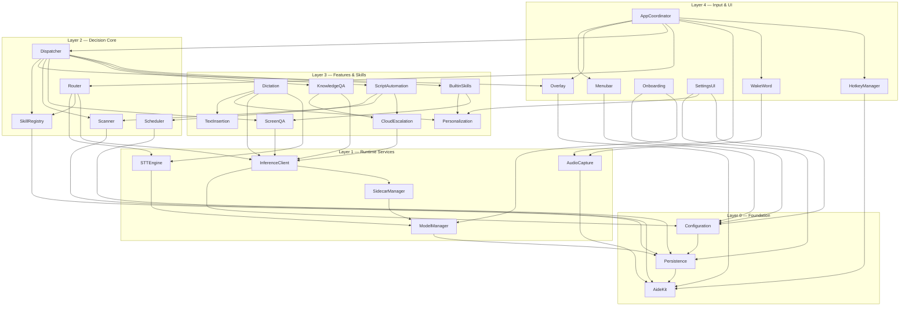

> **Cross-ref.** The mapping of these modules to physical SwiftPM targets, and the process boundary between the app and the Sidecar, is in `03-architecture.md`. Concrete public types per module are in `05-lld.md §Interfaces`.

---

## 3. Audio & Speech-to-Text Subsystem

**Modules:** `AudioCapture`, `STTEngine` · **Collaborators:** `HotkeyManager`, `WakeWord`, `Router`, `Dictation`, `ModelManager`.

### 3.1 Responsibilities

- **`AudioCapture`** owns the mic session and a mono PCM ring buffer at Whisper's expected sample rate. It is gated by the Push-to-Talk lifecycle: capture opens on hotkey keyDown and closes on keyUp. It emits Listening State transitions (`idle → listening → processing`) that the Overlay/Menubar render. It also exposes a continuous low-cost tap for `WakeWord` when that feature is enabled.
- **`STTEngine`** wraps whisper.cpp **in-process** via SwiftPM (per locked runtime decision — no subprocess for STT). It transcribes the captured buffer and returns transcript text **plus per-segment probability metadata**, which is the raw signal for the **Whisper Segment-Probability Pre-Gate**.

### 3.2 Batch-on-release (v1), buffer architected for streaming

Per the locked STT decision, v1 is **batch-on-release**: audio accumulates in the ring buffer while the hotkey is held; on release the whole utterance is handed to whisper.cpp in one batch. The buffer and the `STTEngine` interface are nonetheless shaped so a future streaming/partial-decode mode can be added without changing callers — the engine interface is defined around "append audio / finalize" semantics rather than "give me a file." The concrete buffer contract and the streaming-ready seam are in `05-lld.md`.

**Assumption (noted inline):** on a warm whisper.cpp context the batch decode of a typical utterance meets the PRD's ≤~2s command / ≤~3s dictation budgets on the 16GB reference machine; the engine keeps the model context warm between utterances rather than reloading per capture (residency governed by `ModelManager`, §4).

### 3.3 Whisper Segment-Probability Pre-Gate

whisper.cpp exposes per-segment confidence (average token logprob / no-speech probability). The **Pre-Gate** is the *first* of the safety signals feeding the Confidence Gate (§5): a transcript whose segments fall below a provisional probability floor is treated as a low-quality capture and biases the downstream decision toward prompt-back rather than execution. It is a **quality signal on the words**, distinct from the **Logprob-Derived Routing Confidence** which is a signal on the *routing decision*.

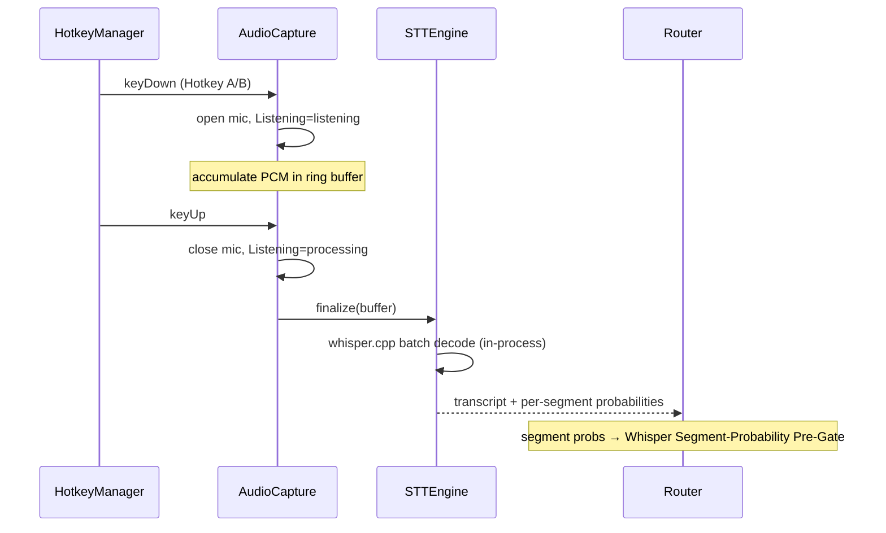

The exact probability thresholds are **provisional** and tuned by the calibration harness (§5.6); do not hardcode final values. See `05-lld.md` for the metadata shape and the Pre-Gate computation.

---

## 4. LLM Runtime & Sidecar Management

**Modules:** `SidecarManager`, `InferenceClient`, `ModelManager` · **Collaborators:** `Router`, `Dictation`, `ScreenQA`, `KnowledgeQA`, `CloudEscalation`, `Onboarding`, `Configuration`.

### 4.1 Sidecar lifecycle (`SidecarManager`)

`llama-server` is the **sole** Sidecar (locked). It is bundled and pinned. `SidecarManager`:

- Selects a **dynamic localhost port** at spawn (never a fixed port; avoids collisions and hardens against external connection).
- Spawns the pinned binary with the Tier-appropriate model path (from `ModelManager`).
- Runs a **health-check** poll against the server's readiness endpoint before declaring the Sidecar "ready"; the app stays responsive and shows a loading state until then.
- On crash/exit, **restarts with backoff** (bounded exponential), never taking the app down. Repeated failures surface a human-readable state in the Menubar (resilience NFR).

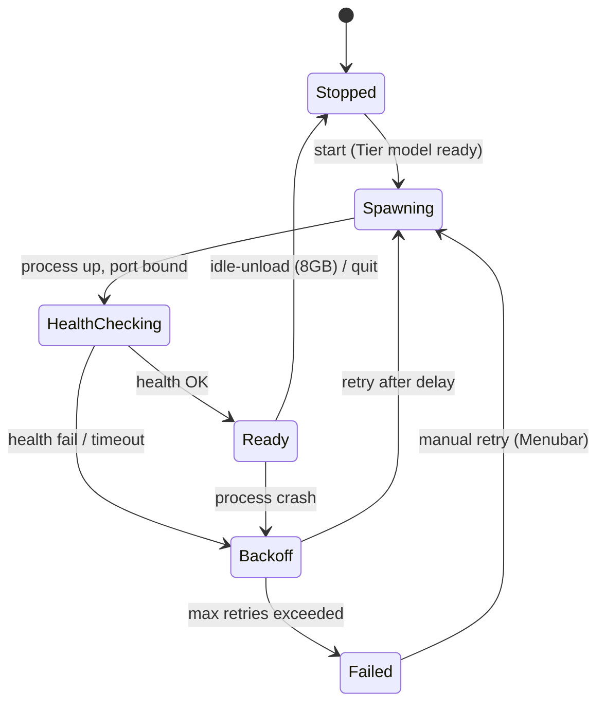

Concrete health-check endpoint, backoff schedule, and readiness criteria are in `05-lld.md`. The process-boundary rationale is in `03-architecture.md`.

### 4.2 The single OpenAI-compatible client (`InferenceClient`)

There is **one** client type for every LLM call — local Sidecar and cloud BYOK alike (locked). It abstracts an OpenAI-compatible chat/completions endpoint with:

- a **target** (local Sidecar on the dynamic port, or a configured BYOK base URL + key + model),
- optional **GBNF Grammar** constraint (used by the Router),
- optional **logprobs** request (used by the Router to derive routing confidence; and by the Pre-Gate's sibling logic),
- streaming for answer surfaces.

Because local and cloud share this one client, the difference between "local" and "cloud" is *only* the target selection — which is exactly what the Local/Cloud Indicator (§12) reflects. Cloud is never reached implicitly (INV-2/INV-4): only `CloudEscalation` selects a cloud target, and only after a user-visible action.

### 4.3 Model Residency & Tier policy (`ModelManager`)

| Tier | Trigger | STT model | LLM model | Residency |
|---|---|---|---|---|
| **16GB** | RAM ≥ 16GB (or override) | Whisper large-v3-turbo | Qwen3-8B Q4_K_M | LLM stays resident; follow-ups instant |
| **8GB** | RAM 8GB (or override) | Whisper small/medium* | Qwen3-4B Q4_K_M | LLM **unloads after idle**; reload on next use with brief visible loading state |

\* The 8GB Whisper variant (small vs medium) is a build-time calibration decision against Hindi / code-mixed audio; the app ships whichever is locked. `ModelManager` treats it as a Tier parameter.

`ModelManager` responsibilities: RAM detection & Tier proposal (consumed by `Onboarding`), pinned-commit + SHA-256 **resumable** downloads from official HF repos, on-disk verification, lazy load, and the 8GB **idle-unload** timer. On 8GB, any Session Context activity resets the unload timer; a follow-up arriving after unload triggers reload (never a dropped context — §11). Download/verify details and the residency timer live in `05-lld.md`.

---

## 5. Router & Intent Dispatch Subsystem

**Modules:** `Router`, `Dispatcher`, `SkillRegistry` (grammar/prompt source) · **Collaborators:** `InferenceClient`, `STTEngine`, `Scanner`, feature modules, `Overlay`.

This subsystem is the boundary between the probabilistic half (STT + LLM) and the deterministic half (Skills/scripts). It is the highest-stakes design in the app.

### 5.1 Router Contract v2 (amends PRD §6)

The Router emits strict JSON with **exactly three fields**: `intent` (short natural-language restatement), `skill_id` (a registered id or null), and `parameters`. **There is no `confidence` field** — that PRD field is removed. Confidence is *derived externally* from logprobs (§5.4), not self-reported by the model. This is the single most important amendment: a small model's self-rated confidence is unreliable, so we never ask for it.

The Router **always runs locally** (locked). Cloud handoff happens only later, at the answer/script layer — never at routing.

### 5.2 GBNF Grammar generation from the registry

The Router constrains generation with a **GBNF Grammar** produced by `SkillRegistry` from the current set of Manifests. The grammar makes the three-field envelope and the enumerated `skill_id` set structurally unforgeable — the model cannot emit an unknown skill id or malformed JSON. Both the **Router prompt fragment** (skill descriptions + parameter schemas) and the **grammar** are *generated*, never hand-maintained (locked); adding/removing a Skill regenerates both. The generation rules are in `05-lld.md`; the registry mechanics are §6.

### 5.3 Schema validation = HARD rejection

After the (grammar-shaped) JSON is produced, `parameters` are validated against the selected Skill's parameter JSON-schema from its Manifest. **Validation failure is a HARD rejection** (locked) — it is not "low confidence, maybe proceed"; it drops to prompt-back. This is stricter than the PRD's "treat as low confidence."

### 5.4 Logprob-Derived Routing Confidence

Confidence is computed from the **logprobs at the `skill_id`-selecting tokens**. Because the GBNF Grammar renormalizes the distribution over only the legal continuations, the logprob at the decisive token is a meaningful, calibrated-over-time measure of how sharply the model chose *this* skill versus its legal alternatives. This value — not a model-authored number — feeds the Confidence Gate.

### 5.5 The Confidence Gate (assembled from three signals)

The **Confidence Gate** is the deterministic decision that decides execute vs. Confirm-Back vs. prompt-back. It combines:

1. **Whisper Segment-Probability Pre-Gate** (§3.3) — was the *speech* clean?
2. **Logprob-Derived Routing Confidence** (§5.4) — was the *routing choice* sharp?
3. **Schema validation** (§5.3) — hard pass/fail on parameters.

…and then applies the **per-Manifest Risk Tier**:

| Risk Tier | Gate outcome |
|---|---|
| **low** | Execute on pass (silent). |
| **confirm** | Silent execute when routing logprob is **high**; **Confirm-Back** when **marginal**. |
| **always_confirm** | **Always Confirm-Back** (destructive skills), regardless of how sharp the routing was. |

`skill_id: null`, a failed schema validation, or a below-floor Pre-Gate/logprob all short-circuit to **prompt-back** ("Did you mean…?") — **never guess-execute** (INV-5, PRD §6 rule preserved). The Dispatcher owns this decision; the Router only produces the validated envelope + confidence signal.

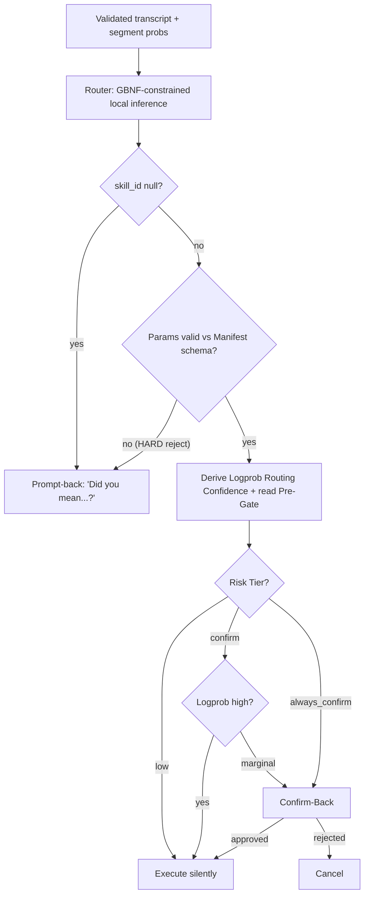

### 5.6 Dispatch & prompt-back

On a clean gate, `Dispatcher` invokes the target — a Built-in Skill (Swift), a Script-Automation (Frozen script, via Scanner first — §8), or a Q&A capability (KnowledgeQA/ScreenQA). Prompt-back and Confirm-Back are rendered by the Overlay (non-destructive cases) or the separate ordinary modal (typed/destructive confirmation that needs focus — §13).

### 5.7 Day-one calibration harness

Per the locked decision, thresholds are **not** guessed to final values. A **calibration-logging harness** ships day one: it records, for each routed utterance, the segment probabilities, the routing logprobs at the decisive tokens, the chosen skill, and the eventual outcome (executed / corrected / prompted-back). Over ~1 week this data calibrates the Pre-Gate floor and the logprob high/marginal boundaries. Meanwhile **loose provisional thresholds** are used. The harness writes locally only (INV-7). Its record shape is in `05-lld.md`; the Router state machine is also there.

---

## 6. Skill & Automation System

**Modules:** `SkillRegistry`, `BuiltinSkills`, `ScriptAutomation` · **Collaborators:** `Router` (grammar/prompt), `Dispatcher`, `Scanner`, `Scheduler`, `CloudEscalation`, `Persistence`.

### 6.1 One Manifest, one registry (locked)

Built-in Skills and User Script-Automations share **one JSON Manifest schema and one registry**. A Manifest declares: `id`, `description` (feeds the Router prompt), parameter JSON-schema, declared permissions (network? file-write paths?), optional schedule, `enabled` flag, failure counter, and **Risk Tier** (`low | confirm | always_confirm`). The concrete schema is in `05-lld.md`.

| | Built-in Skill | User Script-Automation |
|---|---|---|
| Implementation | Native Swift function (in `BuiltinSkills`) | JSON Manifest + **Frozen** shell script file |
| Author | Ships with app | Generated on user request, then user-owned/editable |
| Risk Tier | Assigned per skill (e.g. media = low, destructive ops = always_confirm) | Assigned at approval; scripts default toward `confirm`/`always_confirm` |
| Regeneration | n/a | **Never** regenerated per run (Frozen) |

`SkillRegistry` is the single source that generates both the Router prompt fragment and the GBNF Grammar (§5.2). This keeps the probabilistic layer's vocabulary and the deterministic layer's capabilities in lockstep by construction.

### 6.2 v1 Built-in Skill set

Open/quit application · set timer / reminder (local notification) · media control (system media keys) · take screenshot (file + feed into Screen Q&A) · simple recurring reminders · "correct that: X should be Y" (feeds Personalization Dictionary) · weather (Open-Meteo, keyless, `network:true`, disclosed once) · current time/date & timezones · calculations and unit/currency conversions (currency via Frankfurter, disclosed once) · calendar read via EventKit (optional/skippable permission). General-knowledge Q&A is a first-class *capability*, not a registry Skill (§11).

> **Locked rule.** Simple recurring things (reminders, app-launch-at-time) compile to **parameterized declarative actions** run by Aide's own Scheduler — **not** LLM-generated shell scripts. The LLM only extracts intent + parameters. See §7.

### 6.3 User Script-Automation lifecycle

```mermaid
flowchart LR
  D[1. Describe intent by voice/text] --> G[2. Generate script + Manifest\n(cloud-preferred per BYOK policy)]
  G --> S[3. Scanner pass on generated script]
  S --> R[4. Review: full script shown,\nflagged lines highlighted]
  R -->|approve| F[5. Freeze: write user-owned file]
  R -->|reject/edit| G
  F --> REG[6. Register in SkillRegistry\n+ Scheduler if scheduled]
  REG --> RUN[Deterministic thereafter]
```

The critical invariants: **nothing runs before explicit approval**; the script is shown **in full**; on approval it is **Frozen** (stored as a user-editable file, never regenerated per run — locked); every execution *and* every hand-edit re-triggers the Scanner (§8). The generation step is cloud-preferred (BYOK) because small local models write buggy shell scripts (§12), but falls back to local with a visible "results may be rougher" caveat when no key is configured. Execution guardrails (per-run timeout, local stdout/stderr logging, auto-disable after N consecutive failures) are owned by the Scheduler (§7).

---

## 7. Scheduling Subsystem

**Module:** `Scheduler` · **Collaborators:** `ScriptAutomation`, `BuiltinSkills`, `SkillRegistry`, `Persistence`, launchd.

### 7.1 Two kinds of scheduled work

| Kind | Executed by | Example |
|---|---|---|
| **Parameterized declarative action** | Aide's own Scheduler code (deterministic Swift) | "get up and walk every 30 minutes," "launch Mail at 9am" |
| **Frozen script automation** | launchd runs the Frozen script | "run a prod sanity check every morning" |

The locked rule keeps the common 80% (reminders, timed launches) as declarative parameters the LLM merely fills in — never generated shell. Only genuinely arbitrary logic becomes a Frozen script.

### 7.2 launchd Agents

Each scheduled item registers a **launchd Agent** (user agent — never root; a launchd user agent never needs it, and no voice-triggerable path to root exists, per the Scanner's `sudo` Hard-Block). `Scheduler`:

- writes/loads/unloads the agent plists,
- honors **catch-up across sleep/wake** using launchd's missed-run semantics (a run whose time passed while asleep fires on wake),
- enforces a **per-run timeout**,
- captures stdout/stderr to local human-readable logs (`Persistence`),
- increments the Manifest failure counter and **auto-disables after N consecutive failures**, posting a notification — never silent-fail forever.

```mermaid
sequenceDiagram
  participant SC as Scheduler
  participant LD as launchd
  participant FS as Frozen Script
  participant SCAN as Scanner
  participant LOG as Persistence(logs)
  SC->>LD: register user agent (plist from Manifest)
  Note over LD: time fires (or catch-up on wake)
  LD->>SC: launch job
  SC->>SCAN: re-scan Frozen script (pre-execution)
  SCAN-->>SC: pass / Hard-Block / Confirm
  SC->>FS: run with per-run timeout
  FS-->>SC: exit code + stdout/stderr
  SC->>LOG: append run log
  alt failure
    SC->>SC: failureCounter++ ; if >= N disable + notify
  else success
    SC->>SC: reset failureCounter
  end
```

Every scheduled Frozen-script execution passes through the Scanner **before running** (§8) — hand-edits between runs are therefore caught. Concrete plist mapping, timeout values, and the failure-count N are in `05-lld.md`.

---

## 8. Dangerous-Command Safety Subsystem

**Module:** `Scanner` · **Collaborators:** `ScriptAutomation`, `Scheduler`, `Dispatcher`, `Dictation`, `Overlay`, the separate destructive-confirm modal.

### 8.1 Two-layer guard (LLM self-censoring is NOT sufficient)

- **Layer 1 — deterministic Scanner.** Swift, in-process, **pattern-based** (not LLM-based; cannot be prompt-injected). It performs **recursive descent** into pipes, `$()`, backticks, and `sh -c` so payloads hidden one level down are still inspected. It treats all strings as **data** and **never executes** anything (INV-6). It classifies each match as **Hard-Block** (e.g. `sudo` — no override path in v1) or **Confirm** (destructive but overridable).
- **Layer 2 — escalated confirmation UI.** Non-hard-blocked matches are highlighted with a plain-language risk explanation and require an **explicit, distinct** confirmation (typed confirmation or a destructive-styled button in the separate modal — §13), different from the normal approve action.

Default posture is **strict**: false positives (over-confirming) are acceptable; false negatives are not.

### 8.2 Scanner placement — the trigger points

Per locked scope, the Scanner guards **executable channels only** — not prose Q&A.

| Trigger point | When | Outcome |
|---|---|---|
| **1. On generated script (before display)** | Right after LLM generates a Script-Automation | Flag lines in the review view |
| **2. Before every execution** | Every scheduled/manual run of a Frozen script | Re-scan (catches hand-edits) |
| **3. On hand-edit** | User edits a Frozen script | Re-scan before re-registration |
| **4. Dictated/typed one-off command** | Before a one-off command is printed or run | Scan as data |
| **5. Terminal-dictation destination check** | Dictation Mode inserting into a terminal emulator (bundle-ID allowlist) | **Confirm-Back with override** |

Points 1–4 are the PRD's three script/command trigger points plus the one-off command path. Point 5 is the **destination-aware** rule: when Dictation targets a terminal emulator (matched by a bundle-ID allowlist), the inserted text is treated as a potential command and routed through a Confirm-Back **with override** — because the user may legitimately be dictating a command. **Hard-Block-with-no-override is reserved for Aide-generated automations** (points 1–3), where there is no legitimate reason to bypass; user-dictated terminal input always retains an override.

```mermaid
flowchart TD
  subgraph Executable channels
    A1[Generated script] --> S
    A2[Pre-execution] --> S
    A3[Hand-edit] --> S
    A4[Dictated/typed one-off cmd] --> S
    A5[Dictation into terminal\n(bundle-ID allowlist)] --> S
  end
  S[Scanner: recursive descent\npipes / $() / backticks / sh -c] --> C{Match class}
  C -- sudo / priv-esc\n(Aide automation) --> HB[Hard-Block\nno override]
  C -- destructive, overridable --> CB[Confirm-Back\ndistinct confirmation]
  C -- clean --> OK[Proceed]
  CB -->|typed/destructive-styled confirm| OK
  CB -->|cancel| STOP[Blocked]
  P[Prose Q&A text] -. never scanned .-> OK
```

The blocklist patterns (sudo/privilege escalation, destructive `rm`/`srm`/`shred`, piped remote execution, `dd`/`diskutil erase`/`mkfs`, `chmod -R 777`, writes outside `$HOME` and into system-critical `~/Library`, `kill -9 -1`/killall of system processes, `launchctl` touching Aide's own jobs, shell-profile edits, `crontab -r`, `nvram`/`csrutil`/`spctl`/keychain dumps, fork bombs, base64-decode-then-exec, `eval` of constructed strings) and the Hard-Block vs Confirm partition are enumerated in `05-lld.md`. The parser is to be extended aggressively per the strictness rule.

---

## 9. Dictation Subsystem

**Module:** `Dictation` · **Collaborators:** `AudioCapture`, `STTEngine`, `InferenceClient`, `Personalization`, `TextInsertion`, `Scanner` (terminal destination), `Configuration` (Tone Preset).

### 9.1 Flow

Hotkey B (Push-to-Talk) → capture → Whisper transcribe → **single tone-aware cleanup pass** (local LLM) → Text Insertion at cursor. There is exactly **one** cleanup pass (locked default), tone-aware per the active Tone Preset.

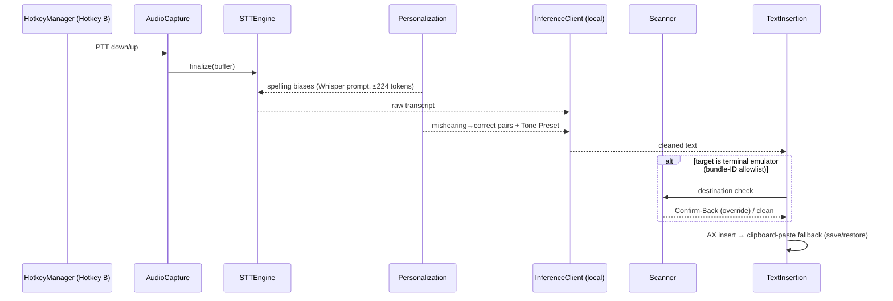

### 9.2 Tone Presets

`As-is` (default — fix grammar, remove filler, keep the user's voice), `Professional`, `Casual`, `Concise`. Selectable in Settings and via quick-switch (a voice prefix like "professional tone: …" is acceptable). Custom tones are out of v1 scope. The active preset parameterizes the single cleanup pass's prompt.

### 9.3 Personalization Dictionary consumption

`Dictation` consumes the Personalization Dictionary in two bounded places (§15 owns the store):

- **Correct spellings → Whisper bias prompt**, prioritized by recency/frequency and capped at Whisper's **~224-token** prompt limit.
- **Mishearing→correct pairs → the cleanup LLM prompt.**

Both consumers stay bounded forever (MRU cap). No model training anywhere.

### 9.4 Text Insertion (AX-first, clipboard-paste fallback)

`TextInsertion` inserts **AX-first** via the Accessibility API; when an app rejects AX insertion (notably Electron), it falls back to **clipboard-paste with save/restore** of the user's prior clipboard. A **per-app allow/deny map** records which apps need the fallback. If the destination is a terminal emulator, the Scanner destination check (§8.2 point 5) runs first.

---

## 10. Screen Q&A Subsystem

**Module:** `ScreenQA` · **Collaborators:** `BuiltinSkills` (screenshot), Apple Vision, `InferenceClient`, `Overlay`, `KnowledgeQA` (Session Context).

### 10.1 Flow

User asks about the screen in Command Mode → full-screen `screencapture` → **Apple Vision OCR** at native resolution preserving rough spatial layout via **Bounding Boxes** → assemble prompt (OCR text + layout hints + user question) → **local text LLM** → answer in the **Overlay**.

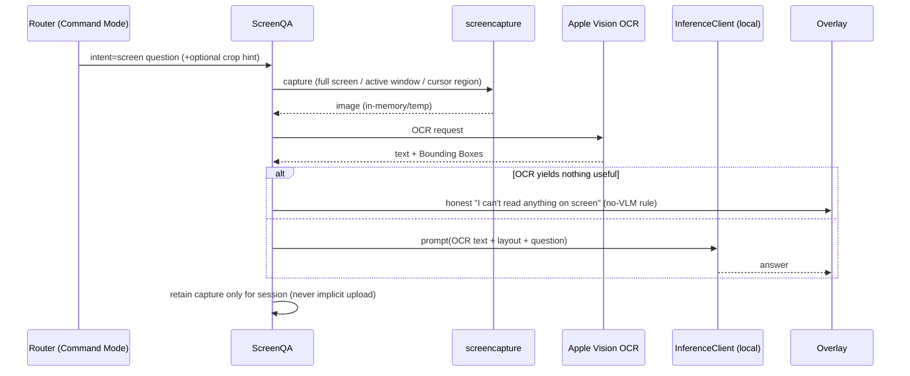

### 10.2 No-VLM honesty rule

There is **no VLM** in v1. If OCR yields nothing useful (pure image content), `ScreenQA` says so honestly rather than hallucinating. Screenshot files are processed in memory/temp and not retained beyond the session unless the user saves one; they are **never uploaded implicitly** (INV-2).

### 10.3 Optional crop

When the query implies a region ("what does this button do"), `ScreenQA` may crop to the active window or cursor region to improve signal. The captured OCR text becomes part of the rolling Session Context (§11) so follow-ups work.

---

## 11. General-Knowledge Q&A & Session Context

**Module:** `KnowledgeQA` · **Collaborators:** `Router`, `InferenceClient`, `CloudEscalation`, `ModelManager`, `Overlay`, `ScreenQA`.

### 11.1 Local answering (first-class)

"Who is X," "explain OAuth," "capital of Australia" — the Router recognizes general questions and the **local LLM answers directly**. This is a first-class capability, not an edge case; without it Aide feels like a launcher, not an assistant. It is **not a user-managed registry Skill** (§6.2), but the Router still needs a deterministic id to emit for it: `general_qa` (and, symmetrically, `screen_qa`) are **reserved built-in router targets** — fixed alternatives in the GBNF Grammar that the Router selects like any Skill (logprob read at the selecting token), which the Dispatcher routes to the `KnowledgeQA` / `ScreenQA` capabilities. `skill_id: null` is reserved exclusively for "nothing matched → prompt-back" (§5.5) and never denotes GK.

### 11.2 ⟨UNSURE⟩ uncertainty flow

Local answers are the default. The system prompt aggressively instructs the model to prefer admitting uncertainty over guessing (time-sensitive/post-cutoff facts, long-tail specifics), and to emit the **⟨UNSURE⟩ Sentinel Token** on an **exact match** when it cannot reliably answer. App-side behavior on the Sentinel is deterministic:

- **BYOK key configured →** offer one-tap/one-phrase **Offload** to the cloud model (or auto-Offload if the user enabled that preference).
- **No key →** respond with the **teach-BYOK** message ("I'm not sure about this — add a cloud API key in Settings to get reliable answers for questions like this"). The no-key state teaches *why* BYOK exists rather than shrugging.

This honesty protocol reduces but cannot eliminate hallucination (small-model self-knowledge is imperfect) — stated honestly per the PRD.

```mermaid
flowchart TD
  Q[General question] --> L[Local LLM answer]
  L --> U{Contains ⟨UNSURE⟩?}
  U -- no --> A[Show answer in Overlay]
  U -- yes --> K{BYOK key?}
  K -- yes, auto-Offload on --> O[Offload to cloud\n(Local/Cloud Indicator flips)]
  K -- yes, manual --> OFFER[Offer one-tap/phrase Offload]
  OFFER -->|accept| O
  K -- no --> T[Teach-BYOK message]
```

### 11.3 Rolling Session Context & automatic continuation

`KnowledgeQA` owns a **rolling Session Context**: the last ~6–8 exchanges plus the most recent Screen Q&A OCR capture, held in the LLM context for the session. **Continuation detection is automatic**: on every utterance the Router (which sees the Session Context) classifies fresh-command vs. follow-up — no user action required. "New topic" is an optional override, not the mechanism. A follow-up wrongly matched at low confidence is caught by the standard prompt-back rule (§5). Context is bounded, fully local, and screen content in context obeys INV-2.

### 11.4 Idle expiry & 8GB model-reload

Session Context expires on **idle timeout (default 8 min)** or explicit "new topic." On the **16GB** Tier the LLM stays resident so follow-ups are instant. On **8GB**, session activity resets the idle-unload timer; if the model has already unloaded, a follow-up triggers **reload with a brief visible loading state** — never a failure or a dropped context (coordinated with `ModelManager`, §4.3).

---

## 12. Cloud Escalation / BYOK Subsystem

**Module:** `CloudEscalation` · **Collaborators:** `InferenceClient`, `KnowledgeQA`, `ScriptAutomation`, `Configuration` (BYOK), `Overlay`/`Menubar` (Local/Cloud Indicator).

### 12.1 One client, two targets

Cloud escalation reuses the **single OpenAI-compatible `InferenceClient`** (§4.2); "cloud" is just a different target (BYOK base URL + key + model name). `CloudEscalation` is the *only* module that selects a cloud target, and it does so only after a user-visible action (INV-2/INV-4). Cloud is **never** an automatic fallback and there is **no auto "too hard for local" detection**.

### 12.2 The two Offload flows

| Flow | Trigger | Default policy |
|---|---|---|
| **Script/automation generation** | User asks to create a Script-Automation | **Cloud-preferred if a BYOK key exists** (small local models write buggy shell scripts). No key → local with a visible "results may be rougher" caveat. |
| **Uncertain Q&A** | Local answer emitted ⟨UNSURE⟩ (§11.2) | Offer one-tap/phrase Offload; or auto-Offload if enabled; no key → teach-BYOK message. |

Everything else stays local unless the user explicitly says "ask the big model."

### 12.3 Local/Cloud Indicator

Before any request leaves the machine, `CloudEscalation` flips the **Local/Cloud Indicator** in the Overlay/Menubar (INV-3). The indicator is subtle but unambiguous. Screenshots and audio are never part of a cloud request unless the user takes a distinct, labeled action to include them.

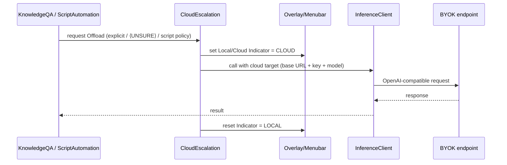

---

## 13. Overlay & Menubar UI Subsystem

**Modules:** `Overlay`, `Menubar` · **Collaborators:** `AppCoordinator`, `Dispatcher`, all feature modules, the separate modal.

### 13.1 Overlay (non-activating NSPanel)

The Overlay is a **non-activating NSPanel + SwiftUI** (locked) — it shows feedback **without stealing focus** from the user's current app (critical for Dictation/Text Insertion). It renders: Listening State, transcription-in-progress, router result, Screen/Knowledge Q&A answers, non-destructive prompt-back and Confirm-Back, and the Local/Cloud Indicator.

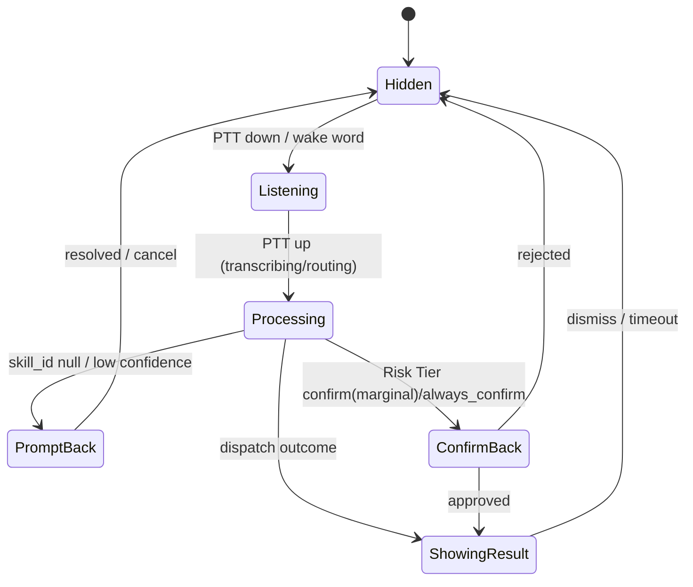

### 13.2 Menubar (MenuBarExtra)

The Menubar App is a **MenuBarExtra** menu (separate from the Overlay) — no Dock icon by default. It surfaces status, the Local/Cloud Indicator, Sidecar health, quick toggles, and entry to Settings. Listening State feedback appears in **both** the Menubar and the Overlay (mandatory feedback per PRD §5), with an optional audio cue.

### 13.3 The separate modal for destructive/typed confirmation

Confirmations that **need focus** — typed confirmation, destructive-styled buttons for Scanner Confirm-Back (§8) — use a **separate ordinary modal**, not the non-activating Overlay. This is deliberate: destructive confirmation must be able to take focus and demand a distinct, unmistakable action, whereas the Overlay must *not* take focus during normal flow.

---

## 14. Onboarding & Permissions Subsystem

**Module:** `Onboarding` · **Collaborators:** `ModelManager`, `Configuration`, TCC-gated system frameworks, System Settings deep-links.

macOS permission UX is load-bearing: a broken first-run kills the app. The flow (locked ordering):

1. **Welcome + one-paragraph privacy promise** (local-first, what it means).
2. **RAM detection → proposed Tier → confirm/override** (via `ModelManager`).
3. **Model downloads** with clear progress + sizes (~2–7GB total; the one unavoidable wait). App stays responsive; downloads **resumable**.
4. **Permission walkthrough, one at a time**, each with a plain-language "why," each **deep-linking** to the exact System Settings pane, with the app **detecting the grant and auto-advancing**:
   - Microphone (STT) · Input Monitoring (global hotkey) · Accessibility (Text Insertion) · Screen Recording (Screen Q&A) · Calendar (schedule queries — optional/skippable).
   - Also discloses **once** the two keyless utility network calls (weather Open-Meteo, currency Frankfurter) as the only implicit network traffic besides model downloads.
5. **Hotkey setup** (sensible defaults offered).
6. **Guided first success** ("Hold ⌥Space and say: *open Safari*"), then a first Dictation into a text field.
7. **Graceful degradation:** any denied permission disables **only** the dependent features, with a persistent, actionable fix-it hint in Settings — never mysterious breakage.

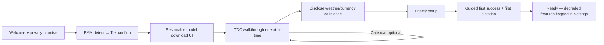

TCC deep-link targets, grant-detection polling, and the per-permission degradation map are in `05-lld.md`.

---

## 15. Settings & Personalization Subsystem

**Modules:** `SettingsUI`, `Personalization` · **Collaborators:** `Configuration`, `Persistence`, `HotkeyManager`, `ModelManager`, `CloudEscalation`.

### 15.1 Settings surfaces

Over `Configuration`: rebind Hotkey A / Hotkey B (via `HotkeyManager`); Tier override (via `ModelManager`); Tone Preset selection; **BYOK config** (base URL + key + model, and auto-Offload toggle); Wake Word Experimental toggle (off by default); one-click **Wipe history** (§16); per-app AX/clipboard allow-deny visibility; graceful-degradation fix-it hints for denied permissions.

### 15.2 Personalization Dictionary (explicit-only v1)

`Personalization` owns the single bounded Personalization Dictionary — the one source of truth, **no model training anywhere**.

- **v1 population is explicit-only:** the "correct that: X should be Y" command. (Auto-edit-detection is deferred.)
- **Entry shape:** correct term + known mishearings + occurrence counter + last-used timestamp.
- **Extraction:** the local LLM diffs original vs corrected and extracts changed **term pairs** only; raw before/after pairs are discarded after extraction (never stored long-term, never accumulated in prompts).
- **Promotion:** explicit "correct that" promotes immediately; (future implicit corrections would promote at a small threshold).
- **Bounded:** hard cap with **MRU eviction**; both consuming prompts stay bounded forever.
- **Consumption:** spellings → Whisper bias prompt (≤~224-token cap, recency/frequency-prioritized); pairs → dictation cleanup prompt (§9.3).
- **UI:** viewable/editable/deletable list with manual add (doubles as the custom-vocabulary feature).

The dictionary schema and MRU/eviction algorithm are in `05-lld.md`.

---

## 16. Data & Storage Subsystem

**Module:** `Persistence` · **Collaborators:** every module that persists; `SettingsUI` (wipe).

### 16.1 Application Support layout (overview)

Everything lives under `~/Library/Application Support/Aide/`: settings, Personalization Dictionary, Skill Registry (Manifests), user Frozen scripts, transcripts/command history, script execution logs, and downloaded models (models may alternatively live in `~/Library/Caches`; the decision is deferred to `05-lld.md`, but they must be user-discoverable). Logs are **local, plain, human-readable** files. Calibration-harness records (§5.7) are local-only. Zero telemetry (INV-7).

The concrete directory tree, file formats, and atomic-write strategy are in `05-lld.md`.

### 16.2 One-click wipe

Settings offers **one-click "Wipe all history"**: transcripts, command log, script logs — **not** settings, scripts, or dictionary unless separately chosen. This makes the trust promise operable, not just stated.

---

## 17. Key Interfaces Between Modules

Conceptual boundaries only. **Concrete signatures, protocols, and types are deferred to `05-lld.md §Interfaces`.** Each row is a stable seam other modules program against.

| # | Boundary (provider → consumer) | Conceptual contract | Notes |
|---|---|---|---|
| I-1 | `AudioCapture` → `STTEngine` | Append PCM / finalize utterance | Streaming-ready seam; v1 finalize-on-release |
| I-2 | `STTEngine` → `Router`/`Dictation` | Transcript + per-segment probabilities | Feeds Whisper Segment-Probability Pre-Gate |
| I-3 | `SidecarManager` → `InferenceClient` | Ready target (dynamic port) + health state | Backoff/restart hidden from consumers |
| I-4 | `InferenceClient` → all LLM callers | Chat/completions with optional GBNF + logprobs, local **or** cloud target | Single client for local & cloud |
| I-5 | `ModelManager` → `SidecarManager`/`STTEngine` | Tier-selected model paths + residency events | Lazy load; 8GB idle-unload/reload |
| I-6 | `SkillRegistry` → `Router` | Generated Router prompt fragment + GBNF Grammar | Regenerated on registry change |
| I-7 | `Router` → `Dispatcher` | Validated Contract v2 envelope + Logprob-Derived Routing Confidence | No `confidence` field in JSON; derived externally |
| I-8 | `Dispatcher` → Skills/Q&A | Dispatch after Confidence Gate + Risk Tier | Prompt-back/Confirm-Back owned here |
| I-9 | `Scanner` → callers | Scan result: clean / Confirm / Hard-Block + flagged spans | Data-only; never executes |
| I-10 | `Scheduler` → launchd | Manifest schedule → user agent plist; run results | Catch-up, timeout, auto-disable |
| I-11 | `Personalization` → `STTEngine`/`Dictation` | Bounded spelling biases + mishearing pairs | ≤~224-token Whisper cap |
| I-12 | `ScreenQA` → `InferenceClient` | OCR text + Bounding Boxes + question → answer | No-VLM honesty rule |
| I-13 | `KnowledgeQA` ↔ `Router` | Rolling Session Context (read for continuation, updated per exchange) | Auto continuation detection |
| I-14 | `CloudEscalation` → `Overlay`/`Menubar` | Local/Cloud Indicator transitions | Precedes any egress |
| I-15 | feature modules → `Overlay`/modal | Listening State, results, prompt-back, Confirm-Back | Non-activating panel vs focus modal |
| I-16 | `Configuration`/`Persistence` → all | Typed settings + Application Support I/O + wipe | Atomic writes |

---

## 18. End-to-End Feature Sequence Diagrams

Each diagram is the HLD-level end-to-end view; **`06-walkthrough.md` carries the step-by-step narrative** for the same scenarios. Concrete data shapes are in `05-lld.md`.

### 18.1 Command Mode → Built-in Skill (happy path)

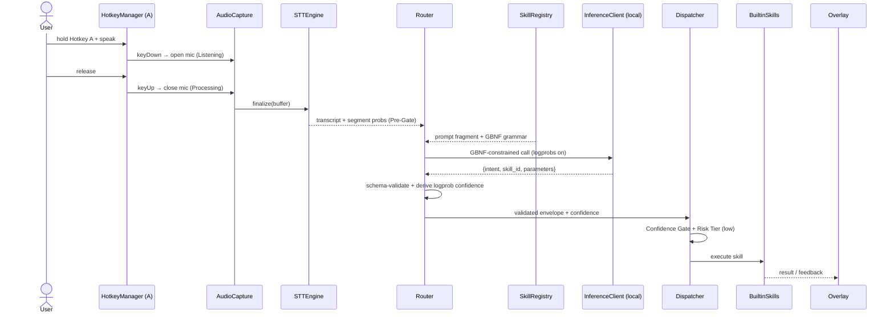

### 18.2 Dictation with tone cleanup

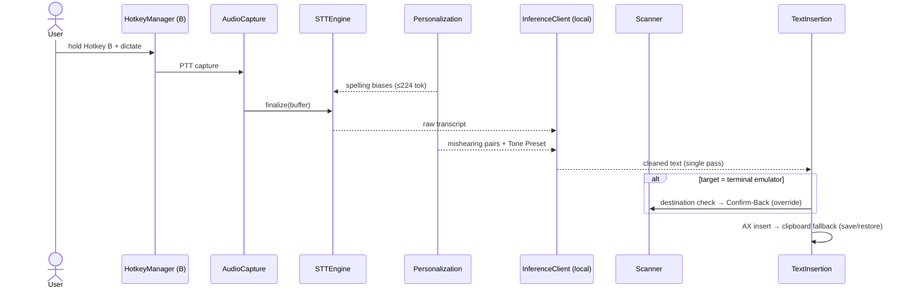

### 18.3 Screen Q&A

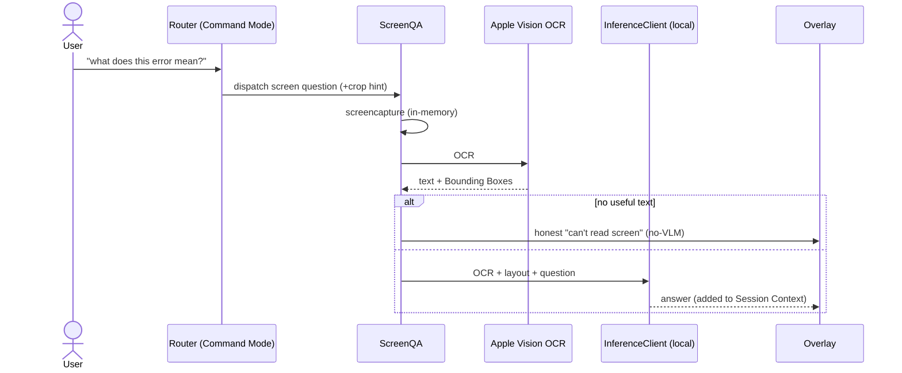

### 18.4 Knowledge Q&A with ⟨UNSURE⟩ → BYOK Offload

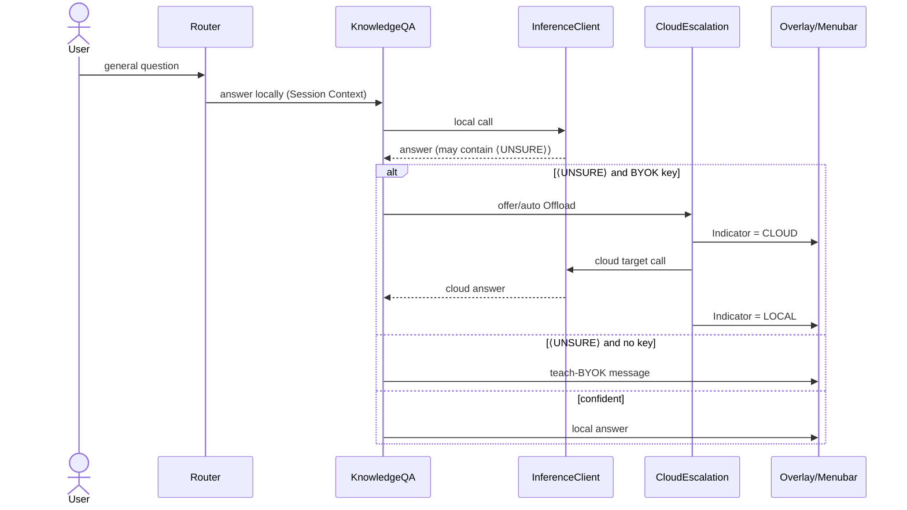

### 18.5 User Script-Automation creation (describe → Frozen → register)

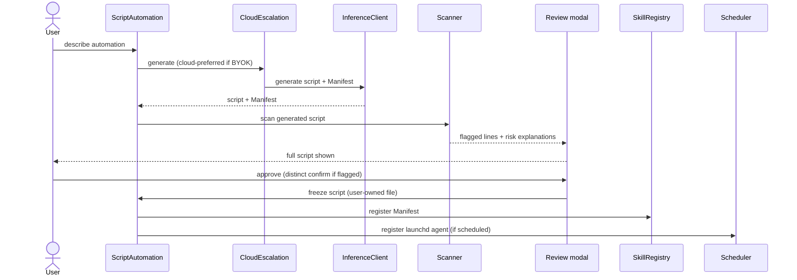

### 18.6 Scheduled run with Scanner re-check & failure handling

```mermaid
sequenceDiagram
  participant LD as launchd
  participant SCH as Scheduler
  participant SC as Scanner
  participant FS as Frozen Script
  participant LOG as Persistence(logs)
  participant N as Notification
  Note over LD: time fires (or catch-up on wake)
  LD->>SCH: launch job
  SCH->>SC: re-scan Frozen script (pre-exec)
  alt Hard-Block (Aide automation, e.g. sudo)
    SC-->>SCH: blocked → do not run
    SCH->>N: notify blocked
  else clean / Confirm resolved
    SCH->>FS: run with per-run timeout
    FS-->>SCH: exit code + stdout/stderr
    SCH->>LOG: append run log
    alt failure
      SCH->>SCH: failureCounter++ ; if ≥ N → disable
      SCH->>N: notify (auto-disabled after N)
    else success
      SCH->>SCH: reset counter
    end
  end
```

---

*End of `04-hld.md`. For concrete schemas, signatures, grammars, thresholds, and state tables, proceed to [`05-lld.md`](./05-lld.md). For the structural/process view, see [`03-architecture.md`](./03-architecture.md). For narrative traces of the flows above, see [`06-walkthrough.md`](./06-walkthrough.md).*
