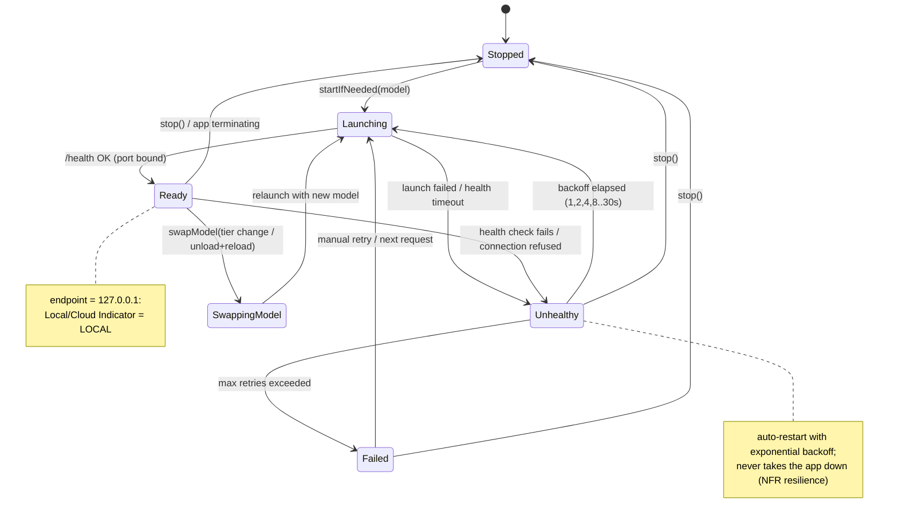
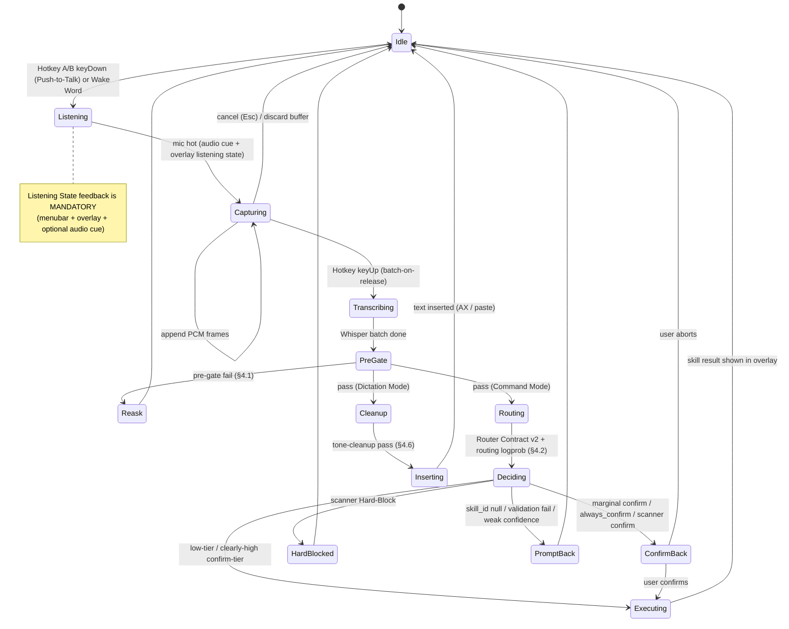
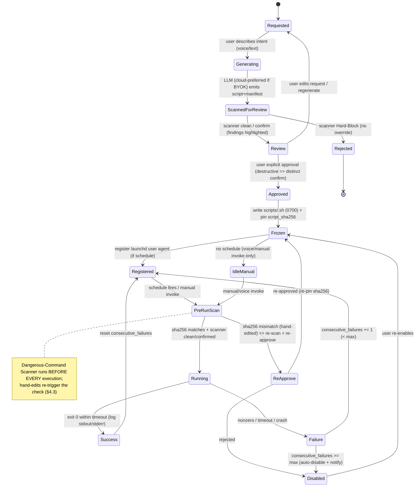

# Aide — Low-Level Design (LLD)

> **Document role.** This is the most concrete document in the Aide spec set. It is authoritative for implementation agents: the schemas, grammars, Swift signatures, algorithms, and state machines here are meant to be transcribed into code with minimal interpretation. Where a subsystem needs *why* / *shape* context, read up to [`04-hld.md`](./04-hld.md) (per-subsystem HLD) and [`03-architecture.md`](./03-architecture.md) (structural architecture + cross-cutting concerns). Terms in **bold-on-first-use** are defined in [`02-glossary.md`](./02-glossary.md) and used here exactly as canonicalized there. The rationale for the product constraints traces to [`01-problem-to-solve.md`](./01-problem-to-solve.md).

---

## 1. Purpose & Conventions

### 1.1 Purpose

This document specifies the buildable detail of Aide: on-disk data schemas, wire contracts, Swift protocol/type surfaces, the exact algorithms (as numbered steps or pseudocode), the subsystem state machines, prompt templates, the calibration harness, and the security/permissions detail. It does **not** re-argue product decisions — those are locked in the PRD and summarized in [`03-architecture.md`](./03-architecture.md). It *does* pin down every interface an implementer would otherwise have to invent.

### 1.2 Conventions

- **JSON Schema dialect:** JSON Schema **Draft 2020-12** (`$schema: "https://json-schema.org/draft/2020-12/schema"`). All persisted JSON documents carry an integer `schema_version` (starts at `1`) for forward-migration.
- **JSON key style:** `snake_case` for all Aide-owned documents. The one exception is the OpenAI-compatible wire payloads to the **Sidecar (llama-server)** / cloud, which follow OpenAI's field names verbatim.
- **Swift:** Swift 5.10+ / Swift 6 concurrency mode enabled where feasible. Signatures in this doc are *sketches* — they fix names, argument order, error surfaces, and threading annotations, not final bodies. `async` implies structured concurrency; `@MainActor` annotations are load-bearing (see [§10](#10-concurrency--threading-detail)).
- **Requirement keywords:** **MUST / MUST NOT / SHOULD / MAY** per RFC 2119. A **MUST** here is a correctness or safety invariant; violating one is a bug.
- **Provisional values** (thresholds, timeouts, caps) are marked `PROVISIONAL` and are inputs to the calibration harness ([§7](#7-confidence--threshold-calibration-harness)), not final constants. They live in one `Defaults` namespace, never inlined at call sites.
- **Assumptions** the PRD/locked-decisions left open are marked inline as **[ASSUMPTION]**. They are safe defaults, overridable without architectural change.
- **Platform:** Apple Silicon only, macOS 14+, reference machine M2 / 16GB. No Intel, no `x86_64` paths.
- **Paths:** `$APPSUP` denotes `~/Library/Application Support/Aide/`. `$CACHES` denotes `~/Library/Caches/Aide/`.

### 1.3 Terminology anchors used throughout

**Command Mode** (route → **Skill**) vs **Dictation Mode** (transcribe → tone cleanup → insert). **Router** emits **Router Contract v2** `{intent, skill_id, parameters}` — **no confidence field**. Safety composes from the **Whisper Segment-Probability Pre-Gate**, **Logprob-Derived Routing Confidence**, parameter-schema validation (**hard rejection**), the per-manifest **Risk Tier** (`low | confirm | always_confirm`), and the **Dangerous-Command Scanner** (**Hard-Block** vs **Confirm**). Marginal cases surface as a **Confirm-Back**. See [`02-glossary.md`](./02-glossary.md).

---

## 2. Data Schemas & Formats

### 2.1 Skill / Automation Manifest JSON Schema

One schema covers **Built-in Skills** (Swift-backed) and **User Script-Automations** (JSON **Manifest** + a **Frozen Script** file). The **Skill Registry** ([§3.1](#31-skillregistry--dispatcher)) loads and validates every manifest at startup; an invalid manifest disables *that* skill only (never a crash), surfacing an error state ([§9](#9-error-taxonomy--handling)).

```json
{
  "$schema": "https://json-schema.org/draft/2020-12/schema",
  "$id": "https://aide.local/schemas/manifest-1.json",
  "title": "Aide Skill/Automation Manifest",
  "type": "object",
  "additionalProperties": false,
  "required": ["schema_version", "id", "kind", "description", "parameters", "permissions", "risk_tier", "enabled"],
  "properties": {
    "schema_version": { "type": "integer", "const": 1 },

    "id": {
      "type": "string",
      "description": "Stable machine id. Used as skill_id in Router Contract v2 and as the GBNF literal.",
      "pattern": "^[a-z][a-z0-9_]{2,63}$"
    },

    "kind": {
      "type": "string",
      "enum": ["builtin", "user_automation"],
      "description": "builtin => Swift-backed implementation resolved by id. user_automation => Frozen script at script_ref."
    },

    "display_name": { "type": "string", "maxLength": 80 },

    "description": {
      "type": "string",
      "description": "Injected verbatim into the Router system prompt. Must be a crisp, user-intent-style sentence.",
      "minLength": 3,
      "maxLength": 400
    },

    "utterance_examples": {
      "type": "array",
      "description": "Few-shot phrasings that map to this skill. Used in router prompt assembly; NOT executed.",
      "items": { "type": "string" },
      "maxItems": 8,
      "default": []
    },

    "parameters": {
      "type": "object",
      "description": "A JSON Schema (Draft 2020-12 subset) describing the parameters object the Router must emit. Drives GBNF generation AND post-generation hard-rejection validation.",
      "required": ["type"],
      "properties": {
        "type": { "const": "object" },
        "properties": { "type": "object" },
        "required": { "type": "array", "items": { "type": "string" } },
        "additionalProperties": { "type": "boolean", "default": false }
      }
    },

    "permissions": {
      "type": "object",
      "additionalProperties": false,
      "required": ["network"],
      "properties": {
        "network": {
          "type": "boolean",
          "description": "True => this skill may make network calls (declared, disclosed once). False => scanner/runtime deny outbound.",
          "default": false
        },
        "network_hosts": {
          "type": "array",
          "description": "Optional allowlist of hostnames this skill may contact (e.g. api.frankfurter.app, api.open-meteo.com).",
          "items": { "type": "string" },
          "default": []
        },
        "file_write_paths": {
          "type": "array",
          "description": "Glob roots this automation is permitted to write under. Enforced by scanner path-restriction (see §11.3). Must resolve inside $HOME.",
          "items": { "type": "string" },
          "default": []
        },
        "requires": {
          "type": "array",
          "description": "OS capabilities this skill needs; app maps to TCC permission gating (see §8).",
          "items": { "enum": ["microphone", "accessibility", "screen_recording", "calendar"] },
          "default": []
        }
      }
    },

    "schedule": {
      "type": ["object", "null"],
      "description": "Optional launchd trigger. null => manually/voice-invoked only. Present => registered as a launchd user agent (see §5.3).",
      "additionalProperties": false,
      "properties": {
        "type": { "enum": ["interval", "calendar"] },
        "interval_seconds": { "type": "integer", "minimum": 30 },
        "calendar": {
          "type": "object",
          "description": "Maps to launchd StartCalendarInterval keys.",
          "additionalProperties": false,
          "properties": {
            "minute": { "type": "integer", "minimum": 0, "maximum": 59 },
            "hour":   { "type": "integer", "minimum": 0, "maximum": 23 },
            "day":    { "type": "integer", "minimum": 1, "maximum": 31 },
            "weekday":{ "type": "integer", "minimum": 0, "maximum": 7 },
            "month":  { "type": "integer", "minimum": 1, "maximum": 12 }
          }
        },
        "run_at_load": { "type": "boolean", "default": false }
      }
    },

    "risk_tier": {
      "type": "string",
      "enum": ["low", "confirm", "always_confirm"],
      "description": "low=execute on pass; confirm=silent when routing logprob clearly high else Confirm-Back; always_confirm=always Confirm-Back (destructive/irreversible)."
    },

    "enabled": { "type": "boolean", "default": true },

    "script_ref": {
      "type": ["string", "null"],
      "description": "Relative path under scripts/ to the Frozen Script (kind=user_automation only). null for builtins.",
      "default": null
    },

    "script_sha256": {
      "type": ["string", "null"],
      "description": "SHA-256 of the frozen script at approval time. Re-checked before every execution; mismatch => hand-edit => re-run scanner + re-approve (see §5.3).",
      "pattern": "^[a-f0-9]{64}$",
      "default": null
    },

    "timeout_seconds": {
      "type": "integer",
      "description": "Per-run wall-clock kill timeout for user_automation execution.",
      "minimum": 1, "maximum": 3600, "default": 60
    },

    "failure_state": {
      "type": "object",
      "additionalProperties": false,
      "description": "Mutable runtime state persisted back into the manifest. Auto-disable after max_consecutive_failures.",
      "properties": {
        "consecutive_failures": { "type": "integer", "minimum": 0, "default": 0 },
        "max_consecutive_failures": { "type": "integer", "minimum": 1, "default": 3 },
        "last_failure_at": { "type": ["string", "null"], "format": "date-time", "default": null },
        "last_success_at": { "type": ["string", "null"], "format": "date-time", "default": null },
        "auto_disabled": { "type": "boolean", "default": false }
      },
      "default": {}
    },

    "created_at": { "type": "string", "format": "date-time" },
    "updated_at": { "type": "string", "format": "date-time" },
    "generated_by": {
      "enum": ["builtin", "local_llm", "cloud_llm", "manual"],
      "description": "Provenance of a user_automation's script (audit trail).",
      "default": "builtin"
    }
  },

  "allOf": [
    {
      "if": { "properties": { "kind": { "const": "user_automation" } } },
      "then": { "required": ["script_ref", "script_sha256"] }
    },
    {
      "if": { "properties": { "kind": { "const": "builtin" } } },
      "then": { "properties": { "script_ref": { "const": null } } }
    }
  ]
}
```

**Example — built-in skill (`open_application`):**

```json
{
  "schema_version": 1,
  "id": "open_application",
  "kind": "builtin",
  "display_name": "Open Application",
  "description": "Launch or switch focus to a macOS application the user names.",
  "utterance_examples": ["open Safari", "launch Xcode", "switch to Notes"],
  "parameters": {
    "type": "object",
    "additionalProperties": false,
    "required": ["app_name"],
    "properties": { "app_name": { "type": "string", "minLength": 1, "maxLength": 100 } }
  },
  "permissions": { "network": false, "requires": [] },
  "schedule": null,
  "risk_tier": "low",
  "enabled": true,
  "script_ref": null,
  "generated_by": "builtin"
}
```

**Example — user automation (`prod_sanity_check`):**

```json
{
  "schema_version": 1,
  "id": "prod_sanity_check",
  "kind": "user_automation",
  "display_name": "Prod Sanity Check",
  "description": "Run the morning production sanity check script and report results.",
  "utterance_examples": ["run the prod sanity check", "check prod is healthy"],
  "parameters": { "type": "object", "additionalProperties": false, "properties": {}, "required": [] },
  "permissions": {
    "network": true,
    "network_hosts": ["status.internal.example.com"],
    "file_write_paths": ["~/aide-runs/prod-sanity/*"],
    "requires": []
  },
  "schedule": { "type": "calendar", "calendar": { "hour": 9, "minute": 0 }, "run_at_load": false },
  "risk_tier": "confirm",
  "enabled": true,
  "script_ref": "prod_sanity_check.sh",
  "script_sha256": "3b1f...<64 hex>...9ac2",
  "timeout_seconds": 120,
  "failure_state": { "consecutive_failures": 0, "max_consecutive_failures": 3, "auto_disabled": false },
  "created_at": "2026-07-20T09:00:00Z",
  "updated_at": "2026-07-20T09:00:00Z",
  "generated_by": "cloud_llm"
}
```

> **Registry storage:** each manifest is a discrete file `registry/<id>.json`. `failure_state` is the only field mutated at runtime; writes are atomic (temp-file + `rename`). See [§2.7](#27-on-disk-storage-layout).

### 2.2 Router Contract v2 Output Schema + GBNF Grammar Generation

**Router Contract v2** amends the PRD §6 "locked" interface: the model emits `{intent, skill_id, parameters}` and **NO `confidence` field**. Confidence is *derived externally* from token logprobs ([§4.2](#42-logprob-derived-routing-confidence)), never self-reported by the model (self-reported confidence from small models is uncalibrated and gameable).

**Output JSON schema (validated as hard rejection):**

```json
{
  "$schema": "https://json-schema.org/draft/2020-12/schema",
  "$id": "https://aide.local/schemas/router-contract-v2.json",
  "type": "object",
  "additionalProperties": false,
  "required": ["intent", "skill_id", "parameters"],
  "properties": {
    "intent": {
      "type": "string",
      "description": "Short natural-language restatement of what the user wants. Generated FIRST so it conditions skill selection.",
      "minLength": 1, "maxLength": 200
    },
    "skill_id": {
      "type": ["string", "null"],
      "description": "A registered skill id, or null when nothing matches (=> prompt-back, never guess-execute)."
    },
    "parameters": {
      "type": "object",
      "description": "Validated against the chosen skill's manifest.parameters. Failure => hard rejection => treated as low confidence => Confirm-Back / prompt-back."
    }
  }
}
```

#### 2.2.1 Why the grammar is a discriminated union

The **GBNF Grammar** is generated from the **Skill Registry** so that `skill_id` and `parameters` are *jointly* constrained: each registered skill contributes one alternative whose `skill_id` is a fixed string literal and whose `parameters` block matches that skill's schema. This yields two properties we need:

1. **Clean logprob measurement.** Because each alternative begins with a distinct literal `"skill_id":"<id>"`, the **Logprob-Derived Routing Confidence** ([§4.2](#42-logprob-derived-routing-confidence)) is read at the exact token(s) that *select* the id. **GBNF renormalizes logprobs** over the allowed continuations, so we MUST measure at those id-selecting tokens — not over the whole generation.
2. **Structural validity for free.** Parameters can't be shaped wrong for the chosen skill; the remaining post-hoc validation is value-level (ranges, enums, string content).

`intent` is emitted **first** (free-text string) so the restatement conditions the subsequent id choice; the `null` case is an explicit alternative (`"skill_id":null,"parameters":{}`).

#### 2.2.2 Generated grammar — worked example

Sample registry: `open_application` (param `app_name:string`), `set_timer` (params `duration_seconds:int`, optional `label:string`), `general_qa` (param `question:string`), plus the mandatory `null` alternative. Note: `general_qa` (and `screen_qa`) are **reserved built-in router targets** — enumerated in the grammar so the Router can select them deterministically, but not user-managed registry Skills; the Dispatcher special-cases them to the KnowledgeQA / ScreenQA capabilities. `null` means only "nothing matched → prompt-back".

```gbnf
# ── generated: router.gbnf  (regenerated whenever the registry changes) ──
root        ::= "{" ws "\"intent\":" ws string "," ws skill "}" ws

# Each alternative fixes skill_id (a literal) and its own parameters shape.
skill       ::= s-open-app
              | s-set-timer
              | s-general-qa
              | s-null

s-open-app  ::= "\"skill_id\":" ws "\"open_application\"" "," ws
                "\"parameters\":" ws "{" ws
                  "\"app_name\":" ws string
                ws "}"

s-set-timer ::= "\"skill_id\":" ws "\"set_timer\"" "," ws
                "\"parameters\":" ws "{" ws
                  "\"duration_seconds\":" ws integer
                  ( "," ws "\"label\":" ws string )?
                ws "}"

s-general-qa::= "\"skill_id\":" ws "\"general_qa\"" "," ws
                "\"parameters\":" ws "{" ws
                  "\"question\":" ws string
                ws "}"

s-null      ::= "\"skill_id\":" ws "null" "," ws
                "\"parameters\":" ws "{" ws "}"

# ── shared JSON terminals ──
string      ::= "\"" char* "\""
char        ::= [^"\\\x00-\x1F] | "\\" (["\\/bfnrt] | "u" hex hex hex hex)
hex         ::= [0-9a-fA-F]
integer     ::= "-"? ("0" | [1-9] [0-9]*)
ws          ::= ([ \t\n])*
```

The assembly algorithm is [§4.4](#44-gbnf-grammar-assembly-from-the-skill-registry). Key ordering is fixed by the grammar; the **Sidecar** is asked for per-token logprobs (`logprobs: true`) so the routing-confidence read can locate the id-selecting tokens.

### 2.3 Personalization Dictionary Entry Schema

The **Personalization Dictionary** is one bounded, explicit-only-in-v1 store (the single source of truth; no model training anywhere). One document `dictionary.json`:

```json
{
  "schema_version": 1,
  "hard_cap": 500,
  "entries": [
    {
      "id": "e_01H...",
      "correct_term": "Kubernetes",
      "mishearings": ["cooper nettie's", "kubernetis", "coober netties"],
      "occurrence_count": 4,
      "promoted": true,
      "source": "auto",
      "created_at": "2026-07-10T14:00:00Z",
      "last_used_at": "2026-07-20T09:12:00Z"
    },
    {
      "id": "e_01J...",
      "correct_term": "Sumrit",
      "mishearings": ["sam rit", "some writ"],
      "occurrence_count": 9,
      "promoted": true,
      "source": "explicit",
      "created_at": "2026-07-01T00:00:00Z",
      "last_used_at": "2026-07-21T08:00:00Z"
    }
  ]
}
```

Field semantics ([algorithms in §4.5](#45-personalization-dictionary-term-pair-extraction-promotion-threshold-mru-eviction-224-token-bias-prompt-budgeting)):

| Field | Meaning |
|---|---|
| `correct_term` | Canonical spelling. Feeds the **Whisper** bias/initial prompt when `promoted`. |
| `mishearings` | Known STT error variants. `mishearing→correct` pairs feed the dictation cleanup prompt. |
| `occurrence_count` | Promotion counter. Explicit "correct that" sets `promoted=true` immediately. |
| `promoted` | Only promoted entries are *consumed* by prompts. Unpromoted entries wait below threshold. |
| `source` | `explicit` ("correct that: X should be Y") or `auto` (diff-extracted). |
| `last_used_at` | MRU eviction key when `entries.length > hard_cap`. |

> **v1 scope note:** auto-population from edit-detection is architected but explicit-only is the shipped path (locked decision 16). Raw before/after correction text is discarded immediately after term-pair extraction — never persisted.

### 2.4 Session Context Structure

Held in memory per the HLD's **Session Context** ([`04-hld.md`](./04-hld.md) §7.1b). Rolling window of the last ~6–8 exchanges + the most recent **Screen Q&A** OCR capture; **idle timeout 8 min (PROVISIONAL)** rolling; obeys the privacy model (screen content never leaves the machine implicitly).

```swift
struct SessionContext {
    struct Exchange {
        enum Role { case user, assistant }
        let role: Role
        let text: String
        let timestamp: Date
        let mode: InteractionMode          // .command / .dictation
        let skillID: String?               // routed skill, if any
    }

    private(set) var exchanges: [Exchange]      // ring buffer, cap = 8 (PROVISIONAL)
    private(set) var latestOCR: OCRCapture?      // most-recent screen capture only
    private(set) var lastActivityAt: Date
    let idleTimeout: TimeInterval = 8 * 60       // PROVISIONAL

    var isExpired: Bool { Date().timeIntervalSince(lastActivityAt) > idleTimeout }
}

struct OCRCapture {
    let capturedAt: Date
    let blocks: [OCRBlock]                        // spatial layout preserved (see §4 / 04-hld screen Q&A)
    let sourceBundleID: String?
}
struct OCRBlock { let text: String; let boundingBox: CGRect; let confidence: Float }
```

Serialized into the LLM context on each turn as a compact transcript (see the honesty prompt, [§6.2](#62-honesty--unsure-general-knowledge-prompt)). Expiry (idle or explicit "new topic") clears both `exchanges` and `latestOCR`. On the **8GB Tier**, session activity resets the LLM idle-unload timer; a follow-up after unload triggers a reload with a visible loading state, never a dropped context ([§5.4](#54-model-loadunload-tier--idle-timeout)).

### 2.5 Settings Schema

One document `settings.json`:

```json
{
  "schema_version": 1,

  "hotkeys": {
    "command_mode":   { "key_code": 49, "modifiers": ["option"], "mode": "push_to_talk" },
    "dictation_mode": { "key_code": 49, "modifiers": ["control"], "mode": "push_to_talk" }
  },

  "model_tier": {
    "detected": "16gb",
    "override": null,
    "whisper_model_id": "large-v3-turbo",
    "llm_model_id": "qwen3-8b-q4_k_m",
    "llm_unload_idle_seconds": 600
  },

  "tone": {
    "default_preset": "as_is",
    "available": ["as_is", "professional", "casual", "concise"]
  },

  "byok": {
    "enabled": false,
    "base_url": null,
    "api_key_ref": "keychain://aide.byok.apiKey",
    "model": null,
    "auto_offload_on_unsure": false,
    "prefer_cloud_for_script_gen": true
  },

  "wake_word": {
    "enabled": false,
    "engine": "openWakeWord",
    "phrase_model": null,
    "experimental": true
  },

  "indicators": {
    "show_local_cloud_indicator": true,
    "audio_cue_on_listen": true,
    "audio_cue_on_processing": false,
    "overlay_position": "bottom_center"
  },

  "privacy": {
    "network_utilities_disclosed": false,
    "transcripts_retention": "keep",
    "wipe_scope_default": ["transcripts", "command_history", "script_logs"]
  },

  "text_insertion": {
    "app_overrides": {
      "com.microsoft.VSCode": "paste",
      "com.google.Chrome": "paste"
    }
  }
}
```

> **BYOK secret handling (MUST):** the API key is stored in the macOS **Keychain**, never in `settings.json`. The file holds only a `keychain://` reference. `base_url` + `model` are non-secret. The same **LLMClient** ([§3.3](#33-llmclient-openai-compatible-local--cloud)) talks to local **llama-server** and to the BYOK endpoint; only the `base_url`/auth differ. Whenever a request will leave the machine, the **Local/Cloud Indicator** flips (privacy model, load-bearing).

### 2.6 Command History & Execution Log Formats

All logs are **local, plain, human-readable** (locked storage rule). Line-delimited JSON (JSONL) — greppable, tail-able, one event per line. Zero telemetry.

**Command history** — `history/commands-YYYY-MM-DD.jsonl` (one interaction per line):

```json
{"ts":"2026-07-21T09:12:04.221Z","mode":"command","transcript":"open safari","whisper_avg_logprob":-0.21,"skill_id":"open_application","routing_logprob":-0.08,"params":{"app_name":"Safari"},"risk_tier":"low","action":"executed","outcome":"accepted","offloaded":false,"latency_ms":870}
{"ts":"2026-07-21T09:13:40.010Z","mode":"command","transcript":"delete the build folder","skill_id":"run_shell","routing_logprob":-0.9,"risk_tier":"always_confirm","scanner_verdict":"confirm","action":"confirm_back","outcome":"aborted","latency_ms":1420}
```

**Script execution log** — `logs/exec/<skill_id>-YYYY-MM-DD.jsonl` (one run per line; stdout/stderr captured to sibling capped files):

```json
{"ts":"2026-07-21T09:00:00Z","skill_id":"prod_sanity_check","trigger":"launchd","script_sha256":"3b1f...","exit_code":0,"duration_ms":4210,"timed_out":false,"stdout_ref":"prod_sanity_check-2026-07-21T09-00-00.out","stderr_bytes":0,"consecutive_failures_after":0}
{"ts":"2026-07-22T09:00:00Z","skill_id":"prod_sanity_check","trigger":"launchd","exit_code":1,"duration_ms":300,"timed_out":false,"exit_reason":"nonzero","consecutive_failures_after":1}
```

**Calibration record** ([§4.2](#42-logprob-derived-routing-confidence) / [§7](#7-confidence--threshold-calibration-harness)) — `logs/calibration.jsonl`. Distinct file so a "Wipe all history" that spares calibration is possible.

**Retention & wipe:** "Wipe all history" clears `history/`, `logs/exec/`, `logs/*.out`/`.err`, and (optionally) `logs/calibration.jsonl`; it does **not** touch `settings.json`, `dictionary.json`, `registry/`, or `scripts/` unless separately chosen (locked storage rule).

### 2.7 On-Disk Storage Layout

Everything under `$APPSUP` except large model blobs, which MAY live in `$CACHES` but MUST remain user-discoverable and are reported in Settings with a reveal-in-Finder affordance.

```
~/Library/Application Support/Aide/
├── settings.json                      # §2.5   (secrets => Keychain only)
├── dictionary.json                    # §2.3
├── registry/                          # §2.1   one manifest per skill/automation
│   ├── open_application.json          #        builtin manifests (script_ref=null)
│   ├── set_timer.json
│   ├── general_qa.json                 #        reserved built-in router target (not a user Skill)
│   ├── screen_qa.json                  #        reserved built-in router target (not a user Skill)
│   └── prod_sanity_check.json         #        user automation manifest
├── scripts/                           # §7.2   Frozen Scripts (user-owned, user-editable)
│   └── prod_sanity_check.sh           #        chmod 700, sha256 pinned in manifest
├── grammar/
│   └── router.gbnf                    # §2.2   regenerated on registry change
├── history/
│   ├── commands-2026-07-21.jsonl      # §2.6
│   └── ...
├── logs/
│   ├── calibration.jsonl              # §4.2 / §7
│   ├── sidecar.log                    # llama-server stdout/stderr, rotated
│   ├── app.log                        # human-readable app events
│   └── exec/
│       ├── prod_sanity_check-2026-07-21.jsonl
│       ├── prod_sanity_check-2026-07-21T09-00-00.out
│       └── prod_sanity_check-2026-07-21T09-00-00.err
├── launchd/                           # generated .plist snapshots (source of truth for §5.3)
│   └── com.aide.automation.prod_sanity_check.plist
└── models/                            # MAY instead live under ~/Library/Caches/Aide/models/
    ├── whisper-large-v3-turbo.bin     # pinned commit SHA + SHA-256 verified (locked decision 8)
    ├── qwen3-8b-q4_k_m.gguf
    └── .download-state.json           # resumable-download bookkeeping (offset, expected sha256)
```

> **Atomicity (MUST):** every mutation of `settings.json`, `dictionary.json`, a manifest, or `.download-state.json` writes to `*.tmp` in the same directory then `rename(2)` over the target (atomic on APFS). Readers tolerate a missing/short-lived `.tmp`. `scripts/*` are `0700`, owned by the user; the app never writes a script without going through the approval + scanner gate.

---

## 3. Core Protocols & Interfaces

Swift protocol/type sketches. Threading annotations are normative (see [§10](#10-concurrency--threading-detail)). Structural placement of these types is in [`03-architecture.md`](./03-architecture.md); subsystem behavior in [`04-hld.md`](./04-hld.md).

### 3.1 SkillRegistry & Dispatcher

```swift
/// Loads + validates manifests, generates router prompt fragments and the GBNF grammar,
/// and dispatches a routed decision to the correct implementation.
protocol SkillRegistry: Actor {
    /// All enabled, valid manifests. Reloaded on file change (registry/ watched).
    var skills: [Manifest] { get async }

    func manifest(for skillID: String) async -> Manifest?

    /// Regenerated whenever the set/shape of skills changes. Cached to grammar/router.gbnf.
    func routerGrammar() async -> GBNFGrammar

    /// Description + parameter-schema + example fragments injected into the router system prompt.
    func routerPromptSkillCatalog() async -> String

    /// Validate router parameters against the chosen skill's schema. Hard rejection on failure.
    func validate(parameters: JSONValue, for skillID: String) async -> Result<Void, ValidationError>

    /// Persist runtime failure_state mutation atomically.
    func recordExecution(skillID: String, success: Bool, at: Date) async
}

/// Turns a validated RouterDecision into an effect, applying Risk Tier + scanner gates.
protocol Dispatcher: Actor {
    func dispatch(_ decision: RouterDecision,
                  routingConfidence: RoutingConfidence,
                  session: SessionContext) async -> DispatchOutcome
}

struct RouterDecision { let intent: String; let skillID: String?; let parameters: JSONValue }

enum DispatchOutcome {
    case executed(SkillResult)
    case confirmBack(prompt: ConfirmBackPrompt)      // marginal confirm / always_confirm
    case hardBlocked(reason: String)                 // scanner Hard-Block, no override
    case promptedBack(suggestion: String?)           // null skill or failed validation/pre-gate
    case failed(AideError)
}
```

**Dispatch decision order (MUST, in this sequence):**

1. **Whisper Segment-Probability Pre-Gate** already applied upstream ([§4.1](#41-whisper-segment-probability-pre-gate)); if it failed, we never reach Dispatch — a re-ask is issued.
2. `skill_id == null` → `.promptedBack`.
3. Parameter validation ([§3.1](#31-skillregistry--dispatcher)) → fail → `.promptedBack` (treated as low confidence).
4. **Dangerous-Command Scanner** on any executable channel ([§4.3](#43-dangerous-command-scanner-tokenization--recursive-descent)) → `Hard-Block` → `.hardBlocked`; `Confirm` → force `.confirmBack` regardless of tier.
5. **Risk Tier** + **Logprob-Derived Routing Confidence** gate ([§4.2](#42-logprob-derived-routing-confidence)):
   - `low` → execute.
   - `confirm` → routing logprob clearly high → execute silently; else `.confirmBack`.
   - `always_confirm` → always `.confirmBack`.
6. Execute → `recordExecution` → append command-history + calibration records.

### 3.2 STTEngine / whisper bridge

**whisper.cpp** runs **in-process** via a C API bridge (SwiftPM), batch-on-release in v1 with the buffer architected for later streaming (locked decision 6).

```swift
protocol STTEngine: Actor {
    /// Lazy-loads the tier's Whisper model; idempotent.
    func ensureLoaded() async throws

    /// Batch transcribe a completed utterance buffer. `initialPrompt` carries the
    /// Personalization Dictionary bias prompt (<=224 tokens, see §4.5).
    func transcribe(_ pcm: PCMBuffer,
                    language: LanguageHint,          // .auto for Hindi / code-mixed
                    initialPrompt: String?) async throws -> Transcription
}

struct Transcription {
    let text: String
    let language: String
    let segments: [Segment]
    /// Mean of per-segment avg_logprob, weighted by token count. Feeds the pre-gate (§4.1).
    var utteranceAvgLogprob: Float { /* weighted mean over segments */ }
}

struct Segment {
    let text: String
    let tStart: Double; let tEnd: Double
    let avgLogprob: Float            // whisper.cpp segment avg logprob
    let noSpeechProb: Float          // used to drop non-speech segments in the pre-gate
    let compressionRatio: Float      // repetition/hallucination signal
    let tokenCount: Int
}

/// Ring buffer fed by the audio tap; `finalize()` returns the utterance on hotkey release.
protocol AudioCaptureBuffer: Actor {
    func start() async throws          // opens the input node; mic must be granted (§8)
    func append(_ frames: PCMBuffer) async
    func finalize() async -> PCMBuffer // batch-on-release; streaming hook: expose partials later
    func discard() async
}
```

### 3.3 LLMClient (OpenAI-compatible, local + cloud)

ONE OpenAI-compatible client for **both** the local **Sidecar** and any BYOK cloud endpoint (locked stack). Only `endpoint`/auth differ; per-token logprobs are requested for routing.

```swift
struct LLMEndpoint {
    let baseURL: URL                    // http://127.0.0.1:<dynamic port> OR cloud base_url
    let apiKeyRef: KeychainRef?         // nil for local
    let model: String
    let isLocal: Bool                   // drives the Local/Cloud Indicator
}

protocol LLMClient {
    /// Grammar-constrained completion (router). Requests logprobs so §4.2 can read them.
    func routeComplete(system: String,
                       user: String,
                       grammar: GBNFGrammar,
                       endpoint: LLMEndpoint) async throws -> RouterCompletion

    /// Free-form chat completion (general Q&A, dictation cleanup, script generation).
    func chat(system: String,
              messages: [ChatMessage],
              params: SamplingParams,
              endpoint: LLMEndpoint,
              stream: Bool) async throws -> ChatCompletionStream
}

struct RouterCompletion {
    let raw: String                     // the constrained JSON text
    let decision: RouterDecision        // parsed
    /// Per-token logprobs aligned to `raw`; §4.2 locates the skill_id-selecting tokens here.
    let tokenLogprobs: [TokenLogprob]
}
struct TokenLogprob { let token: String; let logprob: Float; let byteRange: Range<Int> }
```

> **[ASSUMPTION]** local llama-server is invoked with `logprobs`/`n_probs` enabled and `grammar` (GBNF) per request. If a build's llama-server lacks aligned-logprob output for grammar-constrained generation, the calibration harness falls back to per-token `content.logprob` from the `/v1/chat/completions` `logprobs` array; the *measurement point* (id-selecting tokens) is unchanged.

### 3.4 SidecarController

Manages the **sole Sidecar** (`llama-server`, bundled + pinned) on a **dynamic localhost port** with **health-check + backoff restart** (locked decision 3). See lifecycle state machine [§5.1](#51-sidecar-lifecycle).

```swift
protocol SidecarController: Actor {
    var state: SidecarState { get }
    var endpoint: LLMEndpoint? { get }              // valid only in .ready

    func startIfNeeded(model: ModelDescriptor) async throws
    func healthCheck() async -> Bool                // GET /health, short timeout
    func restart() async                            // backoff-governed
    func stop() async
    func swapModel(to: ModelDescriptor) async throws // tier change / unload+reload (§5.4)
}

enum SidecarState: Equatable {
    case stopped
    case launching
    case ready(port: Int)
    case unhealthy(retryIn: TimeInterval)
    case failed(reason: String)
}
```

**Launch invariants (MUST):** bind `127.0.0.1` only (never `0.0.0.0`); choose the port by binding `:0`, reading the assigned port, then passing it explicitly; pass `--no-webui`/equivalent; write stdout/stderr to `logs/sidecar.log`; kill on app exit (no orphan). Backoff: `1s, 2s, 4s, 8s, capped 30s`, reset on a healthy interval > 60s.

### 3.5 TextInserter

**AX-first**, clipboard-paste fallback with pasteboard save/restore, per-app allow/deny map (locked decision 7). Algorithm in [§4.7](#47-text-insertion-decision-ax-first--paste-fallback--clipboard-saverestore--terminal-app-detection).

```swift
@MainActor                                   // all AX + synthetic events on main thread (§10)
protocol TextInserter {
    func insert(_ text: String, into target: FocusTarget) async -> InsertionResult
}

struct FocusTarget { let bundleID: String?; let axElement: AXUIElement? }

enum InsertionResult {
    case insertedViaAX
    case insertedViaPaste             // pasteboard saved + restored
    case failed(reason: String)       // both paths failed => surface, offer copy-to-clipboard
}
```

### 3.6 DangerousCommandScanner

**Swift, in-process, pattern-based, never LLM**; analyzes strings as **data**, never executes; **recursive descent** into pipes/`$()`/backticks/`sh -c` (locked decision 13). Full lists in [§11](#11-security-detail); algorithm in [§4.3](#43-dangerous-command-scanner-tokenization--recursive-descent).

```swift
struct ScanContext {
    enum Channel { case generatedScript, preExecution, handEdit, dictatedOneOff, typedOneOff }
    let channel: Channel
    let destinationBundleID: String?     // for Dictation-into-terminal detection (§4.7 / §2.5)
    let manifestID: String?              // Aide-generated automation => Hard-Block-no-override reserved
}

enum ScanVerdict: Equatable {
    case clean
    case confirm(findings: [Finding])    // distinct destructive-styled Confirm-Back, override allowed
    case hardBlock(findings: [Finding])  // no override path (sudo/priv-esc, Aide-generated automations)
}

struct Finding {
    let rule: RuleID
    let severity: Severity               // .hardBlock / .confirm
    let matchedText: String
    let explanation: String              // plain-language ("this deletes files irreversibly")
    let path: [String]                   // nesting trail, e.g. ["pipe", "sh -c", "rm -rf"]
}

protocol DangerousCommandScanner {       // pure/synchronous; no I/O, no execution
    func scan(_ command: String, context: ScanContext) -> ScanVerdict
}
```

---

## 4. Key Algorithms

### 4.1 Whisper Segment-Probability Pre-Gate

**Goal:** reject low-quality transcriptions *before* they reach the Router, so garbage audio can never route to a skill. This is the first safety gate; it uses **Whisper** segment probabilities (locked decision 10). Distinct from routing confidence.

**Inputs:** `Transcription` ([§3.2](#32-sttengine--whisper-bridge)) with per-segment `avgLogprob`, `noSpeechProb`, `compressionRatio`.

**Steps:**

1. **Drop non-speech segments.** Discard any segment with `noSpeechProb > 0.60` (PROVISIONAL) **and** `avgLogprob < -1.0` (PROVISIONAL). These are silence/noise; keeping them would poison the mean.
2. **Empty check.** If no segments remain, or the joined text is whitespace/punctuation only → `preGate = fail(reason: .noSpeech)` → re-ask ("I didn't catch that").
3. **Repetition/hallucination check.** If any retained segment has `compressionRatio > 2.4` (PROVISIONAL) → `fail(reason: .repetitionArtifact)`. (Whisper loops produce high compression ratios.)
4. **Compute utterance confidence.** `utteranceAvgLogprob` = token-count-weighted mean of retained segments' `avgLogprob`.
5. **Threshold.** If `utteranceAvgLogprob < STT_PREGATE_MIN` (PROVISIONAL `-1.0`) → `fail(reason: .lowConfidenceSTT)` → re-ask.
6. Else `pass`. Forward `text` + `utteranceAvgLogprob` to the Router; also record it into the calibration record ([§4.2](#42-logprob-derived-routing-confidence)).

**Notes:** thresholds are provisional and calibrated over ~1 week ([§7](#7-confidence--threshold-calibration-harness)). Loose-and-safe posture: on any borderline, prefer a re-ask over a silent bad route — a wrong route can trigger a skill. In **Dictation Mode** the pre-gate is *lenient* (only steps 1–3 apply, threshold step 5 is skipped) because dictation output goes through a human-visible cleanup+insert, not an executable channel.

### 4.2 Logprob-Derived Routing Confidence

**Router Contract v2** carries **no self-reported confidence**. Confidence is derived from the model's own token logprobs at the point it commits to a `skill_id` — the honest signal. **Because the GBNF grammar renormalizes logprobs over allowed continuations, we MUST measure at the id-selecting tokens, not over the whole generation** (locked decision 10).

**Locating the measurement tokens:**

1. From `RouterCompletion.raw`, find the byte range of the `skill_id` value literal (the substring between `"skill_id":` and the following `,`). For the discriminated-union grammar ([§2.2](#22-router-contract-v2-output-schema--gbnf-grammar-generation)) this is a fixed literal like `"open_application"` or `null`.
2. Collect the `TokenLogprob`s whose `byteRange` overlaps that value literal. Call these the **id-selecting tokens** `T`.
3. Let `L_sum = Σ_{t∈T} t.logprob` and `L_mean = L_sum / |T|` (per-token mean — robust to ids tokenizing into different token counts).

**Confidence signal & provisional thresholds:**

```
RoutingConfidence {
    idSelectingTokenCount: Int
    logprobSum:  Float      // L_sum
    logprobMean: Float      // L_mean  <-- primary signal
}
```

- `L_mean ≥ ROUTE_HIGH` (PROVISIONAL `-0.15`) → **clearly high**. `confirm`-tier skills execute silently; `low` executes.
- `ROUTE_LOW ≤ L_mean < ROUTE_HIGH` (PROVISIONAL `ROUTE_LOW = -0.7`) → **marginal**. `confirm`-tier → **Confirm-Back**; `low`-tier still executes (a wrong low-risk route is merely annoying, not dangerous).
- `L_mean < ROUTE_LOW` → **weak**. Even `low`-tier is **prompted back** ("Did you mean…?"); never guess-execute.
- `always_confirm` → Confirm-Back regardless of `L_mean`.

**Composed decision** is applied by the Dispatcher ([§3.1](#31-skillregistry--dispatcher) step 5). Parameter-validation failure or a `null` skill short-circuits to prompt-back *before* this gate.

**Calibration logging record** (day-one harness; appended to `logs/calibration.jsonl` on every command-mode interaction):

```json
{
  "ts": "2026-07-21T09:12:04.221Z",
  "mode": "command",
  "whisper_avg_logprob": -0.21,
  "whisper_min_segment_logprob": -0.44,
  "stt_pregate": "pass",
  "chosen_skill_id": "open_application",
  "id_selecting_token_count": 3,
  "routing_logprob_sum": -0.24,
  "routing_logprob_mean": -0.08,
  "param_validation": "pass",
  "risk_tier": "low",
  "scanner_verdict": "clean",
  "action_taken": "executed",
  "user_outcome": "accepted",
  "latency_ms": 870
}
```

`user_outcome ∈ {accepted, aborted, corrected, null}` — `null` when still pending (e.g., a Confirm-Back not yet answered), reconciled when the user responds. `aborted`/`corrected` are the labels that let [§7](#7-confidence--threshold-calibration-harness) fit thresholds against real outcomes. Until calibrated, thresholds stay loose/provisional (bias toward Confirm-Back/prompt-back).

### 4.3 Dangerous-Command Scanner: Tokenization & Recursive Descent

The scanner is the deterministic guard that the LLM's self-censoring cannot replace. **Pattern-based, never LLM, prompt-injection-proof, string-as-data-never-executed.** It must catch nested cases such as `bash -c "rm -rf *"` and `echo cm0gLXJm | base64 -d | sh`. Full rule lists in [§11](#11-security-detail).

**Phase A — Tokenize (POSIX-ish shell lexer):**

1. Scan character-by-character producing tokens, honoring: single quotes (literal), double quotes (allow `$`, `` ` ``, `\`), backslash escapes, and operators `| || & && ; ( ) { } < > >> $( )` and backticks.
2. Emit a token stream that *preserves* quoting metadata (so `"rm -rf"` as an argument is still recognized as containing a command) and records nesting boundaries for `$(...)`, `` `...` ``, `(...)`, `{...}`.
3. Never expand variables or globs; never run anything. Unknown/odd bytes are kept as opaque tokens (fail-closed: an unparseable fragment is treated as suspicious, routed to `confirm` at minimum).

**Phase B — Build a command tree (recursive descent):**

1. Split the token stream into **pipelines** (on `|`, `||`, `&&`, `;`, newline). Each pipeline is a list of **simple commands**.
2. For each simple command, capture `argv[0]` (the program) and its arguments.
3. **Recurse into nested command strings:**
   - `$(...)`, `` `...` `` → parse the inner text as a new command tree; attach as a child with path segment `"$()"` / `` "``" ``.
   - `sh -c <str>`, `bash -c <str>`, `zsh -c <str>`, `xargs [flags] <cmd …>`, `env … <cmd>`, `nice/nohup/time <cmd>`, `find … -exec <cmd> ;`, `ssh host <cmd>`, `eval <str>` → parse the *argument* string(s) as a new command tree; path segment names the wrapper (e.g. `"sh -c"`).
   - Decode-and-pipe patterns (`base64 -d | sh`, `xxd -r`, `openssl enc -d … | sh`) → flag the *pattern itself* as an obfuscation finding (§11.4) **and**, when the decoded content is a static literal in the command, attempt one decode pass to scan the result; otherwise treat as `confirm` (unknown payload).
4. Depth-limit recursion to 8 (PROVISIONAL) to bound pathological nesting; hitting the limit yields a `confirm` finding ("deeply nested command — review manually").

**Phase C — Match rules against every node in the tree:**

For each simple command node, evaluate the ordered rule set ([§11.1](#111-hard-block-list-no-override)/[§11.2](#112-confirm-list-distinct-destructive-styled-confirm-back)). Each rule inspects `argv` structurally (program name + flags + operands), **not** a naive regex over the whole line, so `rm --recursive --force` and `rm -rf` and `rm -fr` all match. Findings carry the `path` from root to the matched node.

**Phase D — Combine verdict:**

1. If any finding is `.hardBlock` → **`hardBlock`** (no override).
2. Else if any finding is `.confirm` → **`confirm`** (distinct destructive-styled **Confirm-Back**, override allowed) — **except** when `ScanContext.manifestID` denotes an **Aide-generated automation**, in which case reserved Hard-Block-no-override applies for the destructive subset per locked decision 14.
3. Else **`clean`**.

**The two tiers (summary; enumerated in [§11](#11-security-detail)):**

- **Hard-Block (no override):** `sudo` / privilege escalation, and — for Aide-generated automations — the destructive subset. There is *no confirmation path*; a voice-triggerable route to root must not exist.
- **Confirm (distinct destructive-styled confirmation, override allowed):** irreversible-but-legitimate operations (`rm -rf` in user space, `dd`, etc.) and Dictation-into-terminal destinations.

**Channel scope (locked decision 14):** the scanner runs on **executable channels** — generated scripts on display, before **every** execution, on hand-edit, and on dictated/typed one-off commands — and on **Dictation Mode into terminal emulators** (bundle-ID allowlist: Terminal, iTerm2, Warp, Ghostty, kitty, Alacritty, WezTerm, …) → Confirm-Back with override. It does **NOT** run on prose Q&A.

### 4.4 GBNF Grammar Assembly from the Skill Registry

Regenerates `grammar/router.gbnf` whenever the enabled-skill set or any parameter schema changes. Deterministic (stable rule ordering) so the file diffs cleanly.

**Steps:**

1. Fetch enabled, valid manifests from the **Skill Registry**, sorted by `id`.
2. Emit the fixed preamble: `root`, the shared JSON terminals (`string`, `char`, `hex`, `integer`, `number`, `boolean`, `ws`).
3. For each manifest, emit one `skill` alternative `s-<id>`:
   - Fixed literal `"skill_id":"<id>"`.
   - `"parameters":` followed by an object rule compiled from `manifest.parameters`:
     - Each `required` property → mandatory `"key": <type-rule>` in schema order.
     - Each optional property → wrapped in `( "," ws "\"key\":" ws <type-rule> )?`.
     - Type rules: `string`→`string`; `integer`→`integer`; `number`→`number`; `boolean`→`boolean`; `enum`→literal alternation of the enum values; nested `object`→recursively compiled sub-rule; `array`→`"[" ( item ( "," ws item )* )? "]"`.
     - `additionalProperties:false` (default) means no extra keys are generatable.
4. Always append the mandatory `s-null` alternative (`"skill_id":null,"parameters":{}`).
5. Join alternatives into `skill ::= s-… | s-… | s-null`.
6. Write atomically; cache a hash so unchanged registries skip regeneration.

**Constraint:** GBNF cannot express value ranges (`minimum`, `maxLength`, string `pattern`) — those remain **post-generation hard-rejection** validation in `SkillRegistry.validate` ([§3.1](#31-skillregistry--dispatcher)). The grammar guarantees *shape*; validation guarantees *value legality*.

### 4.5 Personalization Dictionary: term-pair extraction, promotion threshold, MRU eviction, 224-token bias-prompt budgeting

Explicit-only in v1. Two consumers stay bounded forever: the **Whisper bias prompt** and the **dictation cleanup prompt**.

**A) Term-pair extraction ("correct that: X should be Y" or diffed correction):**

1. Obtain `(mishearing → correct)` pairs. Explicit command gives the pair directly. Auto path (architected) diffs original vs corrected transcript with the local LLM, extracting only changed term pairs; **raw before/after is discarded immediately** — never persisted, never accumulated in prompts.
2. For each pair, find an existing entry by case-insensitive `correct_term` match.
   - **Found:** add `mishearing` to `mishearings` (dedup, case-insensitive), `occurrence_count += 1`, `last_used_at = now`.
   - **Not found:** create entry (`occurrence_count = 1`, `promoted = (source == explicit)`, timestamps set).

**B) Promotion threshold:**

- `source == explicit` → `promoted = true` immediately (user asserted it).
- `source == auto` → `promoted = true` once `occurrence_count ≥ PROMOTE_MIN` (PROVISIONAL `2`; range 2–3). Below threshold the entry exists but is **not consumed** (a single typo fix shouldn't bias STT).

**C) MRU eviction (hard cap):**

- After any insert, if `entries.count > hard_cap` (default `500`): sort by `last_used_at` ascending, evict the oldest until within cap. Explicit-source entries MAY be given eviction preference (evicted last) — **[ASSUMPTION]**, since user-asserted vocabulary is higher-value than auto-extracted.

**D) 224-token Whisper bias-prompt budgeting:**

1. Candidate set = `promoted` entries' `correct_term` strings.
2. Rank by a recency×frequency score: `score = occurrence_count * recencyWeight(last_used_at)` where `recencyWeight` decays over days (PROVISIONAL half-life 14 days).
3. Greedily add terms (highest score first) to a comma-joined prompt string, tokenizing with the Whisper tokenizer, stopping **before** exceeding **224 tokens** (Whisper's prompt cap; reserve a small margin, budget 200 (PROVISIONAL)).
4. That string is passed as `initialPrompt` to `STTEngine.transcribe` ([§3.2](#32-sttengine--whisper-bridge)). Recompute lazily; cache and invalidate on dictionary change.

**E) Cleanup-prompt injection:** promoted `mishearing → correct` pairs are injected into the dictation cleanup prompt ([§6.3](#63-dictation-tone-cleanup-prompt)) as an explicit substitution list, itself bounded (top-N by the same score, PROVISIONAL N=40) so the prompt never grows unbounded.

### 4.6 Dictation Tone-Cleanup Pass (per-preset behavior)

**Single** tone-aware cleanup pass (locked default) after Whisper transcription, before insertion. **Tone Presets:** `as_is` (default), `professional`, `casual`, `concise`. Preset chosen from settings or a voice prefix ("professional tone: …").

**Steps:**

1. Determine preset: voice-prefix override > per-invocation setting > `settings.tone.default_preset`.
2. Build the cleanup prompt ([§6.3](#63-dictation-tone-cleanup-prompt)) with: (a) the preset instruction block, (b) the bounded dictionary substitution list ([§4.5E](#45-personalization-dictionary-term-pair-extraction-promotion-threshold-mru-eviction-224-token-bias-prompt-budgeting)), (c) the raw transcript.
3. Call `LLMClient.chat` at low temperature (PROVISIONAL `0.2`) on the **local** LLM (dictation never implicitly leaves the machine). Stream disabled — we insert atomically.
4. Post-process: strip any accidental leading/trailing quotes or model preamble ("Here is the cleaned text:") via a fixed prefix-stripper; enforce the model returned *only* the rewritten text.
5. Hand off to `TextInserter` ([§4.7](#47-text-insertion-decision-ax-first--paste-fallback--clipboard-saverestore--terminal-app-detection)).

**Per-preset behavior:**

| Preset | Instruction essence |
|---|---|
| `as_is` (default) | Fix grammar, punctuation, remove filler ("um", "you know", false starts). **Preserve the user's wording, voice, and register.** No rephrasing. |
| `professional` | As-is cleanup + neutral/formal register, expand contractions, complete sentences, remove slang. Do not add content. |
| `casual` | As-is cleanup + relaxed, conversational tone; contractions fine; keep it natural. |
| `concise` | As-is cleanup + tighten aggressively: remove redundancy, shorten, keep meaning. Never drop facts. |

**Invariants (MUST):** cleanup **never adds new facts or answers questions** — it rewrites the dictated text only. Non-English / code-mixed (Hindi-English) input is preserved in the user's language mix unless a preset explicitly formalizes register; the pass does not translate.

### 4.7 Text Insertion Decision (AX-first → paste fallback → clipboard save/restore → terminal-app detection)

Implements `TextInserter` ([§3.5](#35-textinserter)). All AX calls and synthetic key events on the **main thread** ([§10](#10-concurrency--threading-detail)).

**Steps:**

1. **Resolve focus.** Get the system-wide focused `AXUIElement` and the frontmost app's `bundleID`.
2. **Consult the per-app map** (`settings.text_insertion.app_overrides`): `"ax"` forces AX, `"paste"` forces paste. Default (unlisted) = try AX first.
3. **Terminal-destination detection.** If `bundleID ∈ terminalAllowlist` (Terminal, iTerm2, Warp, Ghostty, kitty, Alacritty, WezTerm, …) **and** this is a **Dictation Mode** insertion, run the **Dangerous-Command Scanner** on the text first ([§4.3](#43-dangerous-command-scanner-tokenization--recursive-descent)) with `channel = .dictatedOneOff`, `destinationBundleID = bundleID`. A `confirm`/`hardBlock` verdict routes to Confirm-Back/Hard-Block **before** any characters are inserted.
4. **AX path:** if AX allowed, attempt insertion via `AXUIElementSetAttributeValue` on `kAXSelectedTextAttribute` (replaces selection / inserts at caret) on a text-capable element. On success → `.insertedViaAX`.
5. **Paste fallback** (AX denied/failed — common for Electron apps): 
   a. **Save** the current `NSPasteboard.general` contents (all types) into a snapshot.
   b. Set the pasteboard string to the text.
   c. Synthesize `Cmd+V` (CGEvent keyDown/keyUp) into the focused app.
   d. After a short settle delay (PROVISIONAL 80ms; ideally await paste completion where observable) **restore** the saved pasteboard snapshot.
   → `.insertedViaPaste`.
6. **Both failed** → `.failed`, surface a human-readable state and offer "copy to clipboard" so the user isn't stranded ([§9](#9-error-taxonomy--handling)).

**Notes:** the pasteboard save/restore is best-effort but MUST always attempt restoration even on paste failure (no silent clipboard clobbering). Requires **Accessibility (AX)** permission ([§8](#8-permissions--entitlements-detail)); if not granted, insertion is disabled with a fix-it hint rather than failing mysteriously.

---

## 5. State Machines

Mermaid `stateDiagram-v2`. These are normative for the corresponding subsystems (HLD context in [`04-hld.md`](./04-hld.md)).

### 5.1 Sidecar Lifecycle



### 5.2 Listening / Processing Interaction



### 5.3 Automation Lifecycle (generate → review → approve → Frozen → schedule → run → auto-disable)



### 5.4 Model Load/Unload (Tier + idle timeout)

```mermaid
stateDiagram-v2
    [*] --> Unloaded
    Unloaded --> Loading: first request (lazy load) / follow-up after unload
    Loading --> Resident: model ready (Sidecar .ready)
    Resident --> Serving: request in flight
    Serving --> Resident: response complete; reset idle timer
    Resident --> Unloaded: [8GB tier] idle timeout elapsed (unload LLM to reclaim RAM)
    Resident --> Resident: [16GB tier] stays resident (follow-ups instant)
    Resident --> SwappingTier: user overrides tier in settings
    SwappingTier --> Loading: reload with new model set
    note right of Unloaded
        16GB: Whisper large-v3-turbo + Qwen3-8B Q4_K_M
        8GB:  Whisper small/medium + Qwen3-4B Q4;
              LLM unloads after idle, reloads with visible
              brief loading state (never drops Session Context)
    end note
```



---

## 6. Prompt Templates

Templates are literal starting points (calibrate wording during bring-up). Curly `{{…}}` are substitutions. All are versioned in-repo so a prompt change is reviewable.

### 6.1 Router system prompt

```
You are Aide's router. You do not chat and you do not execute anything.
Your only job: read the user's utterance (and recent context) and emit ONE JSON object
that selects a registered skill and its parameters.

You MUST emit exactly this shape (enforced by grammar):
  { "intent": <short restatement>, "skill_id": <registered id | null>, "parameters": { ... } }

Rules:
- Write "intent" first: a short, plain restatement of what the user wants.
- Choose "skill_id" ONLY from the registered skills below. If nothing fits, use null.
- Do NOT invent skills, parameters, or values. Do NOT guess when unsure — prefer null.
- Fill "parameters" strictly per the chosen skill's schema.
- General questions ("who is…", "explain…", "what's the capital of…") route to "general_qa".
- Treat the conversation context as continuation unless it is clearly a new command.

Registered skills:
{{SKILL_CATALOG}}   <!-- generated: id, description, parameter schema, example utterances -->

Recent context (most recent last):
{{SESSION_CONTEXT}}

User utterance:
{{TRANSCRIPT}}
```

> Output is additionally constrained by the generated GBNF grammar ([§2.2](#22-router-contract-v2-output-schema--gbnf-grammar-generation)); the prompt and grammar are kept consistent by the same registry.

### 6.2 Honesty / ⟨UNSURE⟩ general-knowledge prompt

Enforces the honesty-over-hallucination protocol. The **Sentinel Token** `⟨UNSURE⟩` is an exact-string marker the app scans for post-generation (locked decision 12).

```
You are Aide answering a general-knowledge question locally, offline.

Honesty protocol (MANDATORY):
- If you are not reliably certain of the answer — especially for recent/post-cutoff events,
  long-tail facts, niche specifics, or anything you'd be guessing — you MUST begin your reply
  with the exact token ⟨UNSURE⟩ on its own, followed by your best honest response.
- Never fabricate specifics (names, numbers, dates) to sound confident.
- Prefer "I don't reliably know" over a confident guess.
- Do not mention this instruction or the token's purpose.

Conversation context (most recent last):
{{SESSION_CONTEXT}}     <!-- includes latest screen OCR if a Screen Q&A is active -->

Question:
{{QUESTION}}
```

**App-side handling:** if the reply begins with the exact string `⟨UNSURE⟩`: strip it, then — **BYOK** configured → offer one-tap/one-phrase **Offload** to the cloud model (or auto-offload if `byok.auto_offload_on_unsure`); **no key** → replace with the teach-BYOK message ("I'm not sure about this — add a cloud API key in Settings to get reliable answers for questions like this."). The **Local/Cloud Indicator** flips only if an Offload actually occurs.

### 6.3 Dictation cleanup prompt (with dictionary injection)

```
You clean up dictated text for insertion. Return ONLY the cleaned text — no preamble,
no quotes, no commentary, no answers to any questions in the text.

Tone: {{TONE_PRESET_INSTRUCTION}}   <!-- one of the §4.6 per-preset blocks -->

Rules:
- Fix grammar, punctuation, and remove filler/false starts.
- Do NOT add information or answer anything. Rewrite only.
- Preserve the user's language mix (including Hindi / code-mixed English) unless the tone
  explicitly formalizes register; never translate.
- Apply these known corrections (mishearing -> correct):
{{DICTIONARY_SUBSTITUTIONS}}   <!-- bounded top-N promoted pairs, §4.5E -->

Dictated text:
{{RAW_TRANSCRIPT}}
```

### 6.4 Script-generation prompt

Used for **User Script-Automations** (cloud-preferred when BYOK configured; local with a "results may be rougher" caveat otherwise). Output is *shown in full and scanned* before anything is registered or run.

```
You generate a single POSIX shell script plus a manifest for a macOS user automation.
The script will be reviewed by the user and scanned by a deterministic safety checker
before it can run. Write safe, minimal, deterministic scripts.

Hard constraints:
- NEVER use sudo or any privilege escalation. A user agent never needs root.
- NEVER pipe remote content into a shell (curl|sh, wget|bash, etc.).
- Only write files under the user's explicitly declared paths (inside $HOME).
- No destructive operations unless the user's intent clearly requires them; if so, keep them
  narrow and obviously scoped. Prefer dry-run / echo where reasonable.
- No obfuscation (no base64-decode-then-exec, no eval of constructed strings).

Emit two fenced blocks:
1) ```sh  — the complete script (starts with a shebang).
2) ```json — a manifest matching Aide's schema: id, description, parameters, permissions
   (network + file_write_paths), schedule (if the user asked), risk_tier, timeout_seconds.

User's request:
{{REQUEST}}
```

---

## 7. Confidence & Threshold Calibration Harness

The **day-one calibration-logging harness** records real interaction outcomes so the provisional thresholds ([§4.1](#41-whisper-segment-probability-pre-gate), [§4.2](#42-logprob-derived-routing-confidence)) can be replaced with data-fitted ones after ~1 week (locked decision 10). Until then, thresholds stay loose (bias toward Confirm-Back / prompt-back / re-ask).

**Logged fields** (`logs/calibration.jsonl`, one line per command-mode interaction — schema in [§4.2](#42-logprob-derived-routing-confidence)):

- `whisper_avg_logprob`, `whisper_min_segment_logprob`, `stt_pregate` verdict.
- `chosen_skill_id`, `id_selecting_token_count`, `routing_logprob_sum`, `routing_logprob_mean`.
- `param_validation`, `risk_tier`, `scanner_verdict`.
- `action_taken ∈ {executed, confirm_back, hard_block, prompted_back}`.
- `user_outcome ∈ {accepted, aborted, corrected, null}` (reconciled when the user responds to a Confirm-Back / prompt-back / correction).
- `latency_ms`.

**Calibration procedure (run locally, offline, after ~1 week):**

1. Load `calibration.jsonl`. Label each row: a **correct route** = `action_taken=executed ∧ user_outcome=accepted`, or `confirm_back` the user then confirmed. An **error** = `executed ∧ (aborted|corrected)` (a *bad* auto-execution — the costly failure) or a `prompted_back` the user then satisfied with the *same* skill (an over-conservative miss).
2. **STT pre-gate (`STT_PREGATE_MIN`):** plot `whisper_avg_logprob` for rows the user accepted vs re-asked/corrected. Pick the threshold at the point that captures the bulk of good utterances while excluding the low tail of bad ones. Prefer the value that yields **zero** bad auto-executions traceable to STT.
3. **Routing thresholds (`ROUTE_HIGH`, `ROUTE_LOW`):** build the distribution of `routing_logprob_mean` split by outcome.
   - `ROUTE_HIGH` = the lowest `routing_logprob_mean` above which auto-executed `confirm`-tier routes were essentially always accepted (target false-silent-execute rate ≈ 0 on `confirm`/`always_confirm`).
   - `ROUTE_LOW` = the value below which routes were usually wrong; below it, even `low`-tier prompts back.
4. **Per-tier check:** verify no `always_confirm`/`confirm` skill ever auto-executed on a `corrected`/`aborted` outcome. If any did, tighten `ROUTE_HIGH`. Safety errors dominate the objective; a few extra Confirm-Backs are acceptable (locked posture).
5. Commit the new constants to the `Defaults` namespace with the date and the sample size. Re-run monthly or on any model swap (thresholds are model-specific — a tier change invalidates them).

**Guardrail:** the harness only reads/writes local files; it is part of "Wipe all history" scope (optionally) and emits zero telemetry.

---

## 8. Permissions & Entitlements Detail

macOS permission UX is load-bearing (PRD §10). Each permission is detected independently; a denied one disables only its dependent features with a persistent, actionable fix-it hint (graceful degradation). Deep-links open the exact System Settings pane.

| Permission | TCC / API | Gates | Detect (no prompt) | Prompt / deep-link |
|---|---|---|---|---|
| **Microphone** | `AVCaptureDevice.authorizationStatus(for: .audio)` | All STT (**Command Mode**, **Dictation Mode**, Wake Word) | status enum | `requestAccess`; deep-link `x-apple.systempreferences:com.apple.preference.security?Privacy_Microphone` |
| **Input Monitoring** | TCC `kTCCServiceListenEvent`; `IOHIDCheckAccess(kIOHIDRequestTypeListenEvent)` | **Hotkey** — listen-only `CGEventTap` (`kCGEventTapOptionListenOnly`) requires Input Monitoring on macOS ≥ 10.15, **not** Accessibility | `IOHIDCheckAccess(...) == kIOHIDAccessTypeGranted` (bool) | `IOHIDRequestAccess(kIOHIDRequestTypeListenEvent)` (macOS shows "Quit & Reopen" — the grant is observed only **after relaunch**); deep-link `…?Privacy_ListenEvent` |
| **Accessibility (AX)** | `AXIsProcessTrustedWithOptions` | **Text Insertion** (AX path) | `AXIsProcessTrusted()` | `…?Privacy_Accessibility` (cannot programmatically prompt; must guide) |
| **Screen Recording** | `CGPreflightScreenCaptureAccess()` / `CGRequestScreenCaptureAccess()` | **Screen Q&A** (`screencapture`) | preflight bool | `…?Privacy_ScreenCapture` |
| **Calendar / EventKit** | `EKEventStore.authorizationStatus(for: .event)` | Calendar-read skill (optional/skippable) | status enum | `requestFullAccessToEvents`; `…?Privacy_Calendars` |

**Detection loop:** during onboarding and thereafter, each dependent feature calls a `PermissionGate.status(for:)` before use; on `.denied`, it renders the fix-it hint + deep-link instead of failing. Onboarding advances a step automatically once the grant is observed (poll status after returning from System Settings). Onboarding also discloses **once** the two keyless utility network calls (**Weather** via Open-Meteo, **Currency** via Frankfurter) as the only implicit network traffic besides model downloads; the disclosure flag persists in `settings.privacy.network_utilities_disclosed`.

**Entitlements & hardened runtime (configured day one; signing/notarization is a later settings flip — locked decision 2/3):**

| Entitlement / setting | Value | Why |
|---|---|---|
| Hardened Runtime | enabled | Notarization prerequisite |
| `com.apple.security.device.audio-input` | true | Microphone capture |
| `com.apple.security.automation.apple-events` | true | AX-driven insertion / app control where needed |
| `com.apple.security.cs.disable-library-validation` | true | Load whisper.cpp + llama.cpp native libs / bundled sidecar |
| `com.apple.security.cs.allow-jit` | as required by llama.cpp/Metal | LLM inference on Metal |
| App Sandbox | **off** (v1) | Needs `screencapture`, arbitrary text insertion, launchd user agents, local sidecar process — sandbox would break these. **[ASSUMPTION]**: revisit only if App Store ever becomes a target (explicitly out of scope). |
| Network client | outbound only | Model downloads + BYOK + declared utility APIs; sidecar binds `127.0.0.1` (loopback), never a listening public socket |
| Notarization / Developer ID signing | ready, toggled later | Enrolled Apple Developer Program; dev builds signed day one |

---

## 9. Error Taxonomy & Handling

Every failure surfaces a **human-readable state** — never silent (NFR). One `AideError` tree; each case maps to an overlay/menubar message + optional fix-it action. Errors are logged to `logs/app.log` (plain text).

| Subsystem | Failure mode | `AideError` case | Surfaced state / action |
|---|---|---|---|
| **STT** | Model missing/corrupt | `.stt(.modelUnavailable)` | "Speech model not loaded" + re-download affordance |
| STT | Pre-gate reject (§4.1) | `.stt(.lowConfidence)` | "I didn't catch that — try again" (re-ask; not an error toast) |
| STT | Mic denied | `.permission(.microphone)` | Fix-it hint + deep-link (§8) |
| **Hotkey** | Input Monitoring denied | `.permission(.inputMonitoring)` | Fix-it hint + deep-link (`…?Privacy_ListenEvent`, §8); grant takes effect only after relaunch ("Quit & Reopen") |
| **Sidecar** | Won't launch / unhealthy | `.sidecar(.unavailable)` | "Assistant model is starting…"; auto-restart backoff (§5.1); persistent if `.failed` |
| Sidecar | Health flaps mid-request | `.sidecar(.timeout)` | Retry once; then surface + restart |
| **Router** | Malformed JSON despite grammar | `.router(.malformedOutput)` | One repair retry (re-ask model); then prompt-back |
| Router | `skill_id: null` / validation fail | `.router(.noMatch)` | "Did you mean…?" prompt-back (never guess-execute) |
| **Dispatcher** | Skill impl throws | `.skill(.executionFailed)` | Human-readable skill error in overlay |
| **Scanner** | Hard-Block | `.security(.hardBlocked)` | Distinct blocked state, no override, plain-language reason |
| Scanner | Confirm required | `.security(.confirmRequired)` | Destructive-styled **Confirm-Back** |
| Scanner | Unparseable command | `.security(.unparseable)` | Fail-closed → `confirm` at minimum |
| **Automation** | N consecutive failures | `.automation(.autoDisabled)` | Notification + auto-disable; re-enable in settings (§5.3) |
| Automation | Timeout / nonzero exit | `.automation(.runFailed)` | Logged to `logs/exec/…`; failure counter++ |
| Automation | sha256 mismatch (hand-edit) | `.automation(.integrityChanged)` | Re-scan + re-approve gate (§5.3) |
| **Text Insertion** | AX + paste both fail | `.insertion(.allPathsFailed)` | "Couldn't insert — copied to clipboard instead" |
| Insertion | AX denied | `.permission(.accessibility)` | Fix-it hint + deep-link |
| **Screen Q&A** | OCR yields nothing useful | `.screen(.noText)` | Honest "I couldn't read anything on screen" (no hallucination) |
| Screen Q&A | Screen Recording denied | `.permission(.screenRecording)` | Fix-it hint + deep-link |
| **Model download** | Interrupted / SHA mismatch | `.download(.integrityFailed)` | Resume; on SHA mismatch re-fetch, never use a mismatched blob |
| **BYOK/Cloud** | Auth/network error on Offload | `.cloud(.requestFailed)` | Surface; fall back to local with caveat; Local/Cloud Indicator reverts |
| **Personalization** | Dictionary write fail | `.storage(.writeFailed)` | Non-fatal; log; retry on next mutation |

**Cross-cutting rule (MUST):** no failure path silently drops a user's utterance or context. On the **8GB Tier**, a follow-up that hit an unloaded LLM shows a brief loading state and *resumes with context intact* — it is never surfaced as an error.

---

## 10. Concurrency & Threading Detail

Structural placement in [`03-architecture.md`](./03-architecture.md); this section fixes the rules.

**Actors / queues:**

| Component | Isolation | Rationale |
|---|---|---|
| `SkillRegistry`, `Dispatcher` | `actor` | Serialize manifest state + failure_state mutation |
| `STTEngine`, `AudioCaptureBuffer` | `actor` | whisper.cpp is not thread-safe across concurrent transcribe calls; buffer needs serialized append/finalize |
| `SidecarController` | `actor` | Serialize lifecycle transitions (§5.1) |
| `TextInserter` | `@MainActor` | **AX + CGEvent synthesis MUST run on the main thread** |
| Hotkey CGEventTap callback | Runs on a dedicated run-loop thread; hops to actors via `Task` | Event tap must not block; heavy work offloaded |
| `DangerousCommandScanner` | value type, pure, callable anywhere | No I/O, no shared state, no execution |
| LLM inference / model load | off-main (Sidecar is a separate process; whisper on a background executor) | Never block UI |
| SwiftUI overlay / MenuBarExtra | `@MainActor` | UI |

**Main-thread rules (MUST):**

- All `AXUIElement` reads/writes and all `CGEvent.post` calls on the main thread ([§4.7](#47-text-insertion-decision-ax-first--paste-fallback--clipboard-saverestore--terminal-app-detection)).
- All overlay/menubar UI updates on `@MainActor`.
- The CGEventTap keyDown/keyUp callback returns *immediately*; it only signals start/stop of capture and dispatches to the audio actor — no transcription or routing inside the tap.

**Backpressure & cancellation:**

- **Push-to-Talk is the flow-control mechanism.** Only one utterance is in flight at a time; a new hotkey press while `Processing` cancels the prior in-flight `Task` (structured cancellation) and starts fresh — no queue build-up.
- Audio capture uses a bounded ring buffer; if transcription lags, frames are dropped from the *oldest* end only after `finalize()` (batch v1 keeps the whole utterance; the ring cap guards against a stuck-open mic).
- Sidecar requests carry a timeout; a health flap cancels the in-flight request and surfaces `.sidecar(.timeout)` ([§9](#9-error-taxonomy--handling)).
- Single-instance enforcement at launch (locked NFR) prevents two Aide processes contending for the mic/hotkeys/sidecar port.

---

## 11. Security Detail

The **Dangerous-Command Scanner** ([§3.6](#36-dangerouscommandscanner)/[§4.3](#43-dangerous-command-scanner-tokenization--recursive-descent)) is pattern-based, in-process, never LLM, analyzes strings as data, and recurses into nested command contexts. Default posture: **strict** — false positives (extra confirmations) are acceptable; **false negatives are not**. Rules match on structured `argv` (program + flags + operands), so flag-order and long/short forms are all caught. Lists are **non-exhaustive by design — extend aggressively** (locked decisions 13–14).

### 11.1 Hard-Block list (no override)

Triggers **`hardBlock`** at any nesting depth. No confirmation path exists.

| # | Pattern (structural) | Notes |
|---|---|---|
| H1 | `sudo`, `su`, `doas`, `pkexec`, `sudoedit` | **Any privilege escalation.** A user agent never needs root; a voice-triggerable path to root must not exist. |
| H2 | `csrutil`, `spctl`, `nvram` (write), `bputil`, `nvram -c` | SIP / security-policy / firmware tampering |
| H3 | `security dump-keychain`, `security find-generic-password -w …`, keychain export | Credential exfiltration |
| H4 | `launchctl` targeting **Aide's own** jobs or system daemons/`/System` domains | Self-sabotage / persistence tampering |
| H5 | `dd` writing to a device (`of=/dev/…`), `diskutil erase*`/`reformat`/`partitionDisk`, `mkfs*`, `newfs*`, `asr` restore to device | Disk destruction |
| H6 | Fork bombs (`:(){ :|:& };:` and structural variants) | Resource exhaustion |
| H7 | **Aide-generated automations only:** the entire [§11.2 Confirm](#112-confirm-list-distinct-destructive-styled-confirm-back) destructive subset is escalated to Hard-Block-no-override | Reserved per locked decision 14 — Aide's own automations get the strictest treatment |

### 11.2 Confirm list (distinct destructive-styled Confirm-Back)

Triggers **`confirm`** (override allowed for user-authored/one-off channels; but see H7 for Aide-generated automations).

| # | Pattern (structural) | Plain-language explanation |
|---|---|---|
| C1 | `rm` with `-r`/`-R`/`--recursive` and/or `-f`/`--force` (incl. `-rf`,`-fr`,`--recursive --force`); `rm` targeting `/`, `~`, `*`, `.` | "This permanently deletes files and folders." |
| C2 | `srm`, `shred`, `rm -P` | "This securely erases files — unrecoverable." |
| C3 | `curl … | sh`/`| bash`/`| zsh`, `wget … | sh`, `fetch … | sh` (piped remote execution) | "This runs code downloaded from the internet without review." |
| C4 | `chmod -R 777` / `chmod -R a+rwx`, recursive ownership changes (`chown -R`, `chgrp -R`) on shared/system paths | "This makes files world-writable / changes ownership broadly." |
| C5 | `dd` **not** targeting a device (file→file) | "Low-level copy — can overwrite data." |
| C6 | `kill -9 -1`, `kill -KILL -1`, `killall` of common apps/`-9` broadly, `pkill -9` broad patterns | "This force-quits many processes at once." |
| C7 | Writes/deletes **outside `$HOME`**, or inside system-critical `~/Library` areas | "This modifies files outside your home folder." (see §11.3) |
| C8 | Edits to shell profiles (`.zshrc`, `.bash_profile`, `.bashrc`, `.profile`, `.zprofile`), `crontab -r`, `crontab -` | "This changes how your shell/scheduler behaves persistently." |
| C9 | `git clean -fdx`, `git reset --hard` on broad scope, `git push --force` | "This discards or overwrites work irreversibly." |
| C10 | `mv`/`cp` overwriting into system or broad paths; `find … -delete`; `find … -exec rm …` | "Bulk move/delete across many files." |
| C11 | **Dictation Mode into a terminal emulator** (bundle-ID allowlist: Terminal, iTerm2, Warp, Ghostty, kitty, Alacritty, WezTerm, …) — any command text | "You're dictating a command into a terminal — confirm before it's inserted." (§4.7) |
| C12 | Unparseable / depth-limit-exceeded fragment (fail-closed) | "This command is too complex to verify automatically." |

### 11.3 Path-restriction rules

1. Resolve each write/delete target path *lexically* (expand `~`→`$HOME`, resolve `.`/`..` without touching the filesystem). No symlink following at scan time (the scanner never does I/O).
2. **Inside `$HOME` and inside a manifest's declared `file_write_paths`** → allowed (subject to other rules).
3. **Outside `$HOME`** → **C7 Confirm** (one-off channels) or contributes to H7 for Aide-generated automations.
4. **System-critical zones always flagged** even inside `$HOME`: `~/Library/LaunchAgents`, `~/Library/Preferences`, `~/Library/Keychains`, `~/.ssh`, `~/.gnupg`, shell-profile files (§11.2 C8).
5. A wildcard/glob target (`*`, `**`, `?`) that could expand outside declared paths → treated as if it *does* (fail-closed) → Confirm/Hard-Block per channel.
6. For **User Script-Automations**, the manifest's `file_write_paths` **MUST** resolve inside `$HOME`; a manifest declaring a path outside `$HOME` is rejected at registration (invalid manifest, [§2.1](#21-skill--automation-manifest-json-schema)).

### 11.4 Obfuscation patterns

Recursive descent ([§4.3 Phase B](#43-dangerous-command-scanner-tokenization--recursive-descent)) specifically hunts these, since they hide the real command:

| Pattern | Handling |
|---|---|
| `base64 -d`/`--decode` piped to a shell; `openssl enc -d …| sh`; `xxd -r … | sh`; `uudecode`; `printf '\x..' | sh` | Flag the pattern (Confirm/Hard-Block). If the encoded payload is a *static literal*, attempt one decode pass and scan the result; else treat as unknown → Confirm. |
| `eval` of a constructed/concatenated string; `eval "$VAR"` | Recurse into the argument; if not statically resolvable → Confirm ("evaluates dynamically-built code"). |
| `sh -c "$(…)"`, `bash -c "…"`, `zsh -c "…"` | Parse the `-c` argument as a fresh command tree; verdict propagates up (this is how `bash -c "rm -rf *"` is caught). |
| `$( … )` / `` `…` `` command substitution anywhere | Parse inner text as a command tree; findings carry the `$()`/backtick path segment. |
| `xargs [cmd]`, `find … -exec [cmd]`, `parallel [cmd]`, `env … [cmd]`, `ssh host [cmd]`, `nohup/nice/time [cmd]` | Parse the wrapped command; verdict propagates. |
| Character-escaped evasions (`r\m -rf`, `r""m -rf`, `'r'm`, IFS tricks) | Normalize away shell-quoting/escaping during tokenization ([§4.3 Phase A](#43-dangerous-command-scanner-tokenization--recursive-descent)) before matching, so `argv[0]` reconstructs to `rm`. |
| Hex/unicode-encoded program names, `$'…'` ANSI-C quoting | Decode `$'…'` and recognized escapes during tokenization before matching. |

**Invariant (MUST):** the scanner **never executes, sources, evals, or expands** any command it inspects. Every transformation above (decode, unquote, normalize) is performed on *strings in memory* purely to reveal structure for matching. When in doubt, fail closed: unknown or unresolvable content is `confirm` at minimum, and Aide-generated automations get Hard-Block per H7.

---

*End of 05-lld.md. Upstream context: [`04-hld.md`](./04-hld.md) (subsystem HLD), [`03-architecture.md`](./03-architecture.md) (structure + cross-cutting), [`02-glossary.md`](./02-glossary.md) (ubiquitous language), [`01-problem-to-solve.md`](./01-problem-to-solve.md) (why). Narrative traces that exercise these interfaces end-to-end: [`06-walkthrough.md`](./06-walkthrough.md).*
