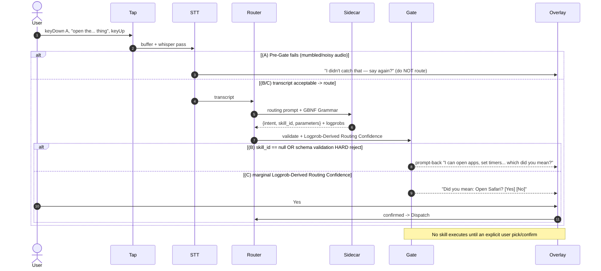
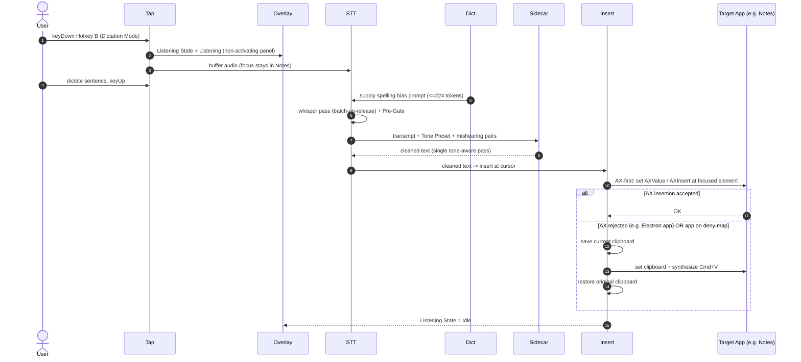
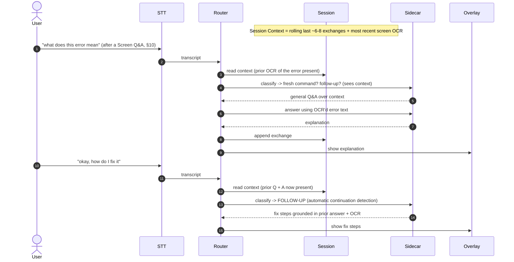
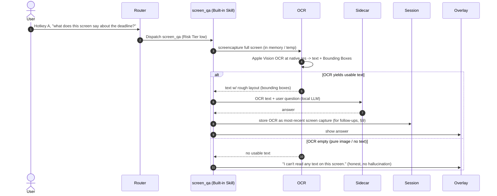
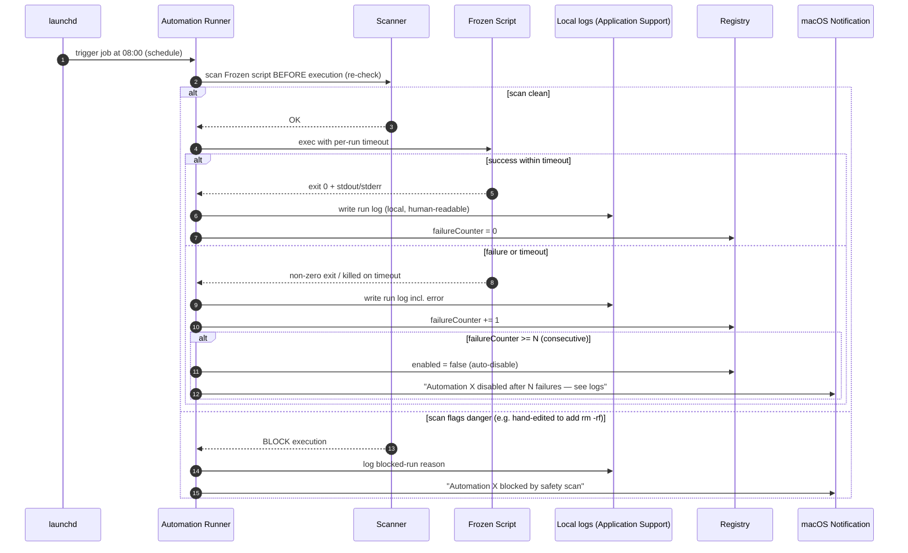
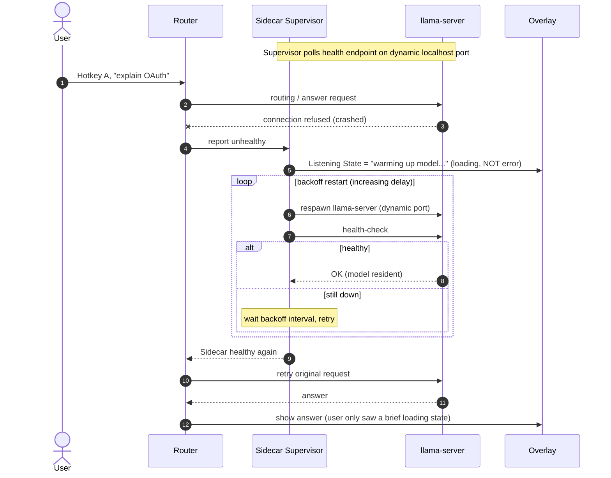
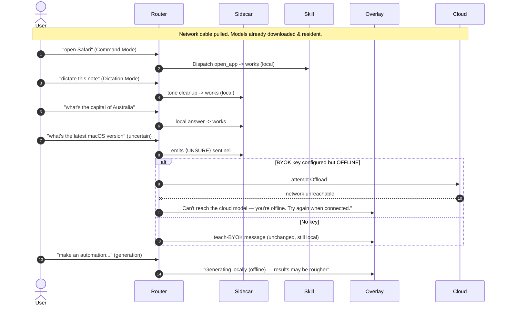

# Aide — Walk-throughs

> Document 6 of 6 in the Aide technical spec set.
> Companion to: `01-problem-to-solve.md`, `02-glossary.md`, `03-architecture.md`, `04-hld.md`, `05-lld.md`.
>
> This document is the "how it actually works" **story**. Every other doc tells you what a
> subsystem *is*; this one traces what happens, in order, when a real user does a real thing —
> which subsystem does what, what (if anything) crosses the local/cloud boundary, where the
> safety gates fire, and what the user sees in the Overlay at each step.

---

## 1. Purpose & How to Read These Walk-throughs

These traces are **authoritative for implementation**. When an implementation agent asks "when
Hotkey A is released, who runs the Whisper pass, and what does the Overlay show while it runs?",
the answer is here, concretely, naming the module and the state.

### 1.1 What each walk-through contains

Every scenario (§2–§15) has four parts:

1. **A Mermaid `sequenceDiagram`** — the message-passing view. Actors are the subsystems from
   `04-hld.md`. `autonumber` on the diagram is a visual convenience; the **numbered narrative is
   the authoritative step list**.
2. **A numbered narrative** — the ordered prose trace, naming modules, states, and data.
3. **What the user sees** — the Overlay / Menubar / modal surface, step by step.
4. **What crosses the boundary** — exactly which bytes (if any) leave the machine, and how the
   **Local/Cloud Indicator** reflects it.

§16 is a cross-cutting summary table.

### 1.2 Cross-reference convention

- `→ 04-hld.md` references a **subsystem** by name (e.g. *Router subsystem*).
- `→ 05-lld.md` references a **schema, algorithm, or state machine** by name (e.g. *Confidence
  Gate*, *Listening State machine*, *Dangerous-Command Scanner algorithm*).
- Where a sibling doc's exact section number may differ from this draft, the reference is by
  **title**, which is stable. *(Assumption: the HLD/LLD keep the canonical subsystem/algorithm
  names from the glossary; that is the shared contract of this spec set.)*

### 1.3 The two visible state machines the reader must keep straight

Two independent UI signals appear in the Overlay and Menubar. Do not conflate them.

| Signal | Source | States used in these traces | Meaning |
|---|---|---|---|
| **Listening State** | `05-lld.md` *Listening State machine* | `Idle` → `Listening` (mic hot, buffering) → `Transcribing` → `Routing` → `Executing` / `Inserting` / `Answering` / `Confirming` → `Idle` | Where we are in the capture→act pipeline. |
| **Local/Cloud Indicator** | `04-hld.md` *Overlay & Menubar subsystem*; policy in `04-hld.md` *Cloud & Escalation subsystem* | `LOCAL` (on-device, calm/neutral glyph — the resting default) ↔ `CLOUD` (distinct accent glyph + destination-model label) | Whether bytes are crossing to a BYOK cloud endpoint **right now**. |

**Invariant (PRD §4.3):** the Indicator sits at `LOCAL` for the overwhelming majority of flows.
It flips to `CLOUD` **only** during an explicit Escalation/Offload (§8) or a BYOK-preferred script
generation (§11), and flips back the instant the outbound request completes. The flip is animated
and labeled so it is *legible*, not merely *true*.

### 1.4 Reference hardware

All latency and residency statements assume the reference **Tier: 16GB** machine (Apple M2 /
16GB): Whisper `large-v3-turbo` in-process, Qwen3-8B Q4_K_M resident in the Sidecar. Model
Residency stays hot, so follow-ups are instant. Divergences on **Tier: 8GB** (LLM unloads after
idle; follow-up triggers a visible reload) are called out inline where relevant (§9, §14) and in
`05-lld.md` *Model Residency state machine*.

### 1.5 Diagram participant shorthand

The same cast recurs across diagrams. Canonical short names:

| Short name | Subsystem (`04-hld.md`) |
|---|---|
| **User** | the human |
| **Tap** | Input & Activation subsystem — CGEventTap, Push-to-Talk, Hotkey A/B, Wake Word |
| **Overlay** | Overlay & Menubar subsystem — non-activating NSPanel, MenuBarExtra, Local/Cloud Indicator |
| **Modal** | the *separate ordinary modal* for typed/destructive Confirm-Back (activating window) |
| **STT** | STT subsystem — whisper.cpp in-process (incl. Whisper Segment-Probability Pre-Gate) |
| **Router** | Router subsystem — Router Contract v2, GBNF Grammar |
| **Sidecar** | Sidecar & LLM subsystem — llama-server + Qwen3, on dynamic localhost port |
| **Gate** | Safety subsystem — Confidence Gate (Logprob-Derived Routing Confidence), schema validation |
| **Scanner** | Safety subsystem — Dangerous-Command Scanner (Swift, in-process) |
| **Registry** | Skill Registry & Dispatch subsystem — Manifest lookup, Dispatch |
| **Skill** | the dispatched Built-in Skill or User Script-Automation |
| **Insert** | Dictation & Text Insertion subsystem — AX-first, clipboard-paste fallback, Tone Preset |
| **OCR** | Screen Q&A subsystem — `screencapture` + Apple Vision OCR, Bounding Box |
| **Session** | Session Context subsystem |
| **Dict** | Personalization Dictionary |
| **Cloud** | the user's BYOK cloud endpoint (only reached on Escalation/Offload) |
| **launchd** | launchd Agent (scheduling) |

---

## 2. First-Run Onboarding (cold install → first successful voice command)

The single highest-stakes flow: a broken first-run kills the app (PRD §10). This trace covers the
double-click of the notarized DMG-installed app through the first successful Command Mode
utterance. It stitches together the *Model Management & Onboarding subsystem*, *Storage &
Permissions subsystem*, and every input subsystem.

```mermaid
sequenceDiagram
    autonumber
    actor User
    participant App as Onboarding (Model Mgmt subsystem)
    participant Sys as macOS (TCC / System Settings)
    participant Net as HF Repos (network)
    participant Tap
    participant STT
    participant Router
    participant Sidecar
    participant Overlay

    User->>App: Launch app (first run, no config)
    App->>Overlay: Show Welcome + privacy promise
    App->>App: Detect physical RAM (sysctl) -> propose Tier 16GB
    App->>User: Confirm/override tier
    User->>App: Confirm 16GB
    Note over App,Net: Model delivery: pinned SHA + SHA-256, resumable
    loop Each model (Whisper large-v3-turbo, Qwen3-8B Q4_K_M)
        App->>Net: HTTPS GET model blob (range requests)
        Net-->>App: Bytes (progress + size shown)
        App->>App: Verify SHA-256, write to Application Support
    end
    Note over App,Sys: TCC walkthrough, one permission at a time
    loop Microphone, Accessibility, Screen Recording, Calendar(optional)
        App->>Overlay: Explain WHY (plain language) + Grant button
        App->>Sys: Deep-link to exact Settings pane
        User->>Sys: Toggle grant
        Sys-->>App: Authorization change callback -> auto-advance
    end
    App->>Tap: Register CGEventTap for Hotkey A/B (defaults offered)
    App->>Sidecar: Spawn llama-server, health-check until ready
    Sidecar-->>App: Healthy (model resident)
    App->>User: Guided success — "Hold Opt+Space and say: open Safari"
    User->>Tap: keyDown Hotkey A (Push-to-Talk)
    Tap->>STT: Begin buffering (Listening)
    User->>Tap: "open Safari" then keyUp
    Tap->>STT: Run Whisper pass on buffer (batch-on-release)
    STT->>Router: transcript + segment probs (Pre-Gate passes)
    Router->>Sidecar: GBNF-constrained routing call
    Sidecar-->>Router: {intent, skill_id: open_app, parameters:{app:"Safari"}}
    Router->>App: Dispatch open_app (Risk Tier low)
    App-->>User: Safari launches; Overlay shows success
    App->>App: Mark onboarding complete
```

### 2.1 Numbered narrative

1. **Launch, no config.** The *Onboarding subsystem* finds no `settings.json` in
   `~/Library/Application Support/Aide/` and enters first-run. Single-instance enforcement (PRD
   §12) is asserted first.
2. **Welcome + privacy promise.** The Overlay (here presented as a full onboarding window, not the
   compact NSPanel) shows the one-paragraph local-first promise. Local/Cloud Indicator concept is
   introduced here but is inert — no inference yet.
3. **RAM detection → tiering.** RAM is read via `sysctl`; ≥16GB proposes **Tier: 16GB** (Whisper
   `large-v3-turbo` + Qwen3-8B Q4_K_M). The user confirms or overrides (→ `04-hld.md` *Model
   Management & Onboarding subsystem*; policy in `05-lld.md` *Model Residency state machine*).
4. **Model downloads.** Each model is pulled from its **official HF repo at a pinned commit SHA**,
   verified against a **pinned SHA-256**, and written to Application Support. Downloads are
   **resumable via HTTP range requests**; the UI shows per-file progress and total size (~2–7GB).
   The app stays responsive. This is the one unavoidable wait (PRD §10.3).
5. **One-time network disclosure.** During this screen the onboarding also discloses, once, the two
   keyless utility calls (Weather via Open-Meteo, Currency via Frankfurter) as the *only* other
   implicit network traffic. No per-request nagging thereafter.
6. **TCC walkthrough, one at a time.** For **Microphone → Accessibility → Screen Recording →
   Calendar (optional/skippable)**, each step shows a plain-language "why", deep-links to the exact
   System Settings pane, and **auto-advances the moment the TCC authorization callback reports a
   grant** (→ `04-hld.md` *Storage & Permissions subsystem*). A denied permission does not block
   onboarding; it records a graceful-degradation flag (see step 12).
7. **Hotkey setup.** Sensible defaults are offered: **Hotkey A = Command Mode (⌥Space)**, **Hotkey
   B = Dictation Mode**. The *Input & Activation subsystem* registers a **CGEventTap** listening for
   keyDown/keyUp (Push-to-Talk). Wake Word remains **off** (Experimental).
8. **Sidecar warm-up.** The *Sidecar & LLM subsystem* spawns the sole **llama-server** on a
   **dynamic localhost port**, then health-checks until the model is resident (→ `05-lld.md`
   *Sidecar lifecycle state machine*). On Tier 16GB the LLM will stay resident from here on.
9. **Guided first success.** Prompt: *"Hold ⌥Space and say: open Safari."* The user presses
   **Hotkey A (keyDown)**; Listening State → `Listening`; STT **buffers** audio while the key is
   held (batch-on-release v1).
10. **Release → transcribe.** On **keyUp**, Listening State → `Transcribing`; STT runs a single
    whisper.cpp pass over the buffer. The **Whisper Segment-Probability Pre-Gate** passes (clean
    "open Safari" audio) → the transcript is handed to the Router.
11. **Route.** Listening State → `Routing`; the Router calls the Sidecar with a **GBNF Grammar**
    constraint and receives **Router Contract v2** output `{intent, skill_id:"open_app",
    parameters:{app:"Safari"}}`. The **open_app** Manifest is **Risk Tier: low**; Logprob-Derived
    Routing Confidence is high → the **Confidence Gate** passes silently.
12. **Dispatch + degradation record.** Registry/Dispatch invokes the Swift-backed **open_app**
    Built-in Skill; Safari launches. Onboarding is marked complete and persisted. Any permission
    denied in step 6 is now surfaced as a **persistent, actionable fix-it hint** in Settings — the
    dependent feature is disabled, never mysteriously broken (PRD §10.7).

### 2.2 What the user sees

- Full-window onboarding: Welcome → tier confirm → **download progress bars with sizes** → four
  permission cards (each with "why" + a *Open Settings* deep-link, auto-checking off as granted) →
  hotkey defaults → the "Hold ⌥Space and say: *open Safari*" coach card.
- On the utterance: the compact **Overlay (NSPanel)** appears with a `Listening` indicator, then
  live transcript "open Safari", then a router-result chip, then Safari opening. Local/Cloud
  Indicator is `LOCAL` throughout.
- A denied permission shows a yellow fix-it banner in Settings afterward, not an error.

### 2.3 What crosses the boundary

- **Model blobs** from official HF repos (HTTPS, pinned SHA, SHA-256-verified, resumable) — the
  disclosed one-time download. This is *model delivery*, not inference; the Local/Cloud Indicator
  governs **inference** traffic and is not implicated here (the download has its own explicit
  progress UI).
- The **one-time disclosure** of Weather/Currency keyless endpoints — informational; no request is
  made during onboarding.
- **No audio, no transcript, no screenshot leaves the machine.** The first command is fully local.

---

## 3. Command Mode — "Open Safari" (Hotkey A → Whisper → Router → Dispatch → skill executes)

The canonical happy path and the latency benchmark (command mode ≤ ~2s on 16GB). Everything is
local.

```mermaid
sequenceDiagram
    autonumber
    actor User
    participant Tap
    participant Overlay
    participant STT
    participant Router
    participant Sidecar
    participant Gate
    participant Registry
    participant Skill

    User->>Tap: keyDown Hotkey A (Push-to-Talk)
    Tap->>Overlay: Listening State = Listening (mic hot)
    Tap->>STT: Start buffering audio
    User->>Tap: "open Safari"
    User->>Tap: keyUp Hotkey A
    Tap->>STT: Stop; run whisper.cpp pass (batch-on-release)
    STT->>STT: Segment-Probability Pre-Gate (high prob -> pass)
    STT->>Overlay: Listening State = Transcribing; show transcript
    STT->>Router: transcript "open Safari"
    Router->>Overlay: Listening State = Routing
    Router->>Sidecar: routing prompt + GBNF Grammar (skill schemas)
    Sidecar-->>Router: {intent, skill_id:"open_app", parameters:{app:"Safari"}} + logprobs
    Router->>Gate: validate schema + Logprob-Derived Routing Confidence
    Gate-->>Router: PASS (Risk Tier low, high logprob)
    Router->>Registry: Dispatch open_app(app:"Safari")
    Registry->>Skill: invoke Swift open_app
    Skill-->>Overlay: success -> Listening State = Idle
    Skill-->>User: Safari is now frontmost
```

### 3.1 Numbered narrative

1. **Activate.** User presses **Hotkey A** (keyDown). The **CGEventTap** in the *Input & Activation
   subsystem* recognizes the Push-to-Talk down-edge and signals STT to start. Listening State →
   `Listening`; the Overlay shows the mic-hot state (and optional audio cue).
2. **Buffer.** While the key is held, STT **buffers** the microphone stream (batch-on-release v1 —
   no partial transcription yet). The Overlay may show a live level meter.
3. **Release → transcribe.** On **keyUp**, Listening State → `Transcribing`. STT runs one
   whisper.cpp pass over the buffered audio in-process (→ `04-hld.md` *STT subsystem*).
4. **Pre-Gate.** The **Whisper Segment-Probability Pre-Gate** (→ `05-lld.md` *Confidence Gate*)
   inspects per-segment probabilities. Clean audio → **pass**; the transcript "open Safari" and its
   segment stats move forward. (A failing Pre-Gate would short-circuit to §4's "ask to repeat".)
5. **Route.** Listening State → `Routing`. The *Router subsystem* builds a routing prompt listing
   available skills + parameter schemas (generated from the Skill Registry) and calls the
   **Sidecar** with a **GBNF Grammar** constraint that forces syntactically valid **Router Contract
   v2** JSON. Routing is **ALWAYS local** (locked decision 9).
6. **Contract v2 output.** The Sidecar returns `{intent:"open the Safari app",
   skill_id:"open_app", parameters:{app:"Safari"}}` — **no confidence field** (Router Contract v2)
   — plus the token **logprobs** captured at the skill_id-selecting tokens.
7. **Confidence Gate.** The *Safety subsystem* runs the **Confidence Gate**: (a) validate
   `parameters` against the **open_app** Manifest schema; (b) compute **Logprob-Derived Routing
   Confidence** at the skill_id tokens. Schema valid + high confidence + Manifest **Risk Tier:
   low** → **PASS, execute on pass** (locked decision 11).
8. **Dispatch.** The *Skill Registry & Dispatch subsystem* dispatches to the Swift-backed
   **open_app** Built-in Skill with `{app:"Safari"}`.
9. **Execute.** The skill activates Safari. Listening State → `Idle`. Total elapsed targets ≤ ~2s.

### 3.2 What the user sees

- Overlay: `Listening` (mic glyph pulsing) → `Transcribing` with the words "open Safari" appearing →
  a compact router-result chip ("Open app · Safari") → dismiss as Safari comes forward.
- Menubar: the MenuBarExtra glyph mirrors the Listening State.
- **Local/Cloud Indicator: `LOCAL`** the entire time.

### 3.3 What crosses the boundary

- **Nothing.** Audio, transcript, and routing all stay on-device (Sidecar is localhost-only). The
  Indicator never leaves `LOCAL`.

---

## 4. Command Mode — Low-Confidence / Prompt-Back (marginal routing logprob or null skill_id → "Did you mean…?")

Where the safety promise "never guess-execute" (PRD §6) is enforced. Three distinct rejection
sources all funnel into one Overlay **prompt-back**. None of them execute anything.



### 4.1 Numbered narrative

1. **Capture** as in §3 steps 1–3. Utterance is ambiguous, e.g. "open the… thing".
2. **Branch A — Pre-Gate fail.** If the **Whisper Segment-Probability Pre-Gate** finds low
   transcription probability (mumble, cross-talk, clipping), the pipeline **does not route at all**.
   The Overlay asks the user to **repeat** ("I didn't catch that — say it again?"). This is the
   cheapest, earliest gate and prevents garbage-in routing (locked decision 10).
3. **Route (if Pre-Gate passes).** Router calls the Sidecar under the **GBNF Grammar**; gets
   **Router Contract v2** output + logprobs.
4. **Branch B — null skill or schema reject.** If `skill_id` is `null`, **or** the returned
   `parameters` **fail Manifest schema validation** (a **HARD rejection** per locked decision 10),
   the **Confidence Gate** refuses to dispatch and issues a **prompt-back** naming plausible
   capabilities ("I can open apps, set timers, check the weather — which did you mean?").
5. **Branch C — marginal logprob.** If schema validation passes but **Logprob-Derived Routing
   Confidence** at the skill_id-selecting tokens is **marginal** (below the calibrated band; the
   calibration is tuned over ~1 week of use), the Gate issues a **specific** Confirm-Back: *"Did you
   mean: **Open Safari**?"* with **Yes/No** in the Overlay.
6. **Resolution.** On **Yes**, the Router proceeds to Dispatch exactly as §3 step 8. On **No** (or
   timeout), nothing runs; Listening State returns to `Idle`.
7. **Continuation safety net.** If this ambiguous utterance was actually a mis-detected follow-up
   (§9), the same prompt-back rule catches it — a wrongly-matched follow-up at low confidence never
   silently executes (PRD §7.1b).

> **Design note.** Branches B and C are non-destructive prompts and live in the **Overlay**
> (non-activating NSPanel). This is distinct from the destructive Confirm-Back in §6/§11, which uses
> the **separate ordinary modal**. The Overlay never steals focus.

### 4.2 What the user sees

- Branch A: a gentle "say again" chip; mic can re-arm.
- Branch B: a "which did you mean?" chip listing capabilities.
- Branch C: a **"Did you mean: Open Safari?"** chip with Yes/No.
- **Local/Cloud Indicator: `LOCAL`** throughout.

### 4.3 What crosses the boundary

- **Nothing.** All gating is local. Indicator stays `LOCAL`.

---

## 5. Dictation into a Standard App (Hotkey B → transcribe → tone cleanup → AX insertion, with clipboard-paste fallback)

The hero feature. Note the deliberate design: the Overlay is a **non-activating NSPanel** so it
**never steals focus** from the target text field during insertion (locked decision 5).



### 5.1 Numbered narrative

1. **Activate dictation.** User presses **Hotkey B** (keyDown). Focus **stays** in the target app
   (e.g. Notes) because the Overlay is a **non-activating NSPanel**. Listening State → `Listening`.
2. **Bias the recognizer.** Before/at transcription, the *Dictation & Text Insertion subsystem*
   pulls **correct spellings** from the **Personalization Dictionary** and injects them as
   Whisper's **initial/bias prompt**, prioritized by recency/frequency and **capped at ~224
   tokens** (locked decision 16; → `05-lld.md` *Personalization Dictionary schema*).
3. **Buffer + release.** Audio buffers while Hotkey B is held; on **keyUp**, STT runs the
   whisper.cpp pass (batch-on-release). The **Segment-Probability Pre-Gate** guards transcription
   quality (a hard fail here asks the user to repeat, as in §4 Branch A — Dictation Mode does **not**
   route through the Router).
4. **Tone-aware cleanup.** STT hands the raw transcript to the **Sidecar** for a **single
   tone-aware cleanup pass** using the active **Tone Preset** (default **As-is**; or Professional /
   Casual / Concise; a voice prefix like "professional tone: …" may switch it). The cleanup prompt
   also receives **mishearing→correct pairs** from the Personalization Dictionary. This is **local**
   (→ `04-hld.md` *Dictation & Text Insertion subsystem*).
5. **Insert — AX-first.** The cleaned text goes to **Text Insertion**, which **prefers the
   Accessibility API**: locate the focused `AXUIElement` and set/insert its value at the cursor
   (→ `05-lld.md` *Text Insertion algorithm*).
6. **Fallback — clipboard-paste.** If AX insertion is **rejected** (many Electron apps do) **or**
   the target's bundle-ID is flagged in the **per-app allow/deny map**, Insertion falls back to:
   **save the current clipboard → write cleaned text → synthesize ⌘V → restore the original
   clipboard**. The save/restore keeps the user's clipboard intact.
7. **Done.** Listening State → `Idle`. Target dictation latency ≤ ~3s for a typical utterance on
   16GB.

### 5.2 What the user sees

- The **non-activating Overlay** shows `Listening` → `Transcribing` (live words) → a brief
  "cleaning up…" tick, while the **caret stays blinking in Notes**.
- The cleaned sentence appears at the cursor in Notes. With the clipboard fallback, there is a
  near-instant paste; the user's prior clipboard is unchanged afterward.
- **Local/Cloud Indicator: `LOCAL`.**

### 5.3 What crosses the boundary

- **Nothing.** Transcription, tone cleanup, dictionary consumption, and insertion are all local.
  Indicator stays `LOCAL`.

---

## 6. Dictation into a Terminal (destination-aware Dangerous-Command Scanner → Confirm-Back with override)

This is where the **Scanner's destination-awareness** (locked decision 14) matters. Dictating into
a **known terminal emulator** (bundle-ID allowlist) is an **executable channel**, so the Scanner
runs **pre-insertion**. Crucially, because this is the *user's own dictation into their own
terminal*, a match yields a **Confirm-Back with override allowed — even for `sudo`**. The
Hard-Block-no-override posture is reserved for **Aide-generated** automations (§11), not user
dictation.

```mermaid
sequenceDiagram
    autonumber
    actor User
    participant Tap
    participant STT
    participant Sidecar
    participant Insert
    participant Scanner
    participant Modal
    participant Term as Terminal (bundle-ID allowlisted)

    User->>Tap: Hotkey B, "sudo rm minus rf slash tmp slash build", keyUp
    STT->>STT: whisper pass + Pre-Gate
    STT->>Sidecar: tone cleanup (As-is)
    Sidecar-->>Insert: "sudo rm -rf /tmp/build"
    Note over Insert,Scanner: Destination = Terminal (allowlisted) -> executable channel
    Insert->>Scanner: scan text BEFORE insertion
    Scanner->>Scanner: recursive descent (pipes, $(), backticks, sh -c); strings as data
    Scanner-->>Insert: MATCH rm -rf + sudo -> destructive
    Insert->>Modal: Confirm-Back (destructive-styled, override ALLOWED)
    Modal->>User: "This runs: sudo rm -rf /tmp/build — deletes files irreversibly. Type CONFIRM."
    alt User confirms (types CONFIRM / destructive button)
        User->>Modal: CONFIRM
        Modal->>Insert: approved
        Insert->>Term: insert command at cursor
    else User cancels
        User->>Modal: Cancel
        Modal->>Insert: aborted -> nothing inserted
    end
```

### 6.1 Numbered narrative

1. **Dictate into a terminal.** User has **Terminal.app** (or iTerm2 / Ghostty — any **bundle-ID on
   the terminal-emulator allowlist**) focused and dictates via Hotkey B: "sudo remove recursive
   force slash tmp slash build".
2. **Transcribe + clean.** As in §5: whisper pass + Pre-Gate, then a local **As-is** tone-cleanup
   pass yields the literal command string `sudo rm -rf /tmp/build`.
3. **Destination check.** The *Text Insertion subsystem* recognizes the destination's bundle-ID as
   an **allowlisted terminal emulator** → this is a **destination-aware executable channel**, so
   the **Dangerous-Command Scanner** must run **before insertion** (locked decision 14). (Dictation
   into Notes in §5 skipped the Scanner — prose, not an executable channel.)
4. **Scan.** The **Dangerous-Command Scanner** (Swift, in-process, **pattern-based, not
   LLM-based, cannot be prompt-injected**) parses the string via **recursive descent into pipes,
   `$()`, backticks, and `sh -c`**, treating **strings purely as data — it never executes anything**
   (→ `05-lld.md` *Dangerous-Command Scanner algorithm*). It matches both `rm -rf` (destructive) and
   `sudo` (privilege escalation).
5. **Confirm-Back with override.** Because the origin is **user dictation into the user's own
   terminal**, the Scanner's disposition is **Confirm-Back with override allowed — even for
   `sudo`** (locked decision 14). It raises the **separate ordinary modal** (an activating window,
   distinct from the non-activating Overlay), showing the exact command, a **plain-language risk
   explanation** ("this deletes files irreversibly" / "runs as root"), and a **distinct
   destructive-styled confirmation** requiring a **typed CONFIRM** (or a separate destructive
   button) — different from any normal approve action (PRD §7.3 Layer 2).
6. **Resolve.** On confirm → the command is **inserted at the cursor** (Aide inserts; it does not
   press Return — the user runs it). On cancel → **nothing is inserted**.

> **Contrast that fixes the mental model (read this):**
> - **§6, user dictation into an allowlisted terminal:** override **allowed**, even `sudo` →
>   **Confirm-Back**.
> - **§11, Aide-generated automation:** `sudo` and privilege escalation → **Hard-Block, no
>   override**; other destructive patterns → **Confirm-Back**.
> The difference is *provenance*: a human authoring their own command in their own shell may proceed
> with eyes open; an Aide-generated script must never contain a voice-triggerable path to root.

### 6.2 What the user sees

- The focused Terminal stays put; a **modal window** appears on top (this one *does* take focus, by
  design, because it demands a deliberate act) with the command in monospace, a red risk banner, and
  a **Type CONFIRM to proceed** field.
- On confirm, the command text lands at the shell prompt, unexecuted.
- **Local/Cloud Indicator: `LOCAL`** — the Scanner is entirely local.

### 6.3 What crosses the boundary

- **Nothing.** Scanning is local, pattern-based, and inert. Indicator stays `LOCAL`.

---

## 7. General-Knowledge Q&A — Confident Local Answer (no boundary crossing)

General knowledge is a **first-class built-in capability**, not a Skill (PRD §7.1a). The Router
recognizes it and the **local LLM answers directly**.

```mermaid
sequenceDiagram
    autonumber
    actor User
    participant Tap
    participant STT
    participant Router
    participant Sidecar
    participant Session
    participant Overlay

    User->>Tap: Hotkey A, "what's the capital of Australia", keyUp
    STT->>STT: whisper pass + Pre-Gate (pass)
    STT->>Router: transcript
    Router->>Sidecar: routing prompt + GBNF Grammar + session context
    Sidecar-->>Router: {intent, skill_id: "general_qa", parameters:{question:"capital of Australia"}}
    Note over Router,Sidecar: general_qa is a reserved built-in router target (not a user Skill); null is reserved for "nothing matched → prompt-back"
    Router->>Sidecar: answer prompt (honesty system prompt, UNSURE sentinel armed)
    Sidecar-->>Router: "Canberra." (no sentinel emitted -> confident)
    Router->>Session: append exchange (Q + A)
    Router->>Overlay: show answer in Overlay
    Overlay-->>User: "Canberra."
```

### 7.1 Numbered narrative

1. **Ask.** User holds **Hotkey A** and asks "what's the capital of Australia".
2. **Transcribe.** whisper pass + Pre-Gate (pass).
3. **Classify as general-knowledge.** The Router, seeing the utterance + Session Context under the
   **GBNF Grammar**, selects the reserved built-in router target `skill_id: "general_qa"` — one of
   the grammar's fixed alternatives, chosen deterministically like any Skill (its selecting-token
   **Logprob-Derived Routing Confidence** feeds the Confidence Gate). It is **not** a user-managed
   registry Skill; the Dispatcher special-cases it to the **KnowledgeQA** capability. `skill_id:
   null` is reserved exclusively for "nothing matched → prompt-back" (§4) and never means "answer
   directly". See `05-lld.md` *Router Contract v2 schema*.
4. **Answer locally under the honesty protocol.** The Router issues an **answer prompt** to the
   **Sidecar** carrying the **honesty-over-hallucination system prompt** with the **⟨UNSURE⟩
   Sentinel Token armed** (locked decision 12). Qwen3 answers "Canberra." and **does not emit the
   sentinel** → treated as **confident** → the answer is shown as-is. General-knowledge answers are
   **local by default** (locked decision 12).
5. **Record.** The exchange (question + answer) is appended to **Session Context** for follow-ups
   (§9).
6. **Present.** The answer renders in the **Overlay**.

### 7.2 What the user sees

- Overlay: `Listening` → `Transcribing` → `Answering` with the text **"Canberra."**
- **Local/Cloud Indicator: `LOCAL`.**

### 7.3 What crosses the boundary

- **Nothing.** The answer is produced by the resident local LLM. Indicator stays `LOCAL`.
  (Contrast §8, where the *same shape* of question but an *uncertain* answer offers an Offload.)

---

## 8. General-Knowledge Q&A — Uncertain → BYOK Offload (⟨UNSURE⟩ → offer → Local/Cloud Indicator flips) and the No-Key path

The **only** general-Q&A flow that can cross the boundary — and only via an **explicit,
user-visible Escalation/Offload**. There is **no auto "too hard for local" detection** (PRD §4.4);
the trigger is the model's **own** uncertainty signal, the **⟨UNSURE⟩ Sentinel Token**.

```mermaid
sequenceDiagram
    autonumber
    actor User
    participant Router
    participant Sidecar
    participant Overlay
    participant Cloud

    User->>Router: "what's the latest macOS version?" (post-cutoff / long-tail)
    Router->>Sidecar: answer prompt (honesty system prompt, UNSURE sentinel armed)
    Sidecar-->>Router: emits ⟨UNSURE⟩ sentinel
    alt BYOK key configured
        alt auto-offload preference OFF (default)
            Router->>Overlay: offer "I'm not sure — ask the big model? [Ask cloud]"
            User->>Overlay: Ask cloud (one tap / one phrase)
        else auto-offload preference ON
            Note over Router,Overlay: proceeds without asking (user opted in)
        end
        Router->>Overlay: Local/Cloud Indicator flips LOCAL -> CLOUD (labeled with model)
        Router->>Cloud: POST question (+ minimal context) via OpenAI-compatible client
        Cloud-->>Router: answer
        Router->>Overlay: show answer; Indicator flips CLOUD -> LOCAL
    else No key
        Router->>Overlay: "I'm not sure — add a cloud API key in Settings for reliable answers like this."
        Note over Router,Overlay: teach-BYOK message; NOTHING leaves the machine
    end
```

### 8.1 Numbered narrative

1. **Ask something post-cutoff or long-tail.** e.g. "what's the latest macOS version?" —
   time-sensitive, exactly the class the honesty protocol targets.
2. **Local attempt + self-uncertainty.** The Sidecar runs the answer prompt with the **honesty
   system prompt**; instead of guessing, Qwen3 emits the **⟨UNSURE⟩ Sentinel Token** (locked
   decision 12). App-side behavior on any uncertainty expression is **deterministic**.
3. **Branch — BYOK key configured.**
   - **Default (auto-offload OFF):** the Overlay **offers** a one-tap / one-phrase **Offload**: *"I'm
     not sure — ask the big model?"* Nothing has left the machine yet.
   - **Auto-offload ON (user opted in):** Aide proceeds directly, still visibly.
   - On proceed, the **Local/Cloud Indicator flips `LOCAL` → `CLOUD`**, labeled with the destination
     model name (→ `04-hld.md` *Overlay & Menubar subsystem*). The **single OpenAI-compatible HTTP
     client** (→ `04-hld.md` *Cloud & Escalation subsystem*) POSTs the question **plus minimal
     necessary context** to the user's BYOK endpoint. When the answer returns, the Indicator flips
     **`CLOUD` → `LOCAL`**.
4. **Branch — no key.** Aide does **not** offload. It shows the **teach-BYOK** message: *"I'm not
   sure about this — add a cloud API key in Settings to get reliable answers for questions like
   this."* This explains **why BYOK exists** rather than shrugging (locked decision 12). **Nothing
   leaves the machine.**
5. **Honest caveat (design reality).** The sentinel is imperfect — small models have imperfect
   self-knowledge, so this **reduces but cannot eliminate** hallucination (PRD §7.1a). The Offload
   offer is the escape hatch when the model *does* flag itself.

### 8.2 What the user sees

- **Key path:** an Overlay offer chip → on accept, the Indicator visibly turns to **`CLOUD` with the
  model's name** → the cloud answer appears → Indicator returns to **`LOCAL`**. The flip is animated
  and unmistakable.
- **No-key path:** an Overlay message pointing to Settings → **no** Indicator change (stays
  `LOCAL`).

### 8.3 What crosses the boundary

- **Key path:** the **question text + minimal context** cross to the BYOK endpoint — **the only
  outbound inference in the general-Q&A flows**, and only after the model self-flagged and the user
  (or a pre-set preference) consented. Reflected by the `LOCAL → CLOUD → LOCAL` Indicator flip.
- **No-key path:** **nothing** crosses. Indicator stays `LOCAL`.
- **Never** implicit: screenshots/audio are never part of this; no auto-detection ever triggers it.

---

## 9. Follow-Up Using Session Context ("what does this error mean" → "how do I fix it")

Follow-ups must "just work" with **automatic continuation detection by the Router** — no user
action, no "new topic" ritual (PRD §7.1b). This trace shows two utterances sharing one Session
Context, including the most-recent screen OCR.



### 9.1 Numbered narrative

1. **First question, grounded in screen.** Following a Screen Q&A (§10), the **Session Context**
   holds the **most recent screen OCR** (the error text) plus the rolling **last ~6–8 exchanges**
   (→ `05-lld.md` *Session Context structure*). The user asks "what does this error mean".
2. **Router reads context + classifies.** On **every** utterance, the Router — which **sees the
   Session Context** — classifies **fresh-command vs. follow-up automatically**. Here it answers as
   general Q&A grounded in the OCR'd error, via the local Sidecar. The exchange is appended.
3. **Follow-up.** The user says "okay, how do I fix it". The Router again reads context; the
   pronoun-free continuation is **automatically detected as a follow-up** (no "new topic" needed)
   and the Sidecar produces fix steps **grounded in the prior answer and the retained OCR**.
4. **Idle expiry.** Session Context expires on an **8-minute rolling idle timeout** (default) or an
   explicit "new topic" override (locked defaults). Each exchange resets the timer.
5. **Model Residency interaction.** On **Tier 16GB** (reference), the LLM is **resident**, so the
   follow-up is **instant**. On **Tier 8GB**, session activity resets the idle-unload timer; if the
   LLM had unloaded, this follow-up triggers a **visible brief reload** (see §14 for the loading
   state) — **never** a dropped context or failure (PRD §7.1b).
6. **Mis-detection safety.** If a follow-up were wrongly matched to a Skill at low confidence, §4's
   **prompt-back** rule catches it — continuation detection never *silently* mis-executes.

### 9.2 What the user sees

- Overlay: first the error explanation, then — without any topic-switch gesture — the fix steps,
  visibly continuing the same thread.
- On 8GB after an unload: a brief "warming up the model…" state precedes the follow-up answer.
- **Local/Cloud Indicator: `LOCAL`.**

### 9.3 What crosses the boundary

- **Nothing.** Session Context (including retained OCR) is **bounded, fully local, and obeys §4.2 —
  screen content never leaves implicitly**. Indicator stays `LOCAL`. *(If a follow-up itself became
  uncertain, it would follow §8's explicit-Offload path, never an implicit one.)*

---

## 10. Screen Q&A (screencapture → Vision OCR with Bounding Boxes → local LLM → Overlay; OCR-empty honesty case)

Screen understanding is **OCR-based only — no VLM** (PRD §9). The screenshot **never leaves the
machine implicitly** (PRD §4.2). This trace includes the **OCR-empty honesty case**.



### 10.1 Numbered narrative

1. **Ask about the screen.** In Command Mode the user asks "what does this screen say about the
   deadline?". The Router classifies it and dispatches the **screen_qa** Built-in Skill (**Risk
   Tier: low**).
2. **Capture.** screen_qa invokes **`screencapture`** for a full-screen grab, held **in memory /
   temp**, **not retained beyond the session** unless the user explicitly saves it (PRD §9).
   *(Optional refinement per PRD §9: crop to the active window / cursor region when the query
   implies it, to improve signal — noted as an available refinement in `04-hld.md` *Screen Q&A
   subsystem*.)*
3. **OCR.** The **Apple Vision** framework OCRs at native resolution, preserving rough spatial
   layout via **Bounding Boxes** (→ `05-lld.md` *Screen Q&A / OCR data structures*).
4. **Branch — usable text.** The extracted text (with layout) plus the user's question go to the
   **local Sidecar LLM**, which answers. This is **local** — no VLM, no cloud.
5. **Persist for follow-ups.** The OCR result is stored as the **most-recent screen capture in
   Session Context**, enabling §9's "what does this error mean → how do I fix it".
6. **Branch — OCR empty (honesty case).** If OCR yields **nothing useful** (a pure image, a video
   frame, an unlabeled diagram), screen_qa **says so honestly** — "I can't read any text on this
   screen." — rather than hallucinating an answer (PRD §9). No LLM guess is fabricated.
7. **Present.** The answer (or the honest "no text" message) renders in the Overlay.

### 10.2 What the user sees

- Overlay: a brief `Capturing…` → `Reading screen…` state, then the answer (e.g. "The deadline
  shown is Friday, Aug 8"). In the empty case, the honest "I can't read any text on this screen."
- No screenshot preview is uploaded anywhere; if saved, it lands in Application Support by explicit
  action.
- **Local/Cloud Indicator: `LOCAL`.**

### 10.3 What crosses the boundary

- **Nothing.** `screencapture`, Vision OCR, and the answering LLM are all local. The **screenshot
  never leaves the machine implicitly** — sending one to a cloud model would be a *distinct,
  deliberate, clearly-labeled* action (§8-style flip), never an automatic fallback. Indicator stays
  `LOCAL`.

---

## 11. Creating a User Script-Automation (voice → generate → shown in full → Scanner → approve → Frozen → launchd registration)

The extensibility engine (PRD §7.2). This is the flow where **script generation is
cloud-preferred if BYOK** (small local models write buggy shell scripts) — so the Indicator **may
flip** during generation. It is also where the Scanner's **Hard-Block, no override** posture
applies (Aide-generated code).

```mermaid
sequenceDiagram
    autonumber
    actor User
    participant Router
    participant Gen as Automation subsystem
    participant Cloud
    participant Sidecar
    participant Overlay
    participant Scanner
    participant Modal
    participant Registry
    participant launchd

    User->>Router: "make an automation that runs my prod sanity check every morning at 8"
    Router->>Gen: intent = create automation (+ schedule 08:00 daily)
    alt BYOK key configured (cloud-preferred)
        Gen->>Overlay: Indicator LOCAL -> CLOUD (labeled)
        Gen->>Cloud: generate script + Manifest
        Cloud-->>Gen: shell script + Manifest
        Gen->>Overlay: Indicator CLOUD -> LOCAL
    else No key (local fallback)
        Gen->>Sidecar: generate script + Manifest (local)
        Sidecar-->>Gen: script + Manifest ("results may be rougher" caveat)
    end
    Gen->>Scanner: scan generated script BEFORE display
    Scanner->>Scanner: recursive descent; strings as data
    alt contains sudo / privilege escalation
        Scanner-->>Overlay: HARD-BLOCK (no override) — regenerate or abort
    else other destructive pattern
        Scanner-->>Overlay: flag lines w/ plain-language risk (Confirm-Back styling)
    else clean
        Scanner-->>Overlay: no flags
    end
    Gen->>Overlay: show FULL script + Manifest for review
    User->>Modal: explicit approval (typed/destructive confirm if flagged)
    Modal->>Gen: approved
    Gen->>Gen: FREEZE script to user-owned file (never regenerated)
    Gen->>Registry: register Manifest (enabled, failure counter = 0)
    Gen->>launchd: install user agent per schedule (08:00 daily)
```

### 11.1 Numbered narrative

1. **Describe by voice.** "Make an automation that runs my prod sanity check every morning at 8."
   The Router extracts **intent + schedule** (08:00 daily) and hands off to the *Automation &
   Scheduling subsystem*.
2. **Generate — cloud-preferred if BYOK.** Per locked decision 15 and PRD §4.4, generation is
   **cloud-preferred when a BYOK key is configured** (local models write buggy shell). If a key
   exists, the **Local/Cloud Indicator flips `LOCAL` → `CLOUD`** (labeled with the model) while the
   single OpenAI-compatible client requests a **shell script + Manifest**, then flips back on
   return. **If no key**, generation falls back to the **local Sidecar** with a visible **"results
   may be rougher"** caveat — nothing leaves the machine.
3. **Scan before display.** The generated script is run through the **Dangerous-Command Scanner**
   **before it is ever shown** (PRD §7.3 Layer 1: "on every generated script before display"):
   - **`sudo` / privilege escalation → Hard-Block, no override.** A launchd user agent never needs
     root; a voice-triggerable path to root must not exist (locked decisions 13–14). The user must
     regenerate or abort — there is **no confirmation path**.
   - **Other destructive patterns** (`rm -rf`, `curl … | sh`, `dd`, writes outside `$HOME`, etc.) →
     **flagged lines** with plain-language risk, resolvable via **Confirm-Back**.
4. **Show in full.** The **entire** script + Manifest are shown for review; **flagged lines are
   highlighted** with their risk explanation. **Nothing runs before explicit approval** (PRD §7.2.3).
5. **Explicit approval.** If any destructive (non-Hard-Blocked) line was flagged, approval uses the
   **separate ordinary modal** with a **distinct destructive-styled / typed confirmation** (as in
   §6) — different from a plain approve. A clean script uses ordinary approval.
6. **Freeze.** On approval the script is **Frozen**: written to a **user-owned, user-editable file**
   in Application Support and **never regenerated per run** — deterministic thereafter (locked
   decision 15; → `05-lld.md` *Automation lifecycle state machine*).
7. **Register.** The Manifest (id, description, parameter schema, declared permissions, schedule,
   `enabled=true`, `failureCounter=0`) is added to the **Skill Registry** (**one JSON schema for
   built-ins + user automations**), and a **launchd user agent** is installed per the schedule
   (08:00 daily).
8. **Re-scan invariant.** Because the Scanner also runs **before every execution and on any
   hand-edit** (§12, PRD §7.3), a later user edit that introduces a dangerous pattern is re-caught —
   the freeze does not bypass the guard.

### 11.2 What the user sees

- Overlay/window: if BYOK, a visible **`CLOUD` flip during generation** (labeled), then back to
  `LOCAL`. If no key, a "**generated locally — results may be rougher**" caveat.
- A **full script review** pane with syntax highlighting; any risky line is **red-flagged with an
  explanation**. Hard-Blocked `sudo` shows a **non-overridable** block with a "regenerate" prompt.
- A **destructive-styled confirmation modal** for flagged-but-allowed scripts; a normal approve for
  clean ones.

### 11.3 What crosses the boundary

- **BYOK path:** the **automation description** crosses to the cloud endpoint for **generation
  only**; the returned script is then scanned/frozen locally. Reflected by the **`LOCAL → CLOUD →
  LOCAL`** Indicator flip — the one boundary crossing in this flow, and it is **generation**, not
  execution.
- **No-key path:** **nothing** crosses; local generation, Indicator stays `LOCAL`.
- The **frozen script's own runtime network behavior** (if it makes calls) is the *script's*
  behavior, declared in its Manifest `permissions` — see §12.3.

---

## 12. A Scheduled Automation Firing (launchd Agent → run with timeout → logging → consecutive-failure auto-disable + notification)

The Frozen automation from §11 fires unattended. This trace covers the runtime **guardrails**:
per-run timeout, local stdout/stderr logging, and **auto-disable after N consecutive failures**
(PRD §7.2.6).



### 12.1 Numbered narrative

1. **Fire.** At 08:00 the **launchd user agent** triggers the job (launchd handles sleep/wake
   catch-up semantics, PRD §12).
2. **Re-scan before execution.** The **Automation Runner** runs the **Dangerous-Command Scanner on
   the Frozen script before this execution** (PRD §7.3: "on every script before every execution").
   This catches any **hand-edit** made since the freeze — e.g. a user who later added `rm -rf`. If
   flagged, execution is **blocked**, logged, and a notification is posted; the job does not run.
3. **Execute with timeout.** On a clean scan, the Frozen script runs with a **per-run timeout**
   (locked decision 15 / PRD §7.2.6). stdout/stderr are captured.
4. **Log locally.** The run — success or failure, with output — is written to a **local,
   human-readable log** under `~/Library/Application Support/Aide/` (PRD §11). Nothing is sent
   anywhere.
5. **Success path.** Exit 0 within the timeout → the Manifest's **`failureCounter` resets to 0** in
   the Registry.
6. **Failure path + auto-disable.** A non-zero exit or a timeout **increments `failureCounter`**.
   When it reaches **N consecutive failures**, the Runner **sets `enabled=false`** (auto-disable)
   and posts a **macOS notification** ("Automation X disabled after N failures — see logs"). Never
   silent-fail forever (PRD §7.2.6). A subsequent successful run (before hitting N) would have reset
   the counter.

### 12.2 What the user sees

- Nothing during a normal successful run (it is unattended). Logs are viewable in Settings.
- On auto-disable or a safety-block: a **macOS notification** and a persistent disabled/blocked
  state in the automations list, with a link to the run log.
- **Local/Cloud Indicator: `LOCAL`** (Aide's orchestration is local).

### 12.3 What crosses the boundary

- **From Aide: nothing.** Scheduling, scanning, execution, and logging are local.
- **Caveat — the script itself:** if the Frozen script's *own* logic makes network calls (e.g. a
  prod sanity check that curls an internal endpoint), that traffic is the **script's** behavior,
  declared in its Manifest `permissions: {network:true}` and approved by the user at §11. It is
  **not** an Aide inference-boundary crossing and the Local/Cloud Indicator does not represent it —
  the Indicator tracks **Aide's** local/cloud inference boundary, not arbitrary user-script I/O.
  *(Assumption, called out for implementers: the Indicator scope is Aide-originated inference; user
  scripts are sandboxed by their declared permissions and shown in full pre-approval.)*

---

## 13. "Correct that: X should be Y" → Personalization Dictionary Update

Personalization is **explicit-only in v1** (locked decision 16). The local LLM diffs original vs.
corrected, extracts **term pairs**, updates the bounded **Personalization Dictionary**, and
**discards the raw before/after**.

```mermaid
sequenceDiagram
    autonumber
    actor User
    participant Router
    participant Sidecar
    participant Dict
    participant Overlay

    User->>Router: "correct that: Sumrit should be spelled S-U-M-R-I-T"
    Router->>Router: recognize built-in correction command (explicit)
    Router->>Sidecar: diff original vs corrected -> extract term pair(s)
    Sidecar-->>Router: pair {heard:"Sumit", correct:"Sumrit"} (+ spelling)
    Router->>Dict: upsert pair; explicit command -> promote immediately
    Note over Router,Sidecar: raw before/after DISCARDED after extraction
    Dict->>Dict: enforce hard cap (MRU eviction)
    Note over Dict: spelling -> Whisper bias prompt (<=224 tok); pair -> cleanup prompt
    Router->>Overlay: "Got it — I'll spell it Sumrit."
```

### 13.1 Numbered narrative

1. **Explicit correction.** The user issues the **"correct that: X should be Y"** built-in command
   (the explicit, deterministic entry point; v1 does **not** do implicit edit-detection).
2. **Diff + extract pairs.** The Router asks the **local Sidecar** to **diff the original vs. the
   corrected** text and **extract only the changed term pairs** (e.g. `{heard:"Sumit",
   correct:"Sumrit"}`), plus explicit spelling if dictated letter-by-letter (→ `05-lld.md`
   *Personalization Dictionary schema & diff algorithm*).
3. **Discard raw.** The **raw before/after is discarded after extraction** — never stored
   long-term, never accumulated in prompts (locked decision 16 / PRD §8.2).
4. **Upsert + immediate promotion.** The pair is upserted into the **Personalization Dictionary**.
   Normally a pair must reach a **promotion threshold of ~2–3** occurrences before going active
   (guards against one-off typos), **but an explicit "correct that" command promotes it
   immediately**.
5. **Bounded.** The Dictionary enforces a **hard cap with most-recently-used eviction**, keeping
   both consuming prompts bounded forever.
6. **Consumption wiring.** From now on: **correct spellings** feed **Whisper's bias prompt** (≤~224
   tokens, prioritized by recency/frequency); **mishearing→correct pairs** feed the **dictation
   cleanup prompt** (§5 step 4). So the next time the user dictates their name, Whisper is biased
   toward "Sumrit" and cleanup fixes residual mishearings.

### 13.2 What the user sees

- Overlay confirmation: "Got it — I'll spell it **Sumrit**." The entry is now visible/editable in
  the Settings dictionary list (which also supports manual add — the custom-vocabulary feature).
- **Local/Cloud Indicator: `LOCAL`.**

### 13.3 What crosses the boundary

- **Nothing.** The diff, extraction, and storage are all local; **no model training anywhere**
  (PRD §8.2). Indicator stays `LOCAL`.

---

## 14. Sidecar Crash & Auto-Recovery (health-check fails → backoff restart → user sees brief loading state, not failure)

Resilience is load-bearing: a Sidecar crash must **never take the app down** and must surface a
**human-readable state, never a silent failure** (PRD §12). The **llama-server is the sole
Sidecar**; its lifecycle is managed with **health-checks + backoff restart** (locked decision 3).



### 14.1 Numbered narrative

1. **Request hits a dead Sidecar.** The user asks something; the Router's call to the **llama-server**
   fails (connection refused / crash).
2. **Supervisor detects.** The **Sidecar Supervisor** (health-check poller on the **dynamic
   localhost port**) marks the Sidecar unhealthy (→ `05-lld.md` *Sidecar lifecycle state machine*).
3. **User sees loading, not failure.** The Overlay shows a **brief loading state** — "warming up the
   model…" — **not** an error. The app stays up (the crash never propagates to the UI process).
4. **Backoff restart.** The Supervisor **respawns llama-server on a fresh dynamic port** and
   health-checks it, retrying with **increasing backoff** until healthy (locked decision 3 / PRD
   §12).
5. **Retry the original request.** Once healthy (model resident again), the Router **transparently
   retries** the original routing/answer request and returns the result.
6. **8GB tier note.** This same **visible loading state** is what the user sees on **Tier 8GB** when
   a follow-up arrives after the LLM has been **idle-unloaded** (§9 step 5) — a **reload**, not a
   crash, but the UX is deliberately the same "warming up" state so the user never perceives a
   failure or a dropped Session Context.

### 14.2 What the user sees

- A brief "warming up the model…" indicator, then the normal answer — **no error dialog, no app
  restart**. If the Sidecar were persistently unrecoverable, the state would escalate to a
  human-readable persistent error with a fix-it hint (never a silent hang).
- **Local/Cloud Indicator: `LOCAL`** (the Sidecar is localhost).

### 14.3 What crosses the boundary

- **Nothing.** The Sidecar is a **localhost** process; crash and recovery are entirely local.
  Indicator stays `LOCAL`.

---

## 15. Offline Operation (network cable pulled — everything works except cloud Escalation, which degrades with clear messaging)

The core trust proof (PRD §4.1, Success Criteria §14): **pull the network and everything works
except cloud escalation**, which **degrades with clear messaging** — never a mysterious break.



### 15.1 Numbered narrative

1. **Precondition.** Models are already downloaded (§2) and, on 16GB, resident. The network is
   physically pulled.
2. **Command Mode — works.** "open Safari" routes locally and dispatches (§3). No network needed.
3. **Dictation — works.** whisper.cpp transcription + local tone cleanup + AX insertion (§5) are all
   local. No network needed.
4. **Confident general Q&A — works.** "capital of Australia" → local answer (§7). No network needed.
5. **Screen Q&A — works.** `screencapture` + Vision OCR + local LLM (§10) are all local.
6. **Uncertain Q&A — degrades clearly.** For a post-cutoff question, Qwen3 emits **⟨UNSURE⟩**:
   - **BYOK key present but offline:** the Offload **attempt fails on network unreachable**, and the
     Overlay shows a **clear message** — "Can't reach the cloud model — you're offline. Try again
     when connected." — not a spinner-of-death (Success Criteria §14: degrades with clear
     messaging).
   - **No key:** identical to §8's teach-BYOK message; nothing changes, all local.
7. **Automation generation — degrades to local.** Script generation, normally cloud-preferred with
   BYOK (§11), **falls back to the local Sidecar** with the visible **"results may be rougher"**
   caveat (PRD §4.4).
8. **Weather/Currency skills — degrade clearly.** The two keyless network-backed skills return a
   clean "offline" message when invoked, consistent with their disclosed network dependence.

### 15.2 What the user sees

- All local features behave **exactly as online**. Only cloud-dependent actions (Offload, weather,
  currency) show **explicit "you're offline" messaging**. No hangs, no mystery errors.
- **Local/Cloud Indicator: `LOCAL`** everywhere — it can never reach `CLOUD` offline because no
  request completes; a failed Offload attempt returns the Indicator to `LOCAL` with the offline
  message.

### 15.3 What crosses the boundary

- **Nothing successfully crosses** (network is down). The **only attempted** crossings are the
  explicit Offload (§8) and BYOK-preferred generation (§11), both of which fail **gracefully with
  clear messaging** and fall back to (or remain) local. Every other flow is unaffected — the whole
  point of offline-first.

---

## 16. Cross-Cutting: The Local/Cloud Indicator Across All Flows

The Indicator is the visible embodiment of the trust promise: **"Local unless I say otherwise"**
must be *legible*, not merely true (PRD §4.3). It flips to `CLOUD` **only** for explicit,
user-consented Escalation/Offload or BYOK-preferred generation, and flips back immediately.

### 16.1 Indicator-state map

| # | Flow | Indicator state(s) | Does anything cross the boundary? | Trigger for any crossing |
|---|---|---|---|---|
| 2 | First-Run Onboarding | `LOCAL` (inference); **model download** is a separate disclosed channel | Model blobs only (one-time, HF, pinned SHA/SHA-256). **No inference, audio, or screen leaves.** | Model delivery (explicit progress UI) |
| 3 | Command Mode — "Open Safari" | `LOCAL` | No | — |
| 4 | Low-Confidence / Prompt-Back | `LOCAL` | No | — |
| 5 | Dictation into a Standard App | `LOCAL` | No | — |
| 6 | Dictation into a Terminal (Scanner) | `LOCAL` | No (Scanner is local, inert) | — |
| 7 | General-Knowledge Q&A — Confident Local | `LOCAL` | No | — |
| 8 | General-Knowledge Q&A — Uncertain → Offload | **`LOCAL → CLOUD → LOCAL`** (key path); `LOCAL` (no-key path) | **Yes, key path only:** question + minimal context | ⟨UNSURE⟩ sentinel → user Offload (or opted-in auto-offload) |
| 9 | Follow-Up via Session Context | `LOCAL` | No (retained OCR/context never leaves implicitly) | — |
| 10 | Screen Q&A (OCR) | `LOCAL` | No (screenshot never leaves implicitly) | — |
| 11 | Creating a User Script-Automation | **`LOCAL → CLOUD → LOCAL`** (BYOK generation); `LOCAL` (no-key local gen) | **Yes, BYOK path only:** automation description (generation only) | BYOK-preferred script generation (locked decision 15) |
| 12 | Scheduled Automation Firing | `LOCAL` (Aide orchestration) | No from Aide; the *frozen script's own* declared network I/O is out of Indicator scope | Script's declared `permissions` (approved at §11) |
| 13 | "Correct that…" → Dictionary Update | `LOCAL` | No (local diff/extract; raw discarded) | — |
| 14 | Sidecar Crash & Auto-Recovery | `LOCAL` | No (llama-server is localhost) | — |
| 15 | Offline Operation | `LOCAL` (can never reach `CLOUD` offline) | Nothing successfully crosses; Offload/generation **attempts** fail gracefully | Attempted §8/§11 crossings, blocked by no network |

### 16.2 The two rules an implementer can carry from this table

1. **`CLOUD` appears in exactly two flows: §8 (Offload) and §11 (BYOK generation)** — both explicit,
   both consented (or explicitly opted-in), both flipping back to `LOCAL` on completion. If any
   *other* flow ever drives the Indicator to `CLOUD`, that is a bug and a privacy-invariant
   violation.
2. **Screenshots and audio never appear in the "crosses the boundary" column.** They are local-only
   by invariant (PRD §4.2); sending a screenshot to the cloud would have to be a *distinct,
   deliberate, labeled* action — never an automatic fallback and never represented as anything but
   an explicit `CLOUD` flip the user initiated.

### 16.3 Boundary of the Indicator's meaning (for precision)

- The Indicator tracks **Aide-originated inference** crossing to a BYOK endpoint. It is **not** a
  general network monitor. Disclosed utility calls (Weather via Open-Meteo, Currency via
  Frankfurter — disclosed once at onboarding) and a user script's own declared network I/O are
  governed by their own disclosure/permission mechanisms, not by this Indicator. This scoping is
  called out explicitly so implementers do not overload the Indicator into a firewall UI — its job
  is the **trust-critical inference boundary**, kept legible.

---

*End of `06-walkthrough.md`. For structural context see `03-architecture.md`; for per-subsystem
design see `04-hld.md`; for schemas, algorithms, and state machines see `05-lld.md`; for canonical
terms see `02-glossary.md`.*
